## Main question
> You have a feature table.
>
> What does each classical model **actually do** with it?

::: notes
Frame the deck: Session 2 built the feature table. Before we spend the rest of the
semester on neural networks, we look under the hood of the models that still win on
tabular data. Not a catalogue — a handful of mechanisms, each one drawn.
The deck is deliberately light on text: the text is me.
:::

## Classical models

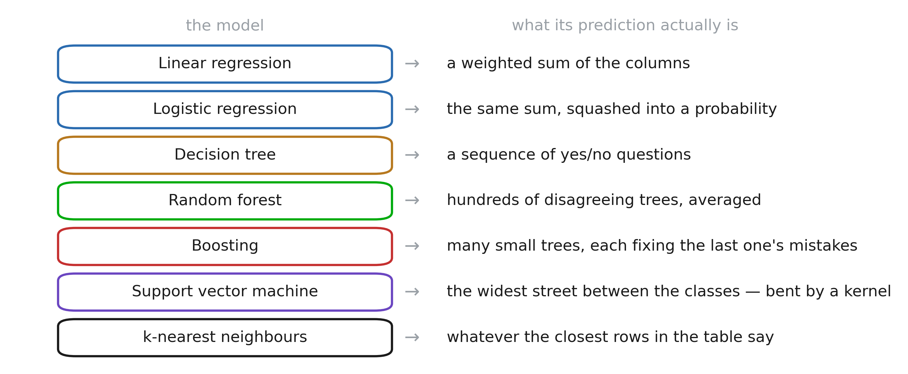

::: notes
Read the right column aloud, not the left. Every row is a different answer to the
same question — "what shape is f?" — and that is the only thing that changes between
them. Seven models, and the colours group them into the three families we will
actually work in: two linear (a weighted sum, with or without a squash), three built
out of trees (one, many averaged, many added), and two that work by distance rather
than by fitting a boundary at all.
That is also the running order of the deck, so this slide is the table of contents.
Promise them we come back to it at the end and put all seven boundaries on one
picture.
:::

## The model box

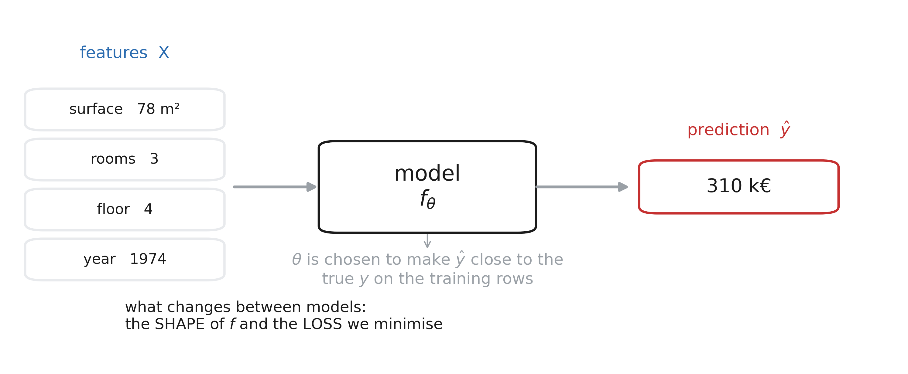

::: notes
Fix the vocabulary once: features X, target y, parameters θ, prediction ŷ, loss.
Every model in this deck fills the box differently, but nothing outside the box
moves. Stress the last line — the shape of f and the loss are the only two design
choices; everything else is arithmetic.
:::

## Two kinds of target

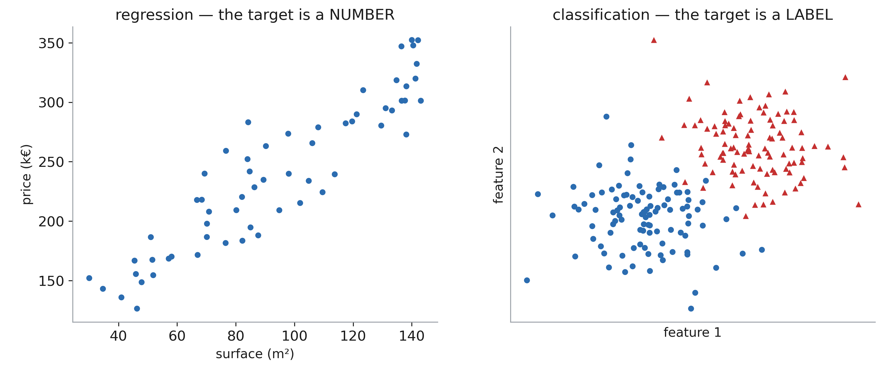

::: notes
Regression → a number, scored with squared error. Classification → a label, scored
with accuracy / log-loss. Same models on both sides, with a different last step:
linear regression ↔ logistic regression, regression tree ↔ classification tree.
Say it now, so the parallel is expected rather than surprising later.
:::

# 1. Linear regression

## Fit a line, judge it on the residuals

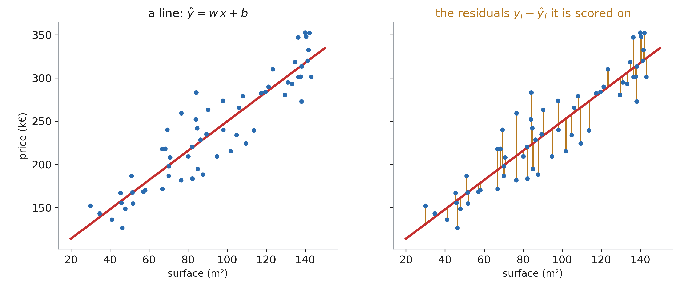

::: notes
Left: the model is two numbers, a slope and an intercept. Right: what "good" means.
Ask why we square the residuals rather than take absolute values — answers: it
punishes big misses harder, it is differentiable everywhere, and it has a closed
form. Squaring is also why one outlier can drag the whole line.
:::

## Quality is measured by MSE

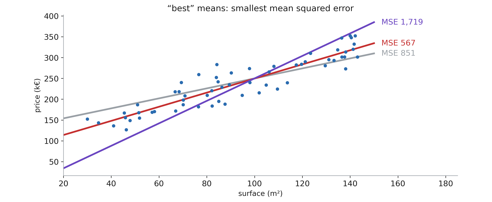

::: notes
Three lines, three MSEs. The point: once you have written the loss down, choosing
the model stops being taste and becomes arithmetic. Ask the room to rank the lines
by eye first, then reveal the numbers — they usually get the order right and the
margins wrong.
:::

## The loss, written out

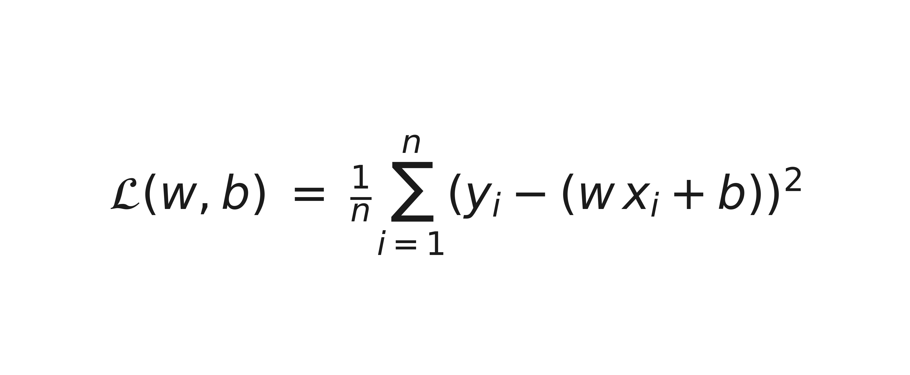

::: notes
Two minutes maximum. Name every symbol: n rows, y_i truth, w and b the two things
we are allowed to change. Note that x_i and y_i are FIXED — the function's inputs
are w and b, which is exactly the flip students find confusing.
:::

## The loss is a bowl

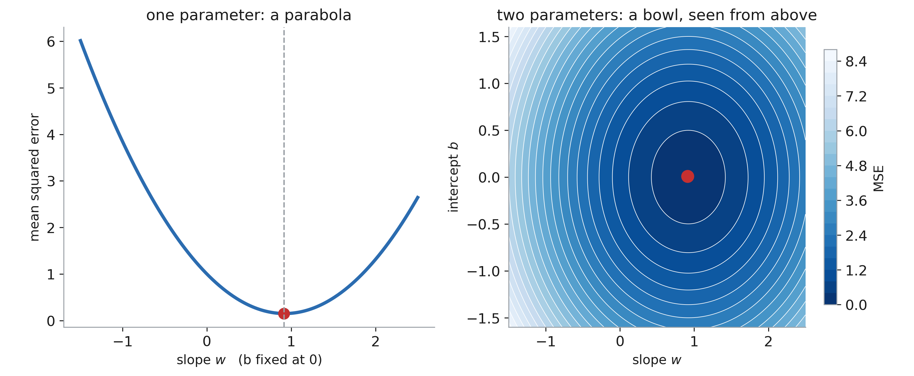

::: notes
Left: freeze b, sweep w — a parabola. Right: sweep both — nested ellipses with one
bottom. The key word is CONVEX: one minimum, no local traps, no random restarts, no
seed. This is the property that neural networks will lose in three weeks.
(Both panels use standardised columns so the bowl is round enough to read.)
:::

## Two ways down the bowl

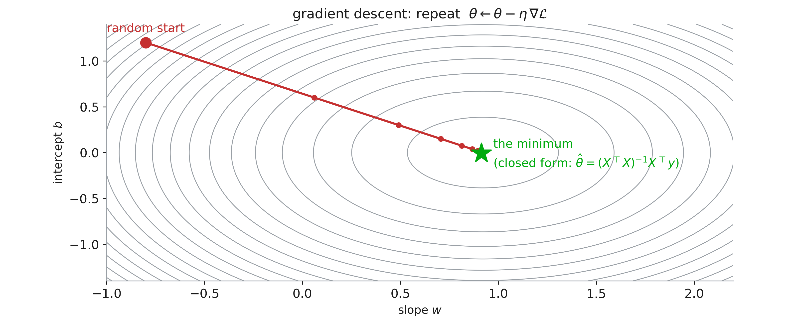

::: notes
Because the bowl is quadratic we can jump straight to the bottom: the normal
equation. We nevertheless walk down it, because gradient descent is the ONLY option
left once the model is a network — and the recitation notebook implements exactly
this loop by hand. Point at the step size: too small crawls, too large diverges.
:::

## More columns: the line becomes a plane

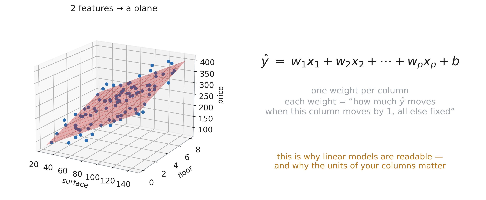

::: notes
p features, p weights, one intercept. Each weight is a partial effect — "all else
held fixed" — and that clause is where causal claims sneak in illegitimately;
Session 13 comes back to it. Say the practical consequence: correlated columns split
the credit between themselves, so a weight near zero is not evidence of no effect.
:::

## "Linear" means linear in the *weights*

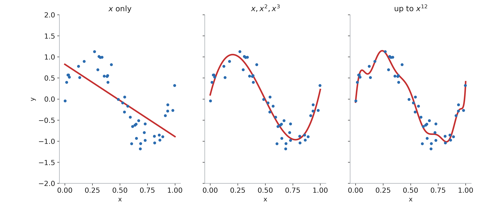

::: notes
This surprises everyone. Adding x², x³, log x, or an interaction x₁·x₂ as extra
COLUMNS keeps the model linear — same normal equation, same bowl. So a linear model
is only as limited as your feature table. This is the direct payoff of last week's
feature engineering, and the reason "linear" is not an insult.
:::

## Classification: squash the same sum

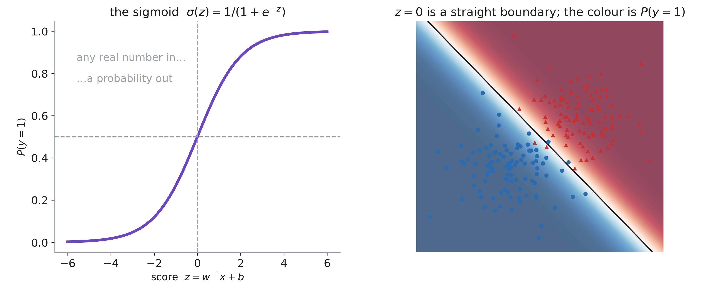

::: notes
Left: the sigmoid — the score can be anything, the output has to be in [0,1].
Right: because the score is linear, the 0.5 contour is a straight line, always.
Emphasise that logistic regression outputs a genuine probability, which is why it is
still the default in clinical risk models — Session 4 is about whether that
probability is calibrated.
:::

## Fitted by maximum likelihood

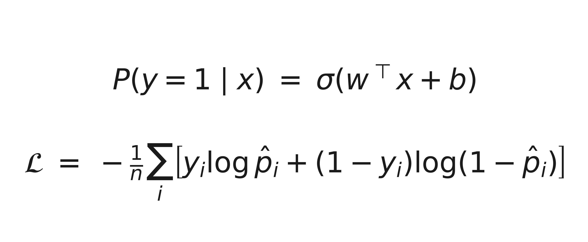

::: notes
Squared error on a probability is a bad idea (it is not convex through the sigmoid,
and it under-punishes confident mistakes). Cross-entropy is the right loss: it goes
to infinity when you are confidently wrong. No closed form here — gradient descent
is compulsory. Note that we will meet this exact loss again for every classifier
network in the course.
:::

## Where a straight boundary cannot go

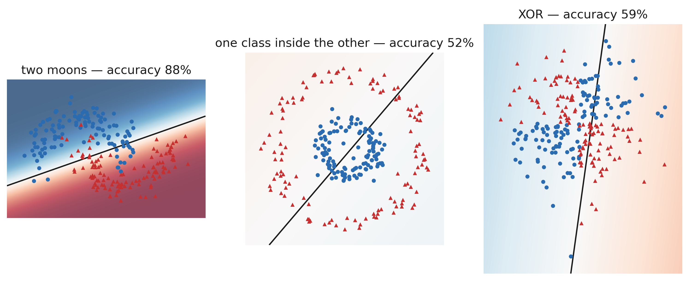

::: notes
Three datasets a first-year student can draw, and logistic regression fails on all
three — XOR at chance level. The fix is either better features (we just saw basis
expansion) or a model that carves space itself. That is the cue for trees.
Ask them what single extra column would rescue the XOR panel: x₁·x₂.
:::

# 2. Decision trees

## A tree is a sequence of questions

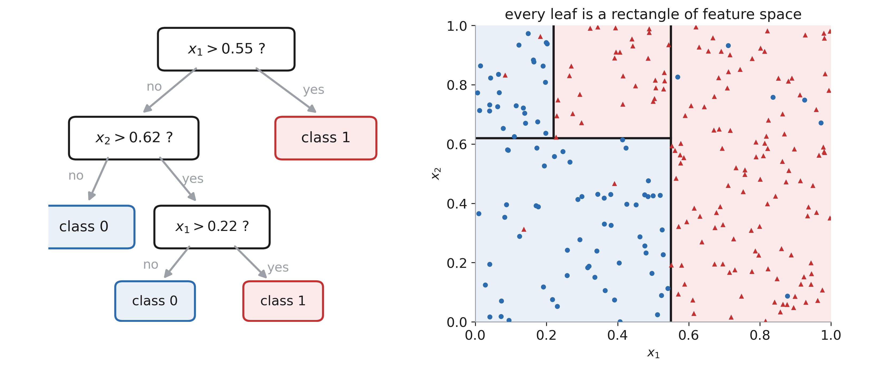

::: notes
The two panels are the SAME object: follow one path down the tree and you have named
one rectangle on the right. Read one path out loud end to end. Say what this buys:
no scaling, no dummy encoding, no distributional assumption, and a model a clinician
can read off the page.
:::

## Best thresholds

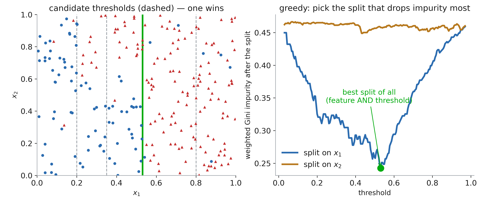

::: notes
The algorithm is brutally simple: for every column, for every threshold, compute the
impurity of the two children, keep the best pair. Then recurse. Note "greedy" — it
never reconsiders an earlier split, so the tree it builds is not the best possible
tree; finding that one is NP-hard. That greediness is a source of variance.
:::

## Feature selection

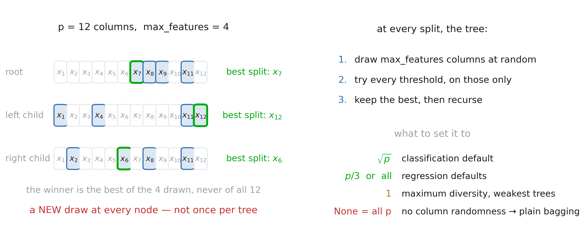

::: notes
Spend a minute on the mechanics, because the name suggests the wrong thing: it is
NOT a feature-selection step, and it is not "use only these 4 columns for this
tree". Walk the three rows: at the root the tree draws 4 of the 12 columns and picks
the best split among those 4 only — x7 here — even if the truly best split in the
whole table was on x2. Then at the next node it draws 4 again, a fresh draw. So a
single tree still gets to use every column somewhere; it just never gets to use the
strongest one everywhere.
On its own this only makes the tree worse — say that plainly, it is a deliberately
handicapped split. The payoff comes in section 3: the dominant column is absent from
roughly (1 − k/p) of the nodes, so the tree is forced to tell the second-best story
in the data, and two such trees end up genuinely different rather than jittered
copies of each other. Flag it as a promise to be cashed at "The knob: max_features".
Give the numbers on the right and flag the two names students trip on: `None` means
all p columns, which is NOT "no columns" but "no randomness" — that is plain bagging;
and `"sqrt"` is a string, not a number.
:::

## "pure" split

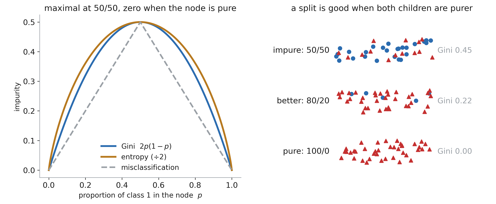

::: notes
Gini and entropy agree almost always; the choice between them is not worth a
hyperparameter search. Misclassification rate is the one that does NOT work: it is
piecewise linear, so it is flat for splits that clearly improve the node — you need
a strictly concave measure to reward moving toward purity.
For regression trees, replace impurity by variance and the story is identical.
:::

## Depth is the capacity knob

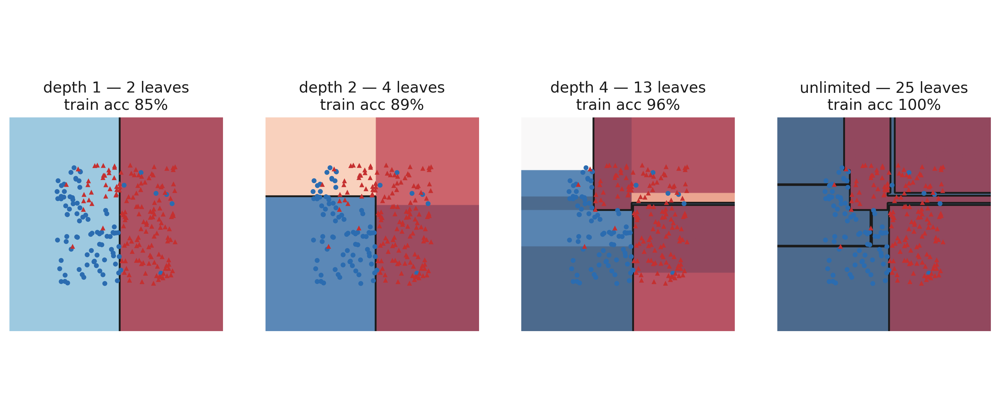

::: notes
Walk left to right: one split, then four regions, then sixteen, then one leaf per
noisy point. The last panel reaches 100% training accuracy and has clearly learned
the noise — the same picture as the degree-15 polynomial from any regression course.
Names to give them: max_depth, min_samples_leaf, ccp_alpha (cost-complexity pruning).
:::

## Regression trees predict staircases

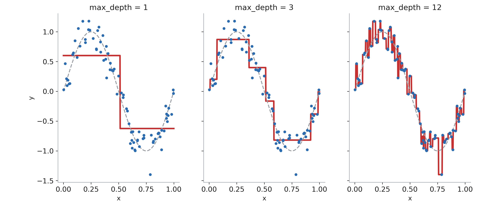

::: notes
The prediction inside a leaf is the mean of its training rows — a constant. So the
model is piecewise constant: never smooth, and flat outside the training range.
That last point matters a lot in practice: a tree can NEVER extrapolate. Ask what a
tree would predict for a 400 m² flat when the largest one it saw was 150 m².
:::

## And over-fit

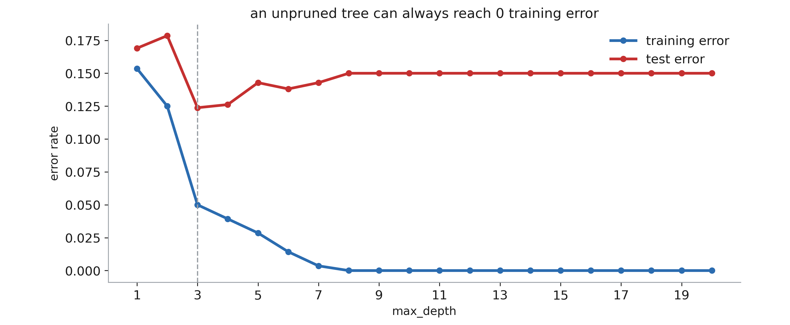

::: notes
Training error goes to zero, test error turns around. Same U as always. The honest
summary of a single tree: shallow underfits, deep overfits, and the "right" depth is
sample-size dependent. This slide is where students expect the answer "so tune the
depth" — the next slide says why that is not enough.
:::

## Decision trees problem: instability

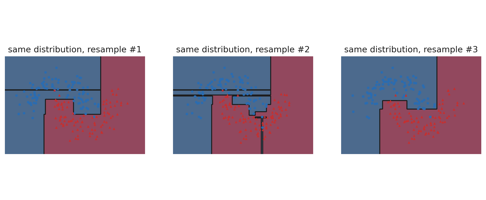

::: notes
Three bootstrap resamples of the SAME distribution, three genuinely different
boundaries. Because splits are chosen greedily, one row changing near the top of the
tree rewrites everything below it. This is high variance in the exact technical
sense, and it is not fixed by tuning depth — it is a property of the procedure.
Hold this slide: the entire next section is the answer to it.
:::

# 3. Random forests

## The idea

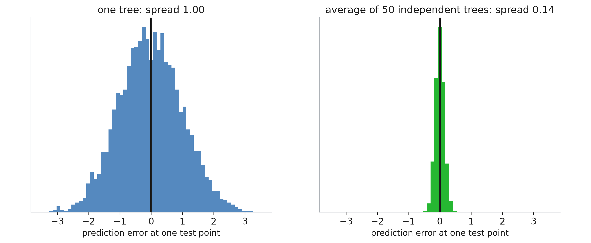

::: notes
Fifty noisy but unbiased guesses, averaged: the spread divides by √50, and the
centre does not move. That is the whole trick. Bias is untouched — which is why we
deliberately grow DEEP trees (low bias, high variance) and let the average clean up
the variance. Averaging shallow trees would just give a confident bad model.
:::

## Trees must disagree

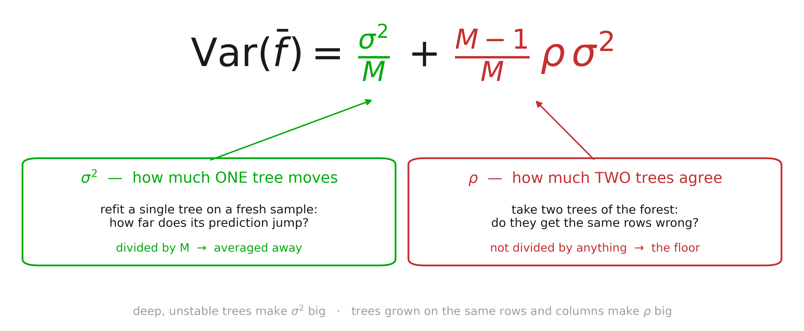

::: notes
Define the two symbols before the formula, because everything hangs on them. Fix ONE
test row. σ² is the variance of a single tree's prediction on that row across
hypothetical refits — grow a tree on a fresh sample from the same population, ask it
again, and see how far the answer moves. It is the tree-instability slide, turned
into a number. ρ is the correlation between two trees of the SAME forest on that
row — do they move together? do they get the same rows wrong? Note that both are
properties of the PROCEDURE over hypothetical datasets, not of the forest you have
in memory; students consistently read them as statistics of the fitted model.
Now the derivation, three lines. M trees, each of variance σ², each pair correlated
by ρ. The variance of a sum is the sum of all M² entries of the covariance matrix:
M diagonal terms worth σ², and M(M−1) off-diagonal terms worth ρσ². Divide by M².
Read the two terms out. GREEN: what each tree gets wrong on its own, divided by M —
the term everybody knows. RED: what they all get wrong together, which averaging
cannot see, because it is already inside every single tree.
So the design problem is ρ, not σ². Making trees individually better is not the
goal; making their MISTAKES independent is. Ask where ρ comes from before moving on:
same rows, same columns, same greedy algorithm — of course they agree. Bagging and
column subsampling exist to break exactly those.
:::

## Averaging is not magic

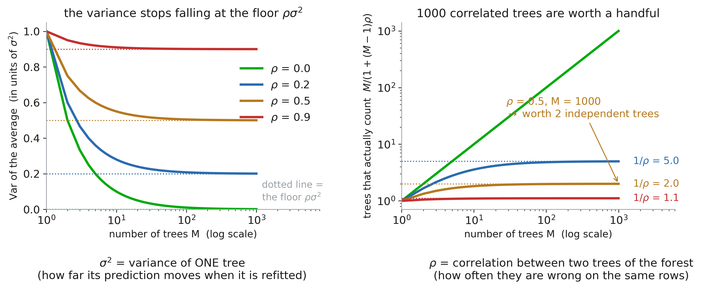

::: notes
Restate the two symbols off the caption line before reading the curves — σ² is one
tree's wobble, ρ is how much two trees of the forest wobble together. Note the
y-axis on the left is in UNITS of σ²: 1.0 is "as bad as a single tree", so the
picture is about the fraction of that wobble averaging can remove, whatever σ²
happens to be.
Left: the formula plotted. At ρ = 0 the variance really does go to zero — the
textbook 1/M. At ρ = 0.9 you are done after about five trees and the curve is flat
forever; the dotted line each curve settles onto is its own floor, ρσ².
Right: the same fact as a count. M/(1 + (M−1)ρ) is how many INDEPENDENT trees your M
correlated ones are actually worth, and it saturates at 1/ρ no matter how much
compute you buy. At ρ = 0.5, a thousand trees are worth two. That number usually
gets a reaction — let it.
Three practical readings: (a) a forest that has stopped improving is telling you
about ρ, not about M, so more trees is wasted money; (b) real forests land around
ρ ≈ 0.1–0.3, so the ceiling is real but not fatal; (c) everything on the next two
slides is an attempt to move ρ left — and the slide after those measures whether it
worked.
:::

## Two injections of randomness

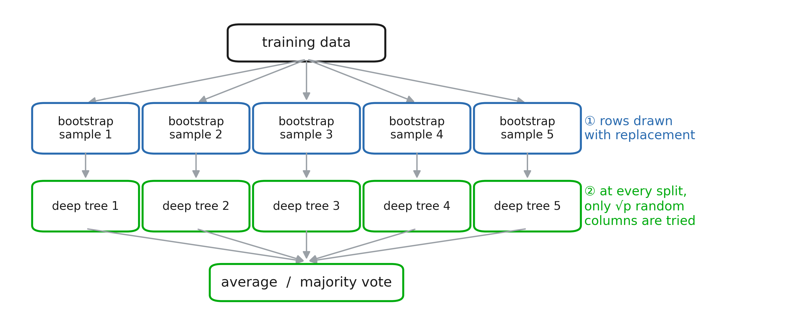

::: notes
① Bootstrap the rows — that alone is "bagging". ② At every split, only √p randomly
chosen columns may be tried — that is what makes it a random FOREST rather than
bagged trees. Each tree is individually worse than a tree fitted on everything; the
average is better. Say that trade-off explicitly, it is the counter-intuitive part.
:::

## The knob: max_features

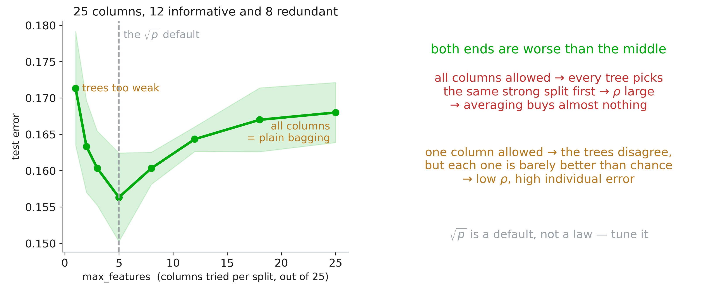

::: notes
Measured, not asserted: 25 columns, 12 informative and 8 redundant, and the U is
real. Too many columns allowed → correlated trees → the ρ floor. Too few → each tree
is close to random. √p for classification, p/3 for regression are the defaults; both
are starting points for the search, which is Session 3's topic.
:::

## Strength against diversity

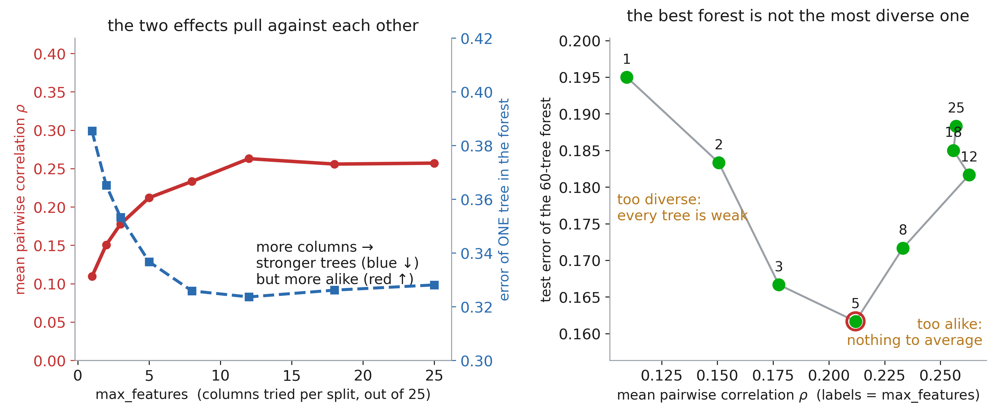

::: notes
Now ρ stops being a symbol. Left: fit 60 trees, ask each one separately for its
predictions on the test rows, and correlate every pair — 1770 pairs. As
max_features grows, the trees get individually better (blue, down from 38% to 32%
error) and simultaneously more alike (red, up from 0.11 to 0.26). One knob, two
effects, opposite signs. This is Breiman's "strength versus correlation" in one
picture.
Right: the same runs plotted in ρ-space, each point labelled with its max_features.
The forest is worst at BOTH ends, and the winner sits at ρ ≈ 0.21 — not at the
lowest correlation available. Say why explicitly: the formula's floor is ρσ², and
σ² is the variance of a single tree, which grows as the trees get weaker. Pushing ρ
down by crippling the trees raises σ² faster than it lowers ρ.
This is also the honest answer to "why √p?" — it is where those two curves happen to
cross for most tabular problems. Nothing deeper. Tune it.
:::

## The boundary stops twitching

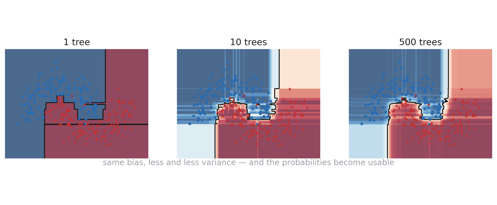

::: notes
Same data, 1 → 10 → 500 trees. The jagged single-tree boundary smooths out, and the
colour field becomes a usable probability instead of a hard 0/1. Note that the
forest boundary is still made of axis-aligned steps — averaging many staircases
approximates a diagonal, it does not become one.
:::

## More trees never over-fits

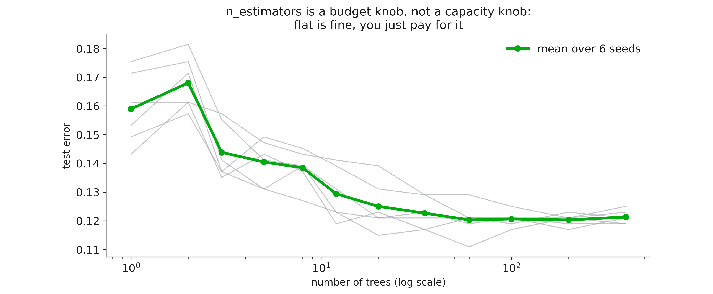

::: notes
The single most common misconception about forests. n_estimators is a compute
budget, not a capacity knob: the curve flattens and stays flat. You stop adding
trees when the improvement stops paying for the inference time — typically a few
hundred. Contrast this with boosting, two slides from now, where it is not true.
:::

# 4. Boosting

## The other way to use many trees

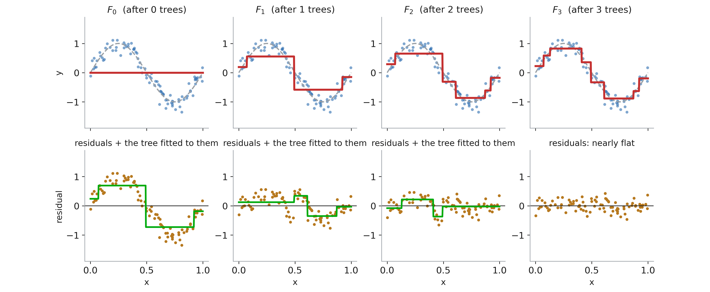

::: notes
Top row: the running model. Bottom row: what is left to explain, and the small tree
being fitted to it. Nothing here is bootstrapped and nothing is averaged — each tree
is fitted to the CURRENT residuals and added with a small learning rate. Watch the
residuals flatten. Three trees is already most of the signal.
:::

## Forest and boosting attack different errors

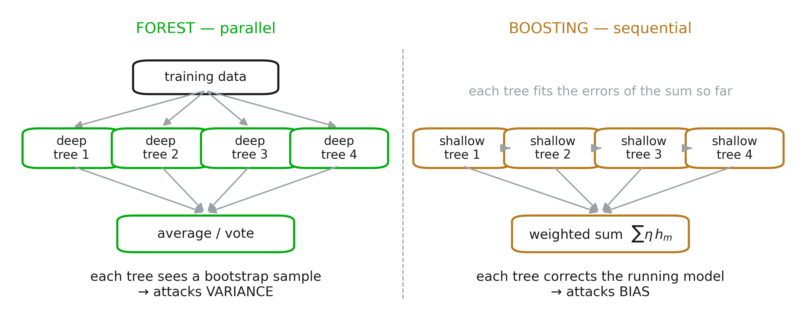

::: notes
The one slide to remember from this section. Forest: deep trees, parallel,
independent, attacks variance. Boosting: shallow trees, sequential, dependent,
attacks bias. This is why boosting usually wins on tabular benchmarks and why it is
far easier to break. XGBoost, LightGBM and CatBoost are engineering on top of this
picture — Session 3 covers them properly.
:::

## Boosting *can* overfit

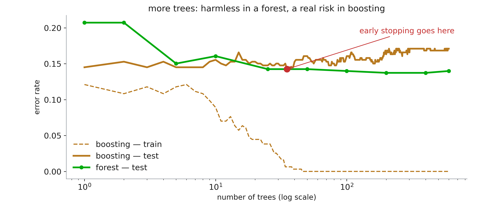

::: notes
The practical difference. The forest curve is flat forever; the boosting curve turns
around, because every extra tree adds capacity aimed straight at the residuals.
Hence early stopping and a small learning rate — the two knobs you always set.
Practical rule: forest for a strong baseline in one line, boosting when you have the
time to tune it and a validation set you trust.
:::

# 5. Support Vector Machines

## Which line?

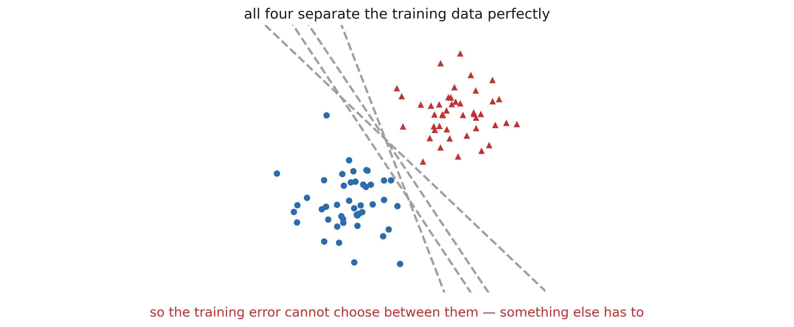

::: notes
Start from the honest embarrassment of the linear model: when the classes are
separable there is not one solution, there are infinitely many, and every one of
them has zero training error. Logistic regression breaks the tie almost by accident
(it keeps pushing the weights up until the likelihood stops improving), and nothing
in the loss says a word about where the boundary should sit inside the gap.
Ask the room to vote for one of the four before revealing the next slide. Nearly
everyone picks the middle one, which is the whole point: they already have the
intuition, the SVM just writes it down.
:::

## The widest street

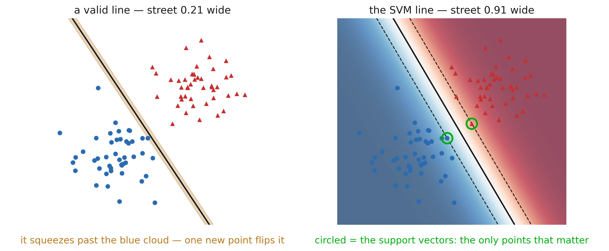

::: notes
The SVM's answer: among all the lines that separate the data, take the one with the
widest empty band around it — the margin, the "street". Left is a genuine separator
whose street is 0.21 wide; right is the widest available, 0.91. Both are perfect on
the training set, but the left one is one new patient away from being wrong.
Then the punchline of the whole method: the fitted line depends ONLY on the circled
points, the support vectors — the ones touching the edge of the street. Delete every
other row of the training set and refit: you get exactly the same line. Compare that
with logistic regression, where every point pulls a little, and with a tree, where
one distant row can change a split near the root.
:::

## What it minimises

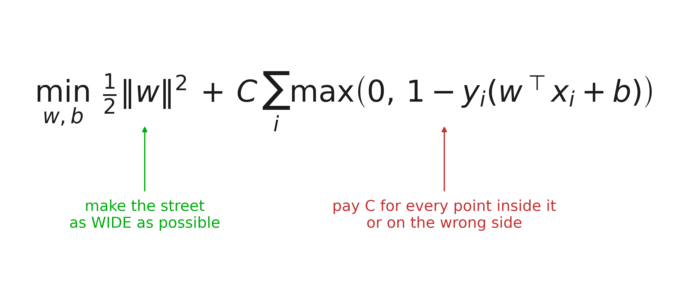

::: notes
Two terms, and they are exactly the trade of Session 3: ‖w‖² is a regularizer — the
street width is 2/‖w‖, so shrinking w widens the street — and the hinge sum is the
data-fit term. The hinge, max(0, 1 − y·f(x)), is zero as soon as a point is on the
correct side AND outside the street; that flat zero region is why most points end up
irrelevant and only the support vectors matter.
Note what changed from logistic regression: the shape of the model is identical, a
linear score wᵀx + b. Only the loss changed — log-loss became hinge loss. Every
difference in behaviour comes from that one swap.
:::

## C: how much misbehaviour do you allow?

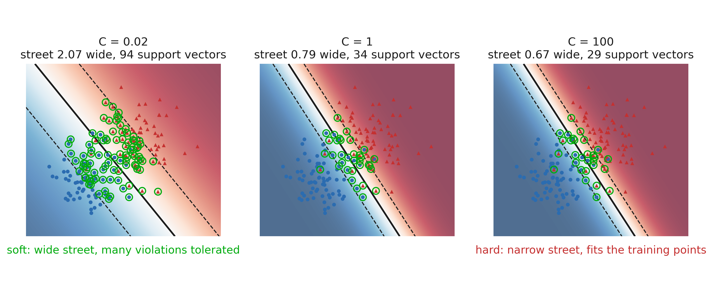

::: notes
Real data overlaps, so "the widest street with nothing inside it" usually has no
solution. The soft margin lets points sit inside the street, or on the wrong side,
at a cost of C each. Small C: violations are cheap, the street grows fat, most
points end up supporting it — a smooth, heavily regularized boundary. Large C:
violations are expensive, the street shrinks around the awkward points and the model
starts to chase them.
So C is 1/λ, the same knob under a different name, and it is the single
hyperparameter people get wrong on this model. Say the practical rules: ALWAYS scale
your columns first — this is a distance-based method, an unscaled column silently
dominates the norm — and tune C on a log grid.
:::

## The kernel trick

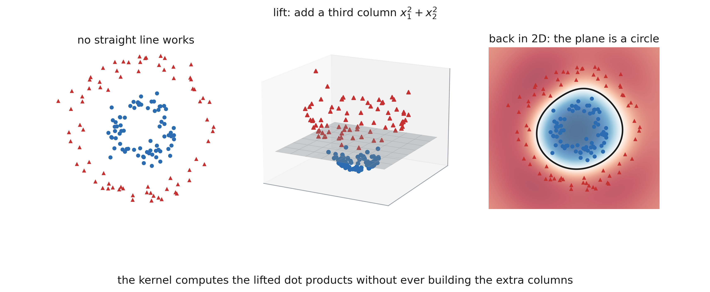

::: notes
Left: no straight line can do this. The old fix from section 1 was to add columns by
hand — and if we add x₁² + x₂², the two classes separate by a flat plane in 3D, which
is a circle when we drop back to 2D. Nothing mysterious yet, it is basis expansion.
The trick is what makes it cheap. The SVM's solution only ever needs DOT PRODUCTS
between pairs of points, never the points themselves. A kernel is a function that
returns the dot product in the lifted space directly, so we can work in a space with
a thousand — or infinitely many — extra columns and never build a single one. That
is the sentence to remember: the model is linear in a space we never visit.
:::

## Radial Basis Function (RBF) kernel

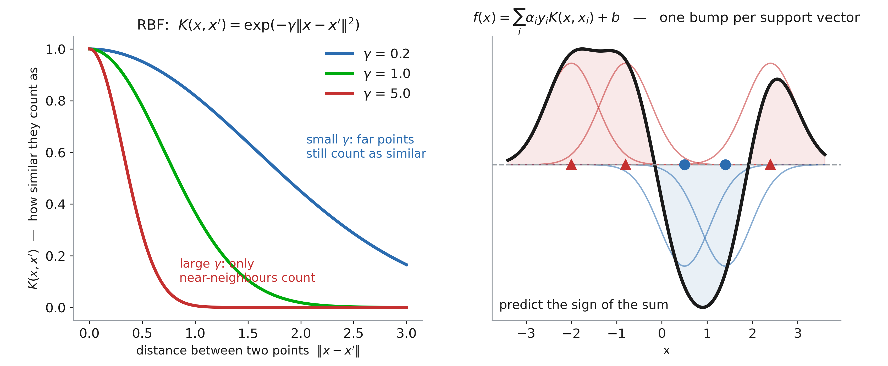

::: notes
Before listing kernels, say what one IS, because "kernel" sounds like machinery and
it is really just a similarity score: K(x, x') is one number saying how alike two
rows count as. Left: the RBF, the one everybody uses. It only looks at the distance
between the two points, and gamma sets how fast similarity dies with distance —
small gamma, everything is a bit similar to everything; large gamma, only immediate
neighbours count.
Right: why that matters. The fitted SVM is literally a weighted vote of similarities
to the support vectors — one bump per support vector, positive for one class,
negative for the other, and the prediction is the sign of the sum. Read the picture
left to right: two red support vectors build a red region, two blue ones dig a blue
valley, and the boundary is where the sum crosses zero.
Two consequences worth saying out loud: this is why gamma is a bias-variance dial
(narrow bumps → each point defends its own island → the memorised panel from the
previous slide), and why an SVM is closer to k-NN than to a linear model once you
kernelise it — the difference being that only the support vectors get to vote.
:::

## Typical kernels

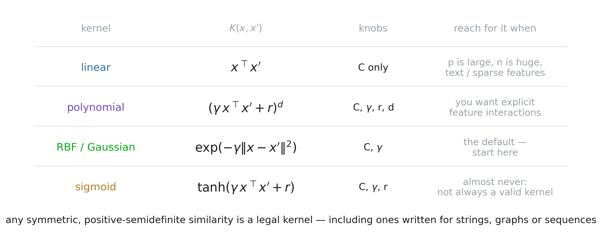

::: notes
Four rows, and honestly only two matter. LINEAR: no lift at all, and the right
choice when p is already large — text, genomics, anything sparse and
high-dimensional, where the data is usually separable without any lift and
`LinearSVC` scales to far more rows. POLYNOMIAL: an explicit lift to all products of
degree up to d; it gives you interactions by hand, but it has three knobs and it is
numerically touchy — degree 5 on unscaled columns overflows happily. RBF: the
default, infinite-dimensional lift, two knobs, and what you should start with.
SIGMOID: mostly a historical curiosity, and for some gamma/r it is not even positive
semi-definite, so the solver is optimising something with no guarantee behind it.
That last point is the rule underneath the table: a function is a legal kernel if it
is symmetric and positive semi-definite — Mercer's condition — which is exactly the
condition for "there exists a space in which this is a dot product". You never check
it by hand; you either use one of these or you build new ones from them, since sums,
products and positive multiples of kernels are kernels.
Then the part students find surprising: x does not have to be a vector. There are
kernels for strings, for graphs, for sequences of clinical measurements — anything
where you can define a sensible similarity, you can run an SVM on, without ever
turning the object into a feature table. That was a big deal in bioinformatics for
protein and DNA sequences.
:::

## Kernels in practice

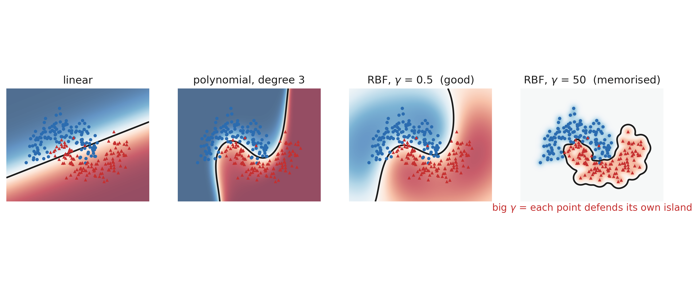

::: notes
Four fits, one dataset. Linear is the plain max-margin line. Polynomial bends it.
The RBF kernel is the default and the one worth knowing: it scores a point by its
distance to each support vector, so gamma sets how far a support vector's influence
reaches. Small gamma → wide, smooth influence. Large gamma → each point defends a
small island around itself, and the fourth panel is what memorisation looks like.
C and gamma interact and must be tuned together, always on scaled data — that pair
is the standard worked example in the next session's hyperparameter search. Say
where SVMs sit today: excellent on small, clean, well-scaled datasets, wonderful
theory, and rarely first choice on a big tabular table because fitting is roughly
quadratic in the number of rows and boosting simply beats it there.
:::

# 5. K - Nearest Neighbors

## How a prediction is made

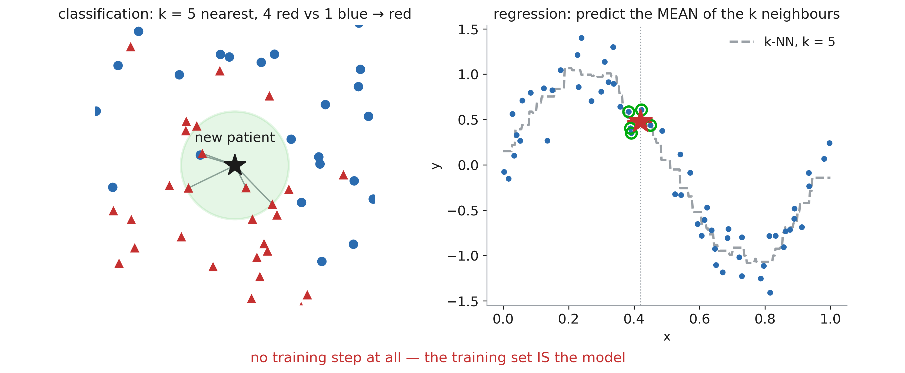

::: notes
The entire algorithm, and it fits in one sentence: to predict for a new row, find
the k closest rows in the training set and let them decide — majority vote for a
class, mean for a number. Walk the left panel: five nearest, four red, one blue,
answer red. There is nothing else; no weights, no loss, no optimiser.
So "training" is just storing the table. The cost has simply moved: fitting is
free, and every single prediction pays for a scan of the training set. That is the
opposite trade from every other model in this deck, and it is why k-NN is awkward in
production — the model file is the dataset, which is also a privacy problem when the
rows are patients.
Two choices are yours to make, and they are the whole model: k, and the distance.
Euclidean is the default; Manhattan is better with many columns; and for
categorical or mixed rows you need something else entirely (Hamming, Gower). Mention
`weights="distance"` too — nearer neighbours voting louder is usually a free
improvement over a flat vote.
:::

## No training needed

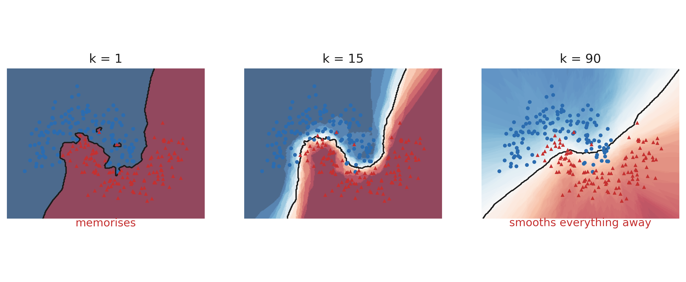

::: notes
k-NN is the useful contrast: zero training, all the work at prediction time, and k is
a pure bias–variance dial. k = 1 memorises, k = 90 flattens everything. It also fails
loudly in high dimensions, which is the cleanest way to introduce the curse of
dimensionality — and why we scale features before ever computing a distance.
:::

## Where k-NN breaks

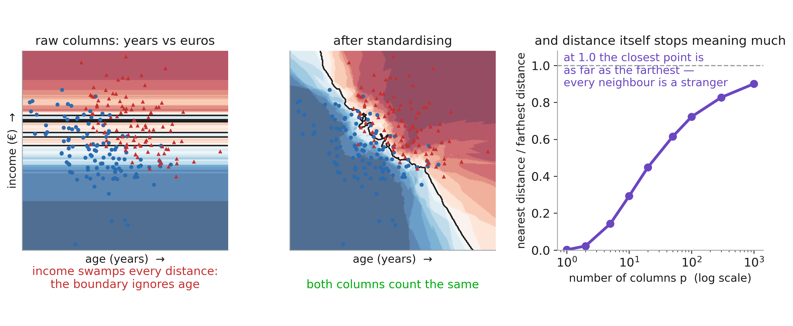

::: notes
Two failure modes, and both are about the distance rather than the idea.
Scale: the left panel is the same data fitted on raw columns. Income has a spread of
15 000 and age a spread of 9, so every distance is essentially the income gap and the
boundary is a set of horizontal lines — age has been silently deleted from the model.
Standardise, and the boundary becomes the diagonal the data actually shows. Say the
rule: for anything distance-based — k-NN, SVM, k-means, PCA — scaling is not
optional, and the scaler must be fitted inside the cross-validation fold, which is
next session's topic.
Dimension: the right panel is the curse of dimensionality made concrete. Draw random
points, look at the closest and the farthest one from a query: in 2 columns the
nearest is ~50 times closer, by 1000 columns the ratio is 0.9 — the nearest point is
essentially as far away as the farthest. "Nearest" stops carrying information, so
k-NN degrades to guessing. This is also why the answer to "should I add 300 more
features?" is different for a tree, which ignores the useless ones, than for k-NN,
which averages them straight into the distance.
:::

# 5. Choosing

## One dataset, eight boundaries

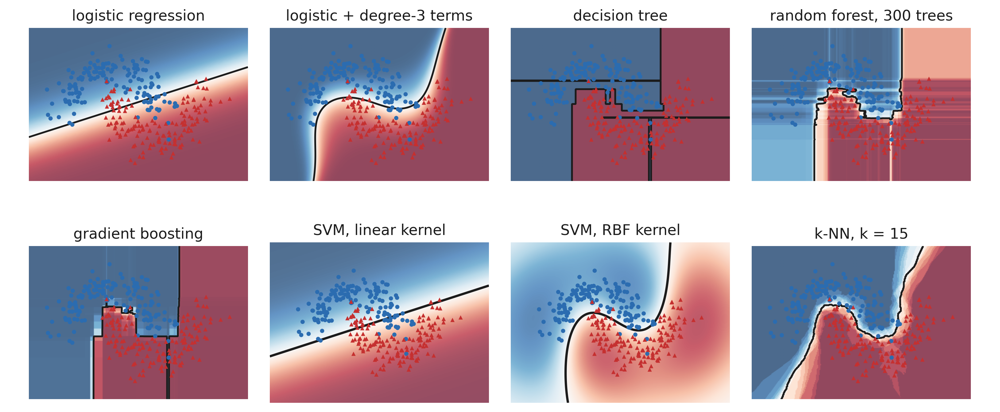

::: notes
The summary slide of the deck: the same 300 points, every model we built, in the
order we met them. Read the shapes, not the accuracies — they are all within a few
points of each other here, which is itself the lesson.
Top row: a straight line; the same line curved by adding columns; raw rectangles;
those rectangles averaged into something smooth. Bottom row: rectangles sharpened by
boosting; a straight line again, but the widest one; that line bent by an RBF
kernel; and a boundary that simply traces wherever the neighbours are.
Two questions for the room. First, which one would you ship — and watch them
hesitate, because on this data it does not matter, so the answer has to come from
somewhere else: the size of the table, the number of junk columns, the inference
budget, whether a human has to sign off on it. Second, which of these could you
explain to a regulator? That thins the field fast.
Close on where the course goes: none of these carve the space for you. They all take
the columns you hand them and draw a shape. From next week the model builds its own
features, and that changes everything.
:::
