# 1. Feature engineering

## What is feature engineering?
> Turning **raw records** into **columns a model can learn from**.

- The model only sees the features you give it
- A good feature encodes something you know about the *domain* or the
  *data-generating process*
- Cheap features often beat expensive models

::: notes
The point of the section: most of the accuracy on tabular and time-stamped data
comes from the feature table, not from the estimator.
:::

## Three families of time-aware features
| Family | Answers |
|---|---|
| **Temporal** | *When* did it happen? |
| **Aggregation windows** | What has it been like *recently*? |
| **Lags** | What was it *before*, and how fast is it moving? |

## Temporal features: decompose the timestamp
A timestamp is a terrible feature; what it *contains* is not:

```python
h = ts.dt.hour
df["hour"] = h                # 0-23
df["dow"]  = ts.dt.dayofweek  # 0=Mon
df["is_weekend"] = df["dow"] >= 5
df["is_night"]   = h.between(0, 6)
df["month"]      = ts.dt.month
```

- Captures **admission at 3am** vs **admission at 3pm**
- Captures staffing, seasonality, weekend effects

::: notes
Ask the room what a "night admission" flag could proxy for: severity, staffing
levels, a different referral path.
:::

## Temporal features: cyclical encoding
Hour 23 and hour 0 are **one hour apart**, not 23:

```python
theta = 2 * np.pi * df["hour"] / 24
df["hour_sin"] = np.sin(theta)
df["hour_cos"] = np.cos(theta)
```

- Same trick for day-of-week (/7), month (/12), day-of-year (/365)
- Needs **both** sin and cos: one alone is ambiguous
- Trees can live without it; linear models and NNs cannot

## Cyclical encoding

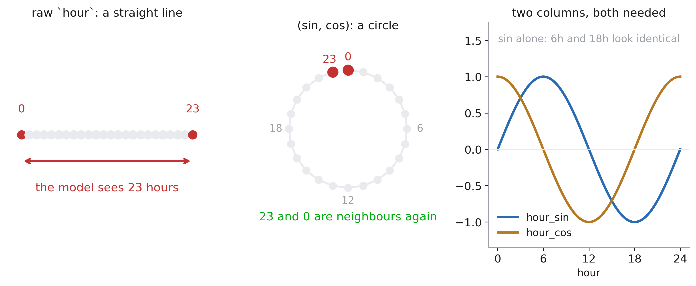

::: notes
Left: the model is handed a number, so it measures 23 hours between an admission at
23:00 and one at midnight — two events one hour apart. Right: sin and cos put the
clock back on a circle, where the two are neighbours again.
The third panel is the answer to "why two columns?": sin alone gives 6h and 18h the
same value. You need both coordinates to name a point on a circle.
Reminder that trees do not care — they can cut the raw hour at 23 and at 0 — but any
linear model or network does.
:::

## Temporal features: elapsed time
Often the strongest single feature in the table:

```python
hour = pd.Timedelta("1h")

df["h_since_admit"] = (ts - admit) / hour
df["h_since_obs"]   = ts.diff() / hour
```

- **Time since** an event: how far into the stay are we?
- **Time between** events: a patient measured every 20 minutes is
  a patient someone is worried about

## Elapsed time

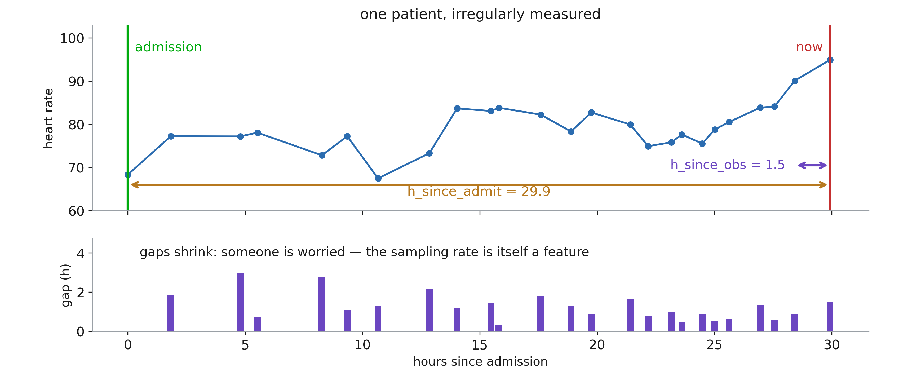

::: notes
One patient, thirty hours, measured whenever someone decided to measure them. The
two arrows are the two columns: time since admission, and time since the previous
observation.
The lower panel is the part students miss. The gaps are shrinking, and nobody wrote
that down — it is a side effect of a nurse deciding to check more often. The
sampling rate is a feature, and often a strong one. Warn them of the flip side: it
is also a leakage risk, because the measurement schedule can encode the outcome.
:::

## Aggregation windows
Collapse a patient's recent history into fixed columns:

- **last 6h** → `hr_mean_6h`, `hr_max_6h`, `hr_std_6h`
- **last 24h** → `hr_mean_24h`, `n_obs_24h`
- **whole stay** → `hr_mean_all`, `creatinine_last`

Two remarks:

- **Several windows** let the model compare short vs long term
- `hr_mean_6h - hr_mean_24h` is a trend detector in one column

## Aggregation windows: in code
```python
g = df.groupby("patient")     # sorted by ts
w = g.rolling("6h", on="timestamp")

df["hr_mean_6h"] = w["heart_rate"].mean()
df["hr_max_6h"]  = w["heart_rate"].max()
df["n_obs_6h"]   = w["heart_rate"].count()
```

- Use a **time-based** window (`"6h"`), not a row-count window (`6`):
  observations are irregularly spaced

## Window

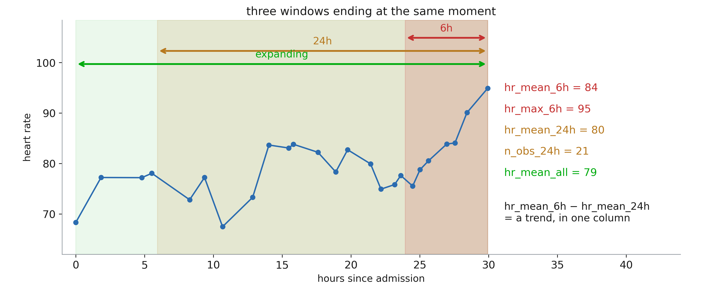

::: notes
Three windows, all ending at the same moment, all producing plain columns. Read the
numbers off the right: the 6h mean is 84 and the 24h mean is 80, and the difference
between them is a trend detector that costs one subtraction.
Point at the irregular spacing again: this is why the window must be "6h" and not
"the last 6 rows" — six rows can be forty minutes or fourteen hours.
:::

## Sliding vs tumbling windows
- **Sliding (rolling):** one value per row, windows overlap

  → prediction at any time

- **Tumbling:** non-overlapping blocks (each 6h bucket once)

  → one row per block, no duplicated information

- **Expanding:** everything since admission

  → "how has the whole stay been?"

::: notes
Sliding is the default for online prediction; tumbling is what you want when
building a training set where rows should be near-independent.
:::

## Sliding, tumbling, expanding

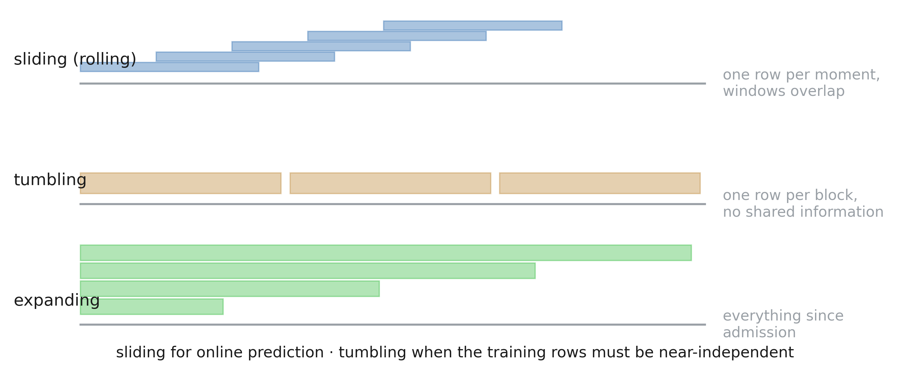

::: notes
Same signal, three different training tables. Sliding gives one row per moment and
consecutive rows share almost all their data — fine for prediction, dangerous when
you then do a random train/test split, because the neighbours of a test row are in
the training set. Tumbling gives fewer, near-independent rows. Expanding answers
"how has the whole stay been?" and grows without bound.
:::

## Lag features
The past values themselves:

```python
hr = df.groupby("patient")["heart_rate"]

df["hr_lag1"]  = hr.shift(1)   # where it was
df["hr_lag2"]  = hr.shift(2)
df["hr_delta"] = hr.diff()     # how much
df["hr_rate"]  = df.hr_delta / df.h_since_obs
```

- **Lag:** where it was — **difference:** how much it moved —
  **rate:** how fast it moved
- The rate is often the best of the three

## Lag features: what they look like
| t | heart_rate | hr_lag1 | hr_delta | hr_mean_6h |
|---|---|---|---|---|
| 08:15 | 78 | — | — | 78 |
| 14:40 | 96 | 78 | +18 | 96 |
| 09:05 | 102 | 96 | +6 | 102 |

::: notes
The first rows are necessarily missing — that is normal, not a bug. But long lag
chains explode the missing rate: keep lags short and few. This is a good place
to announce part 2.
:::

## Lag, difference, rate

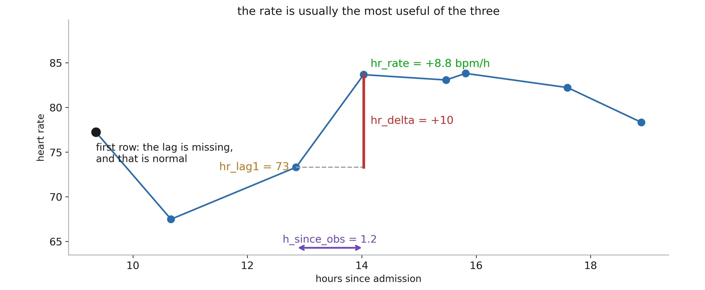

::: notes
One step of the series, annotated three ways: where it was, how much it moved, how
fast it moved. The rate is the one that survives irregular sampling — a jump of +10
means something very different over twenty minutes than over six hours.
The black point is the honest caveat: lags are missing at the start of every
patient, by construction. Chain four of them and a quarter of your table is holes,
which is exactly the bridge into part 3.
:::

# 2. A catalogue of techniques

## Log transformation — *basic*
Compress a right-skewed variable so the long tail stops dominating.

**Example:** length of stay runs 1–90 days; most patients are at 2–3.

```python
df["log_los"] = np.log1p(df["los_days"])
```

- `log1p` so that 0 stays 0
- The model now learns on **ratios**, not differences

## Log transformation example

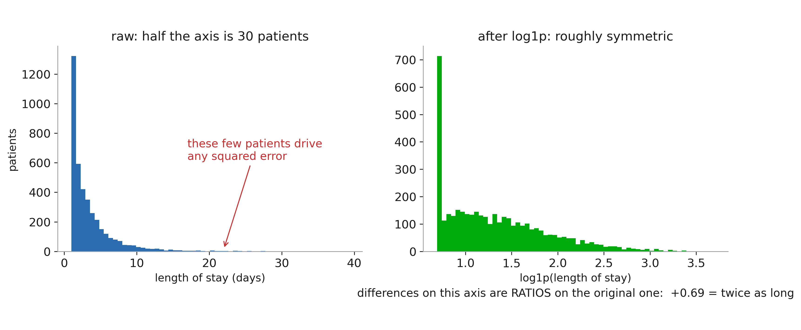

::: notes
Left: the raw length of stay. Half the axis is occupied by a few dozen patients, and
under squared error those few decide the fit. Right: after log1p the shape is close
to symmetric.
The sentence that makes it click: on a log axis, a fixed distance is a fixed RATIO.
+0.69 is "twice as long", whether you started at 2 days or at 40. That is usually
the scale the clinical question actually lives on.
:::

## One-hot encoding — *basic*
Turn an unordered category into one binary column per level.

**Example:** `admission_type` ∈ {emergency, elective, transfer} → 3 columns.

```python
OneHotEncoder(handle_unknown="ignore")
```

- Never encode it as 1/2/3: that invents an order

## One-hot encoding example

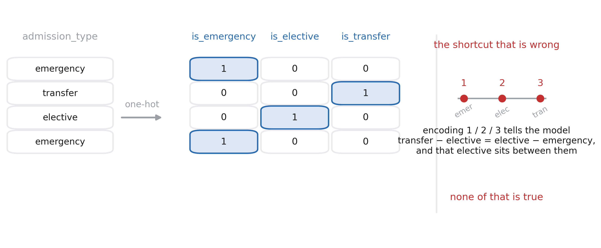

::: notes
Left: one column becomes three, one of which is 1. Right: what the integer shortcut
would have told the model — that the three categories are evenly spaced and that
"elective" sits between the other two. Neither is true, and a linear model will act
on both.
Mention the practical footnotes: `handle_unknown="ignore"` for levels that only
appear at test time, and that high-cardinality columns are where one-hot stops being
reasonable — which is the "learned embeddings" slide later.
:::

## Standardization — *basic*
Centre and rescale so every feature is in comparable units.

**Example:** `heart_rate` ≈ 70, `creatinine` ≈ 1.1 — without scaling, any
distance or penalty is decided by the heart rate alone.

```python
StandardScaler()      # (x - mean) / std
```

- Required by kNN, SVM, PCA, penalised regression, NNs

## Standardization example

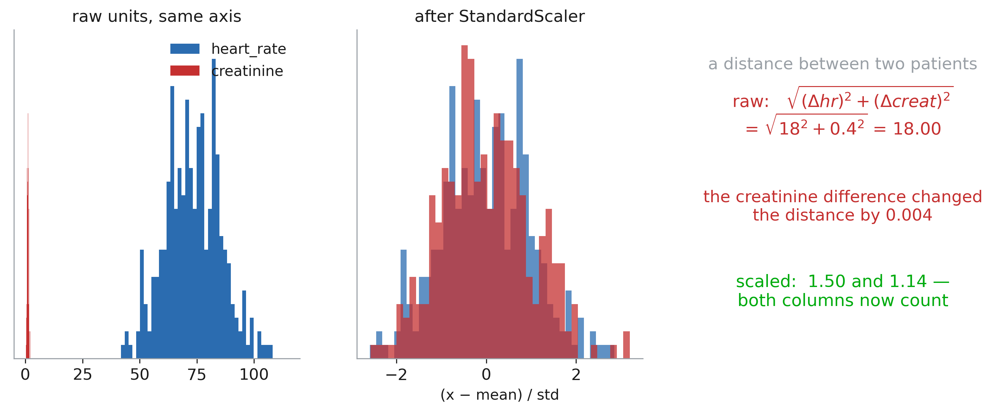

::: notes
Both columns on one axis: creatinine is the red sliver at the left. Any distance
between two patients is decided entirely by the heart rate; the creatinine
difference moves it by 0.004. Same story for an L2 penalty, which is measured in the
units of each coefficient.
Then the rule and its trap: fit the scaler on the training fold ONLY. A scaler fitted
on the whole dataset has already seen the test rows' mean, which is leakage — Session
3 builds the pipeline that makes this automatic.
:::

## Binning — *basic*
Cut a continuous variable into ordered bands.

**Example:** age → `<18`, `18-64`, `65-79`, `80+`, the bands clinicians use.

```python
df["age_band"] = pd.cut(
    df["age"], [0, 18, 65, 80, 120])
```

- Captures a threshold effect a linear term would miss
- Costs resolution; the cut points are a modelling choice, so justify them

## Binning example

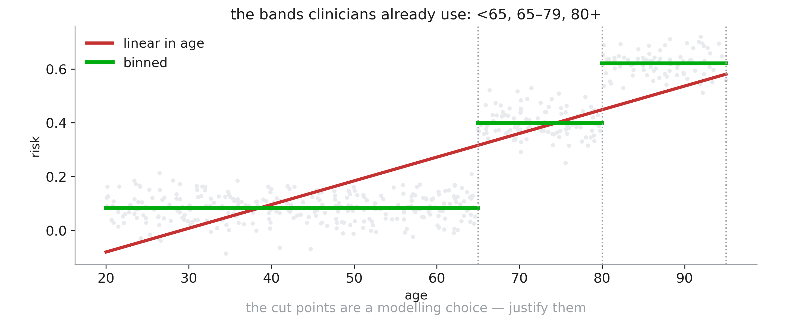

::: notes
The truth here is a step: risk jumps at 65 and again at 80. The straight red line has
to average across the jump and is wrong nearly everywhere; the green bands sit on
the data.
Two honest costs: everyone inside a band is now identical, so you lost resolution,
and the cut points came from you, not from the data. Using the bands clinicians
already use is a defensible choice; picking cut points by looking at the outcome is
not — that is fitting on the test set by hand.
:::

## Polynomial features — *intermediate*
Add powers of a variable so a linear model can bend.

**Example:** in-hospital risk is **U-shaped** in age — high for infants, low in
mid-life, high again in the elderly. `age` alone cannot express that; `age²` can.

```python
PolynomialFeatures(2, include_bias=False)
```

- Standardize first, or the powers dominate
- Degree 3+ overfits fast

## Polynomial features example

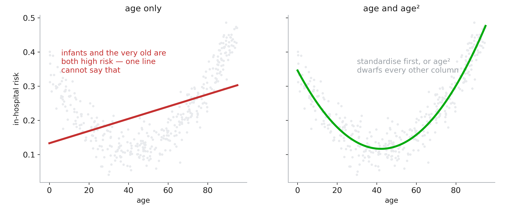

::: notes
In-hospital risk really is U-shaped in age. A single linear term has one slope to
spend, so it splits the difference and reports a gentle rise. Add age² and the same
linear model traces the U exactly — it is still linear in the weights, which is the
point that surprises people.
Two warnings on the slide: standardise first, or age² is in the tens of thousands
and dominates every penalty; and stop at degree 2 or 3 unless you have a reason.
:::

## Interaction features — *intermediate*
The effect of one variable depends on another: give the model the product.

**Example:** a creatinine of 1.4 is mild in a 30-year-old and alarming in an
85-year-old.

```python
df["creat_x_age"] = df.creatinine * df.age
```

## Interactions example

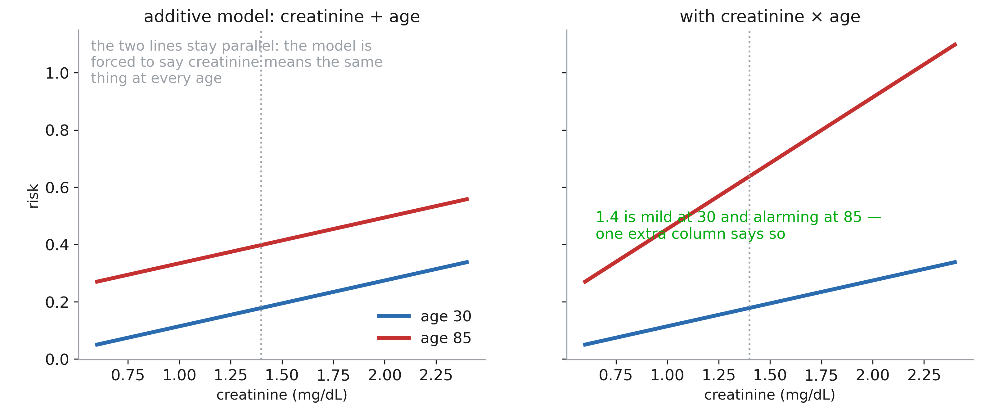

::: notes
Left: an additive model. It is free to give age its own effect and creatinine its
own, but the two lines are forced to stay parallel — creatinine has to mean the same
thing at 30 as at 85. Right: with the product term, the lines can diverge, and a
creatinine of 1.4 becomes mild in the young patient and alarming in the old one.
Worth saying: trees get this for free, because a split inside a split IS an
interaction. Linear models and, to a lesser extent, networks need you to hand it
over.
:::

## Lag / rolling features — *intermediate*
Where the value was, and what it has been recently.

**Example:** heart rate now vs 6 hours ago.

```python
hr = df.groupby("patient")["heart_rate"]
df["hr_lag1"]  = hr.shift(1)
df["hr_delta"] = hr.diff()
```

- Combine with rolling windows: `hr_mean_6h`, `hr_std_24h`
- The workhorse of any time-stamped dataset

## Group-relative features — *advanced*
Compare a value to its group instead of to the whole population.

**Example:** a heart rate of 95 is unremarkable in the ICU and high on a
general ward — so use the z-score **within the ward**.

```python
g  = df.groupby("ward")["heart_rate"]
mu = g.transform("mean")
sd = g.transform("std")
df["hr_z_ward"] = (df.heart_rate - mu) / sd
```

- Removes a site effect you do not want the model to learn
- Also useful per patient: deviation from that patient's own baseline

## Group-relative features example

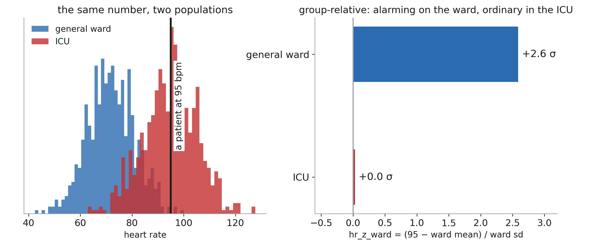

::: notes
95 bpm is +2.6 standard deviations on a general ward and dead average in the ICU.
The raw column says one thing; the within-group z-score says what a clinician would
say.
This also removes a site effect you do not want learned: if the ICU has both higher
heart rates and worse outcomes, the raw column lets the model use "heart rate" as a
proxy for "which ward", and that will not transfer to a hospital with a different
case mix. Same trick per patient — deviation from their own baseline — is often
stronger still.
:::

## Learned embeddings — *advanced*
Map a high-cardinality category to a dense vector learned with the model.

**Example:** 15 000 ICD-10 codes → 32 numbers each, trained jointly with the
classifier. Codes with similar outcomes end up close together.

```python
nn.Embedding(num_embeddings=15000,
             embedding_dim=32)
```

- Replaces a 15 000-column one-hot with 32 dense columns
- The embedding table itself is often worth inspecting

## Embeddings example

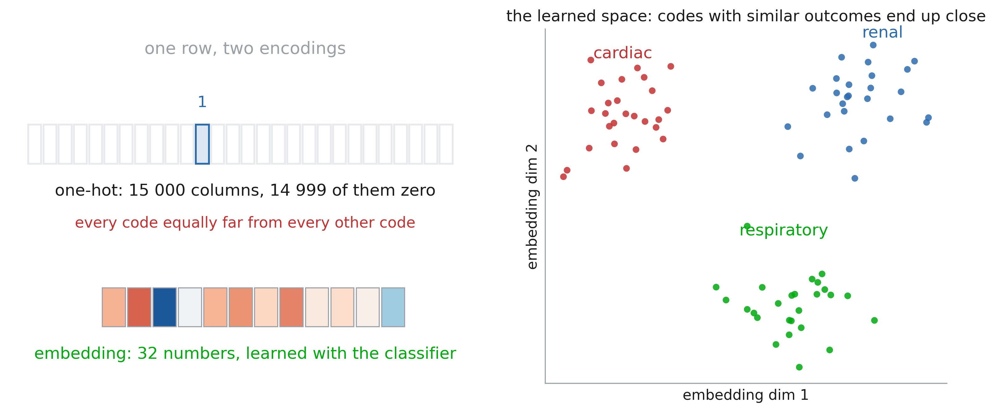

::: notes
Top: one-hot for 15 000 ICD-10 codes — one row is 14 999 zeros and a single 1, and
every code is exactly as far from every other. The model cannot know that two
cardiac codes are related. Bottom: 32 numbers per code, learned jointly with the
classifier, so codes that behave alike end up close.
Right: that learned space is worth looking at. Clusters that match clinical
groupings are a sanity check; clusters that match something else — a coding habit, a
particular hospital — are a warning. Flag that this is the first appearance of
representation learning, which is the rest of the course.
:::

## Representation learning — *advanced*
Stop hand-writing features: let the network learn them from the raw signal.

**Example:** feed the raw ECG waveform to a 1-D CNN instead of the hand-crafted
QRS duration, QT interval, and ST elevation.

- Wins when the raw signal is rich and the dataset is large
- You trade interpretability for capacity

# 3. Missing data

## Missingness is everywhere
Every real table has holes: a lab that was never ordered, a vital never charted
— and the lag features we just built add more.

Three bad reflexes:

1. Drop the rows → you may drop the sickest patients
2. Fill with 0 → 0 is a *value*, and a physiologically absurd one
3. Fill with the mean → the model now sees a fake, over-confident cohort

**The first question is never "what do I fill it with?" but "why is it missing?"**

## Look at the holes first

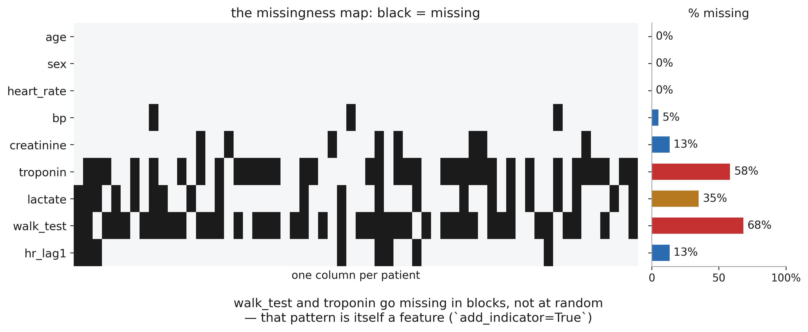

::: notes
The first thing to run on any new table. Rows are features, columns are patients,
black is missing.
Read the structure out loud: age and sex are complete, bp has scattered holes, and
troponin, lactate and walk_test go missing in blocks. Blocks mean a REASON — a test
that is only ordered for certain patients, a device only present in the ICU. That
reason is often predictive, which is why `add_indicator=True` is nearly free
accuracy.
Also point at hr_lag1: those holes are ones we manufactured last section.
:::

## Three mechanisms
| Mechanism | Missingness depends on |
|---|---|
| **MCAR** | nothing |
| **MAR** | the **observed** data |
| **MNAR** | the **missing value itself** |

::: notes
Write P(missing) on the board and ask, for each mechanism, what it is allowed to
be a function of. The mechanism decides which methods are unbiased.
:::

## MCAR — missing completely at random
`P(missing)` depends on **nothing**.

- **Example:** a lab analyser broke down for two days; a tube was dropped
- The observed rows are a **random sample** of all rows
- Deleting rows loses power but does **not** bias estimates
- Rare in practice

## MAR — missing at random
`P(missing)` depends only on the **observed** variables.

- **Example:** troponin is ordered mostly for patients over 60 with chest pain

  → missingness depends on `age` and `symptom`, both of which you *have*

- Given age and symptom, the missing troponins are random
- **Good news:** conditioning on the observed data fixes it

## MNAR — missing not at random
`P(missing)` depends on the **unobserved value itself**.

- **Example:** the 6-minute walk test is missing because the patient was
  **too sick to walk**
- **Example:** income missing precisely for the highest earners
- **No imputation can recover this from the data alone**: you need domain
  knowledge, an explicit model of the missingness, or a sensitivity analysis

## The three mechanisms

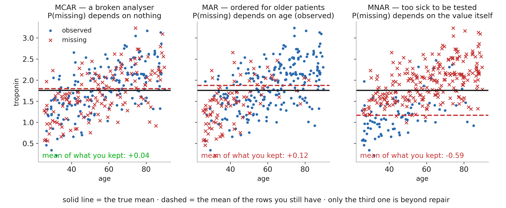

::: notes
Same 320 patients, same troponin, three different reasons for the crosses to be
missing. Compare the dashed line (the mean of what you kept) with the solid one (the
truth).
MCAR: the crosses are scattered, the dashed line sits on the solid one, and you have
lost only power. MAR: missingness follows AGE, which you have — the marginal mean is
biased, but a model that conditions on age can undo it. MNAR: missingness follows the
troponin itself, so the whole top of the distribution is gone and your mean is off by
0.6 with nothing in the data to warn you.
Say the operational consequence: the first two are handled by method; the third is
handled by domain knowledge and a sensitivity analysis, and by writing down what you
assumed.
:::

## Can I test the mechanism?
MCAR vs MAR is **testable-ish**: does missingness relate to observed columns?

```python
m = df["creatinine"].isna()
df.groupby(m)[["age", "heart_rate"]].mean()
```

- MAR vs MNAR is **not testable** (the evidence is, by definition, missing)

::: notes
Insist: "MAR" is an assumption you defend, not a property you prove.
:::

## Imputation strategies
| Strategy | Use when | Risk |
|---|---|---|
| Drop rows | MCAR, few rows | Bias if not MCAR, power loss |
| Drop column | > ~50% missing, low value | Loses a real signal |
| Mean / median | Quick baseline | Shrinks variance, distorts correlations |
| LOCF / interpolate | Time series, dense | Fakes stability, hides trends |
| kNN | Few features, MAR | Cost, scaling-sensitive |
| Iterative (MICE) | MAR, many features | Slower, must fit on train only |
| Model-native | Trees, LightGBM/XGBoost | Only some learners |

## Simple imputation in code
```python
from sklearn.impute import SimpleImputer

pipe = make_pipeline(
    SimpleImputer(strategy="median",
                  add_indicator=True),
    StandardScaler(),
    LogisticRegression(),
)
```

- Imputation is a **fitted transform**: it learns the medians
- Put it in the **pipeline**, so it is refit inside every CV fold
- `add_indicator=True` gives you the missingness flag for free

## What mean imputation does to the data

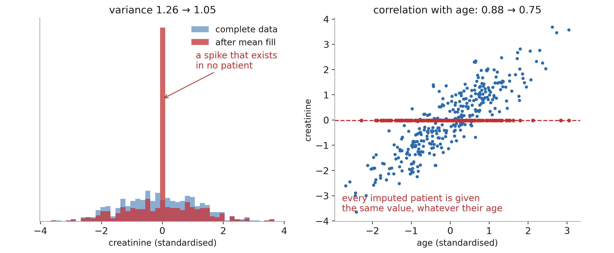

::: notes
Left: fill 35% of a column with its mean and you get a spike no patient sits on, and
the variance drops from 1.26 to 1.05. Every downstream standard error is now too
small.
Right: worse than the histogram. Every imputed patient is given the same value
regardless of age, so the imputed points lie on a flat line and the correlation with
age falls from 0.88 to 0.75. Mean imputation does not just add noise — it actively
pulls relationships toward zero.
That is the argument for conditional imputation (kNN, MICE) and for keeping the
indicator column.
:::

## Why single imputation is not enough
You filled in a number and then **pretended you had measured it**.

- The point estimate can be fine
- The **standard errors are too small**: the model has no idea the value
  was invented
- Consequence: over-confident intervals, over-confident p-values

**Multiple imputation** puts that uncertainty back in.

## Multiple imputation (MICE)
1. **Impute:** build m complete datasets (typically m = 5 to 20), each drawing
   plausible values for a missing column from a model of that column given all
   the others
2. **Analyse:** run your full analysis *separately* on each of the m datasets
3. **Pool:** combine the m results with **Rubin's rules**

- The m datasets differ **only where data was missing**

## Multiple imputation illustration

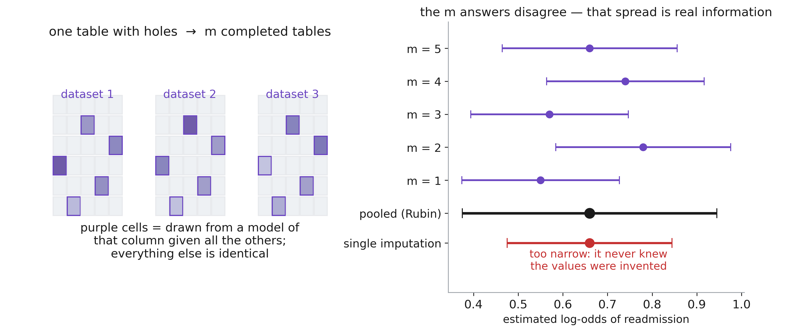

::: notes
Left: m completed tables that are identical everywhere except in the holes, where
each draws a plausible value from a model of that column given the others.
Right: run the analysis m times and the answers disagree — that disagreement is the
information single imputation destroys. The pooled interval (black) is wider than
the single-imputation one (red), and it is wider by exactly the amount your
uncertainty was understated.
If they take one thing: the point estimate barely moved; the honesty of the interval
is what changed.
:::

## Rubin's rules
```text
Q_bar = mean(Q_1, ..., Q_m)
T     = U_bar + (1 + 1/m) * B
```

- `Q_bar`: the **pooled estimate**, `T`: its **total variance**
- `U_bar`: mean of the m sampling variances
- `B`: variance **of** the m estimates ("the imputation uncertainty")
- That second term `(1 + 1/m) * B` is what single imputation throws away

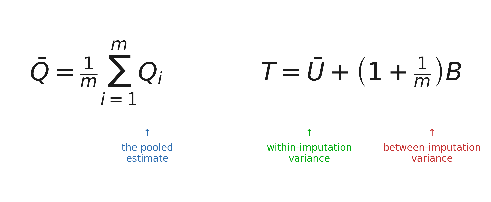

::: notes
Read the second formula left to right. Ū is the uncertainty you would have had with
complete data, averaged over the m runs. B is how much the m estimates disagree —
the price of not having measured the value. The (1 + 1/m) is a small-sample
correction: with m = 5 you pay 20% extra for having used finitely many imputations.
Single imputation reports Ū and stops. Everything to the right of the plus sign is
what it throws away, and it is often the larger term.
:::
