## Main question
> We have a dataset and a fixed computational budget.
> 
> How to systematically build the **best-generalizing** model?

::: notes
Set the frame: this is not nine disconnected topics, it is one story. Session 2
built the feature table and dealt with missing data. Today: what do we do with it.
Running example throughout: 30-day readmission risk from that same tabular record.
Tell them the deck is deliberately light on text — the text is me.
:::

## Every topic answers one piece

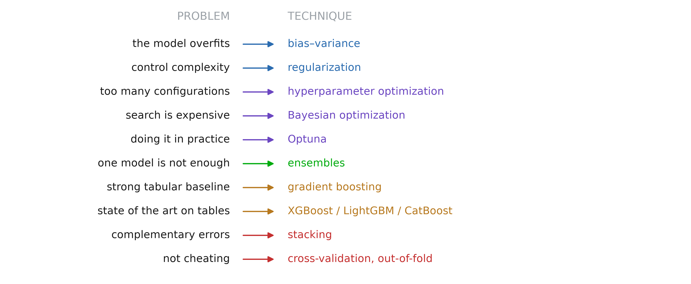

::: notes
Walk down the left column, not the right. Each row is a problem a student will
actually hit this semester; the right column is only the name of the answer.
Promise them we come back to this exact table at the end.
:::

# From training error to generalization

## Training error vs test error

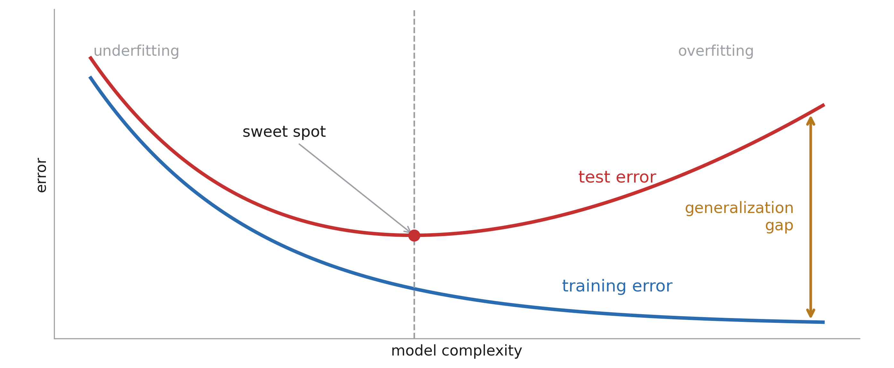

::: notes
Training error falls monotonically. Test error is U-shaped, classically. The gap
between them is the generalization gap. Point at the two ends and name them:
underfitting on the left, overfitting on the right. The sweet spot is not a
constant — it moves with sample size, which I'll show in two slides.
:::

## One dataset, three capacities

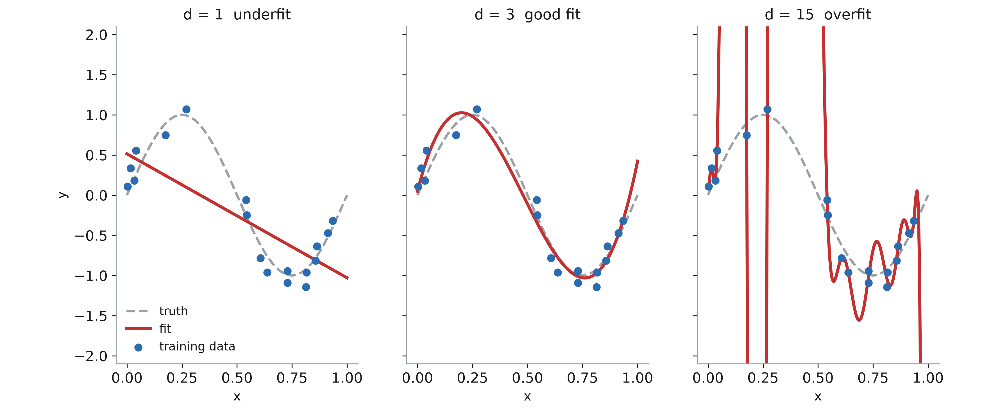

::: notes
18 points from sin(2πx) plus noise. Degree 1 cannot bend. Degree 3 is about right.
Degree 15 passes through every single point and oscillates wildly between them.
This is the single most memorable picture of overfitting — let it sit.
Ask before revealing the next slide: which of these has the lowest TRAINING error?
:::

## Polynomial fit

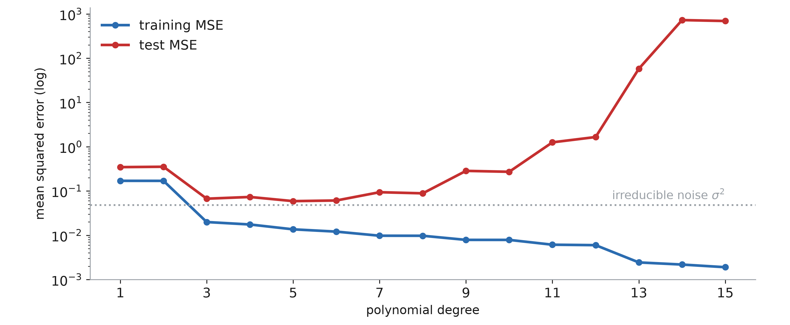

::: notes
Training MSE collapses toward zero. Test MSE bottoms out around degree 3 and then
explodes — note the log axis, this is orders of magnitude. The dotted line is the
noise floor σ²: no model can beat it. A model that appears to beat it is leaking.
:::

## Two different failures
- High training error, high test → the model **cannot** represent the signal
- Low training, high test → the model represents the **noise**

::: notes
This is the diagnostic habit I want them to build: always look at both numbers.
More capacity fixes the first and makes the second worse. More data fixes the
second and does nothing for the first. Naming which one you have is the whole job.
:::

## What makes a model generalize?
> How **wrong on average** is my model family?
> 
> How much does it **move** when I resample the data?
> 
> How much of the target is simply **unpredictable**?

::: notes
Three questions, three terms. Not "which algorithm is best" — that question has no
answer. Transition straight into the decomposition.
:::

# The bias–variance tradeoff

## Thought experiment

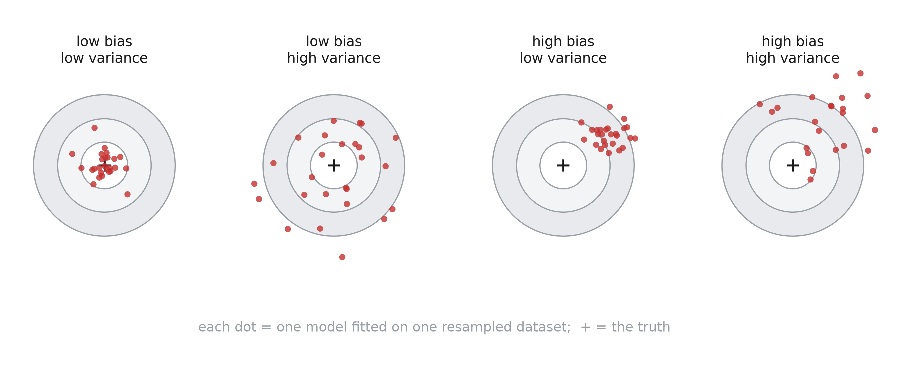

::: notes
Fix a test point. Imagine drawing many training sets from the same distribution
and fitting one model on each. Bias is where the cluster sits; variance is how
wide it is. Stress hard: these are properties of a PROCEDURE over hypothetical
datasets, not of the one model you fitted. Students consistently misread this.
Ask which panel they would rather have — the answer depends on the noise level.
:::

## Expected prediction error
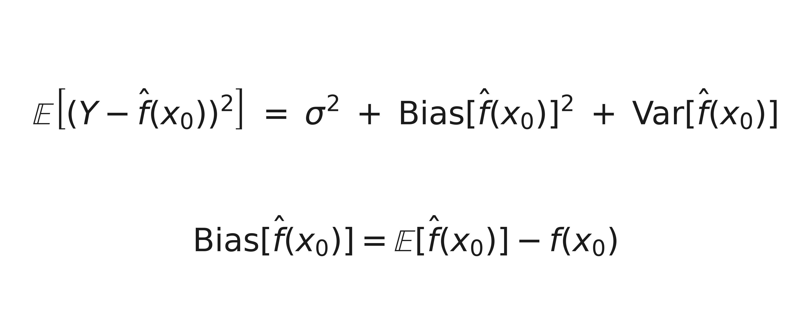

::: notes
Expectation over both the noise AND the random training set. Do not derive it —
add and subtract the mean prediction inside the square, cross term vanishes, done.
Three minutes maximum. It matters as vocabulary, not as an exercise.
σ² is the floor and cannot be reduced by any model. The other two trade off.
:::

## 40 datasets, each giving a different fit

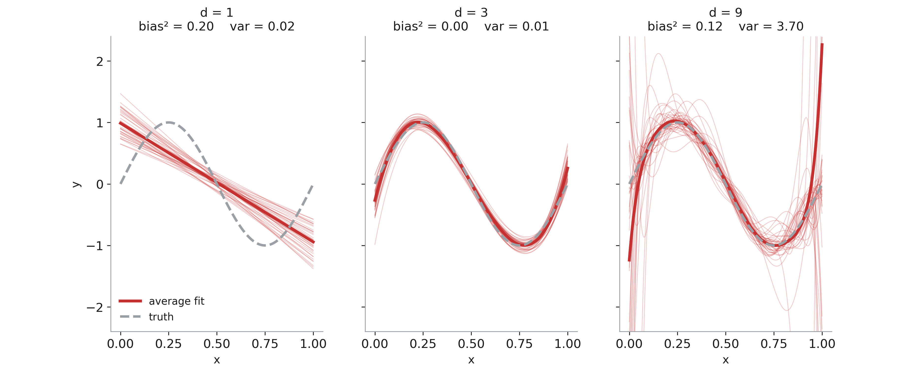

::: notes
Each thin line is one fit on one resampled dataset; the thick line is their
average. Left: all 40 fits agree with each other and all are wrong — that is bias.
Right: the average is nearly perfect but no individual fit is anywhere near it —
that is variance. Read the printed numbers aloud; they are computed, not invented.
:::

## Bias-variance decomposition

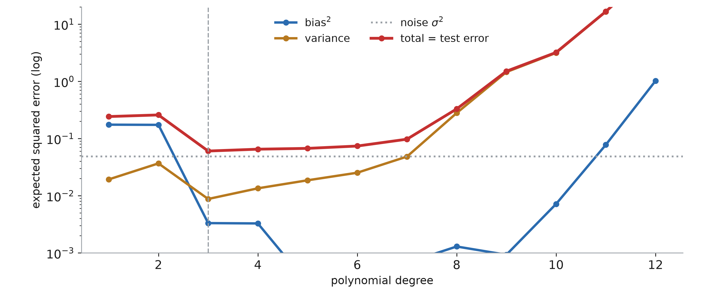

::: notes
Bias² falls, variance rises, noise is flat, and the sum is the test error with its
minimum at the dashed line. Everything here is measured over 120 resampled
datasets, not asserted. The optimum is a property of the problem AND the sample
size: with ten times more data the minimum shifts right. Capacity should scale
with n — "which degree is best" has no answer without n.
:::

# The modern view

## Beyond the classical regime

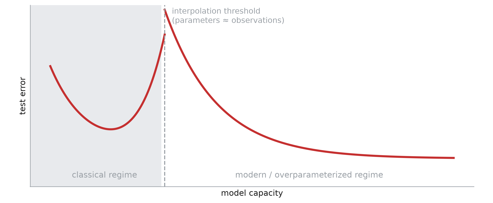

::: notes
Everything so far said: past the sweet spot, more capacity is worse. That is true
in the shaded region, and it is where nearly all classical statistics lives.
But keep pushing capacity and something else happens. The peak sits where the
model has just barely enough parameters to fit the training data exactly — the
interpolation threshold — and past it the test error comes DOWN again.
Flag that this is a schematic; the next slide is the real experiment.
:::

## Double descent

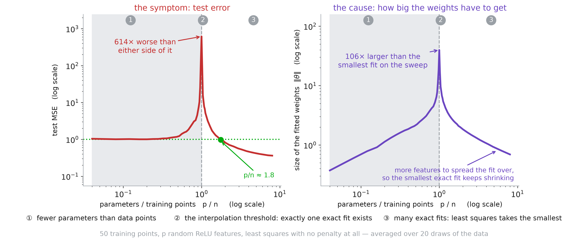

::: notes
The experiment first, so they know it is not a cartoon: 50 training points, targets
from a linear teacher plus noise, and p random ReLU features. Fit by least squares
with NO regularization; where p > n take the minimum-norm solution. Sweep p, average
over 20 seeds. Both panels share the x-axis: p / n, so 1 is the threshold.
Walk the three badges left to right, they are the whole slide.
① p < n: fewer knobs than data points. No exact fit exists, least squares has to
compromise, and compromising averages the noise away. Flat, and roughly as good as
it gets classically — that is the green dotted line.
② p = n: the system is square. Exactly ONE setting passes through all 50 points,
the model has no freedom left, and to hit noisy targets it contorts. 614x worse.
③ p > n: underdetermined. Infinitely many settings give zero training error, they
are NOT equally good, and least squares hands you the smallest one. Error falls,
and from p/n ≈ 1.8 (the green dot) it is better than anything ① could reach.
Now the right panel — ask them to predict it before you show it. Same three phases,
same peak in the same place, but the quantity is the size of the fitted weights.
That is the whole explanation: the blow-up is not mysterious, it is the coefficients
going 106x larger than anywhere else on the sweep, and coming back down once there
are enough features to spread the fit over. Symptom left, cause right.
:::

## The optimizer is crucial for under-determined cases

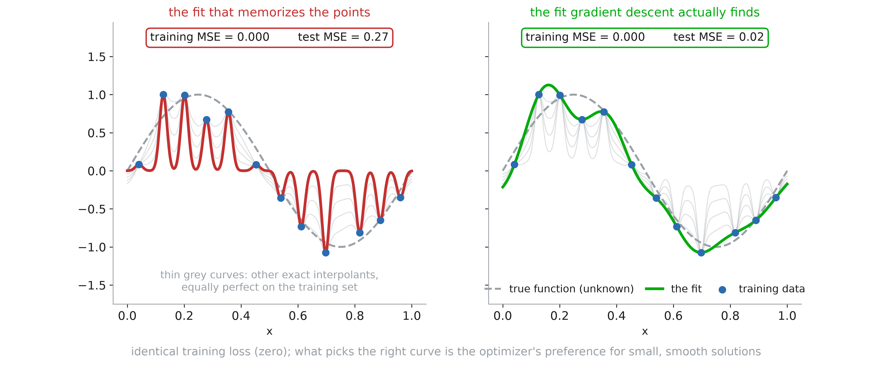

::: notes
Walk the picture before the point. Same twelve training points on both sides, same
unknown sine underneath. Every curve drawn here — the red one, the green one, and
the four thin grey ones in between — passes exactly through all twelve points, so
every one of them has training MSE zero. Read the two boxes aloud: identical
training loss, test loss 10x apart. The grey curves are there to say the choice is
not binary — there are infinitely many exact interpolants, and blending any two of
them gives another one.
So the loss no longer determines the solution: it is satisfied by all of them
equally. What breaks the tie is the optimizer. Least squares takes the
minimum-norm solution; gradient descent from a small initialization drifts to much
the same place — that is the green curve, and nothing in the objective asked for
it. That implicit preference for small, smooth solutions is doing the work of a
regularizer that nobody wrote down.
So "zero training error" no longer implies "memorized the noise" — it depends
entirely on WHICH zero-error solution you landed on. The training procedure has
become part of the model specification.
Worth saying out loud: this is why parameter count is a bad measure of capacity.
What matters is how strongly the fit is constrained, not how many knobs exist.
:::

## Regularize can reduce the peak

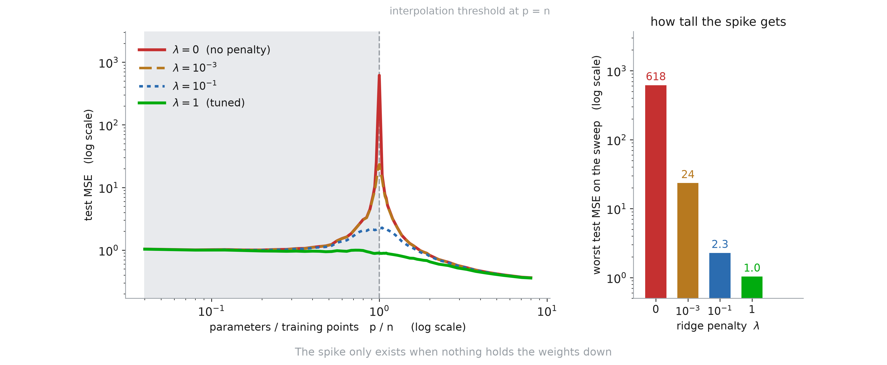

::: notes
Same experiment, same sweep, the only change is a ridge penalty on the weights —
i.e. we now forbid exactly the thing the previous slide identified as the cause.
Left: four sweeps. Right: the same four runs reduced to one number each, the worst
test error anywhere on the sweep. Read the bars, they are the argument: 618, 24,
2.3, 1.0. A penalty of 10⁻³ — almost nothing — already kills 96% of the spike, and
with λ tuned the worst point on the whole curve is just the ordinary error level;
the green curve falls monotonically, there is no peak at all.
Note the far right of the left panel: once p ≫ n all four coincide. The penalty
only matters near the threshold, which is exactly where the weights blow up.
The honest summary: double descent is a symptom of interpolating WITHOUT
regularization. It is real, and it explains why huge models work, but it is not a
reason to skip regularization — it is an argument for it. Which is section 4.
Practical caveat for their own work: if you see a bump in a validation curve near
where parameters ≈ observations, that is this phenomenon, not a bug — and the fix
is on this slide.
Close the section on the through-line: complexity is not inherently bad,
UNCONTROLLED complexity is. Three ways to control it, which is the rest of the
session — constrain the model (regularization), choose the constraints well
(hyperparameter optimization), average away what is left (ensembles).
:::

# Regularization

## Regularized empirical risk minimization
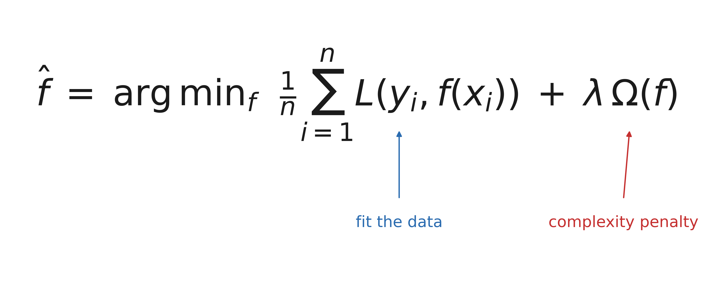

::: notes
Plain ERM over a rich family chases the noise: with enough capacity the empirical
risk hits zero while the true risk is terrible. So make some members of the family
more expensive than others. λ = 0 is plain ERM; λ → ∞ collapses to the simplest
member. λ is a hyperparameter, not a parameter — that distinction is section 7.
:::

## λ is the bias–variance dial

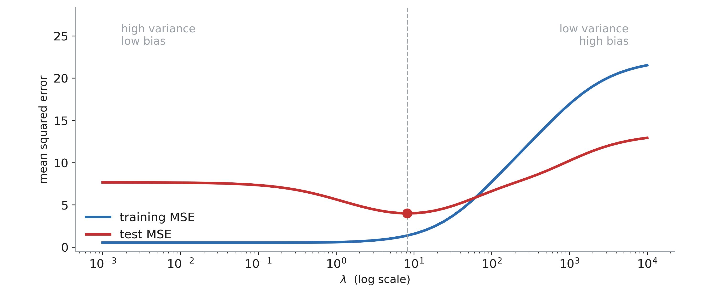

::: notes
45 observations, 30 features, ridge. Left edge: low bias, high variance, the fit
is chasing noise. Right edge: everything shrunk to nothing, high bias. The minimum
is where trading variance for bias stops being profitable. You find it on a
VALIDATION set — never on the training curve, which just slopes down forever.
:::

## Ridge and lasso
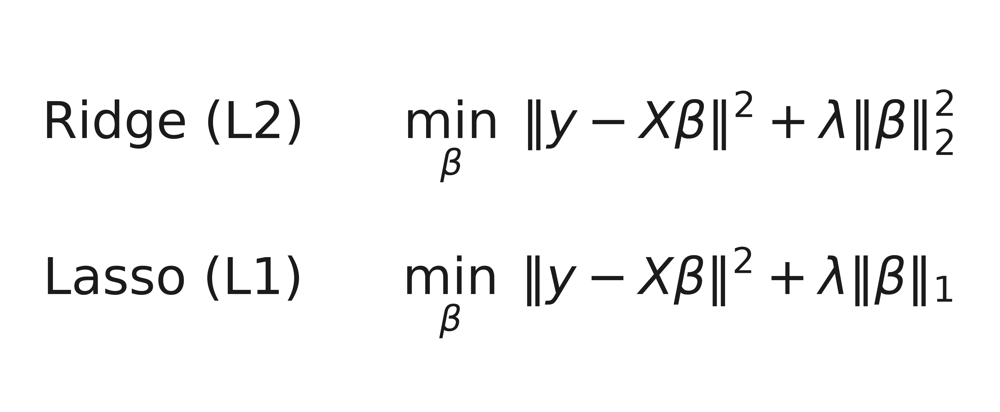

::: notes
Ridge has a closed form, (XᵀX + λI)⁻¹Xᵀy, always invertible even when p > n.
Lasso has none — coordinate descent or LARS. Practical warnings, say them now:
standardize first, because the penalty is scale-dependent and an unscaled feature
is effectively unregularized; do not penalize the intercept; put the scaler inside
the pipeline so it refits in every CV fold; scan λ on a log grid.
:::

## Ridge and lasso effect on coefficients

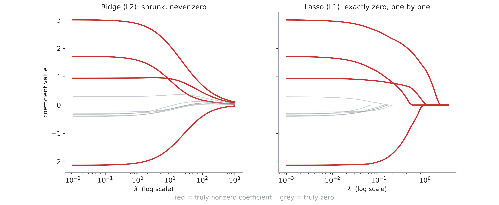

::: notes
Red are the four truly nonzero coefficients, grey the six truly zero ones. Ridge
shrinks everything smoothly and nothing ever reaches zero. Lasso switches them off
one at a time, and by the right-hand edge only the strongest survives. That is
feature selection for free. Caveat for clinical data: among correlated predictors
lasso keeps one and drops the rest, which is why elastic net exists.
:::

## Ridge's and lasso's geometry

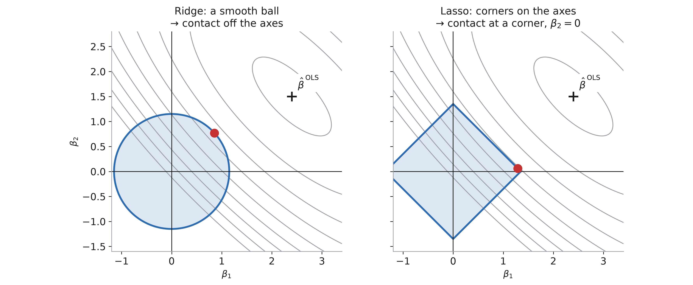

::: notes
The solution is where the loss contour first touches the constraint set. The L2
ball is smooth, so contact happens generically off the axes. The L1 ball has
corners ON the axes, and corners stick out — contact at a corner means a
coefficient is exactly zero. In p dimensions the L1 ball has corners, edges and
faces, most of them low-dimensional. Sparsity is geometry, not a thresholding hack.
:::

## Regularization can be done in many ways

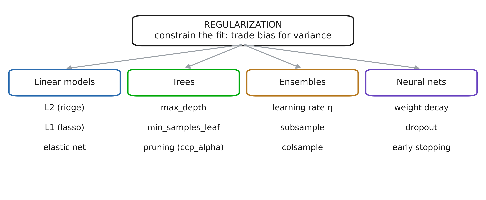

::: notes
Anything that restricts what the fit can do, trading a little bias for a lot of
variance. It does not have to appear in the objective: it can be a constraint,
injected noise, a stopping rule, or extra data. Every model here has at least one
such knob, none has a default that is right for your dataset, and they interact.
Augmentation is a claim about an invariance — a horizontal flip on a chest X-ray
is wrong, because dextrocardia is real. A wrong invariance adds bias.
:::

## Depth can be used as regularization

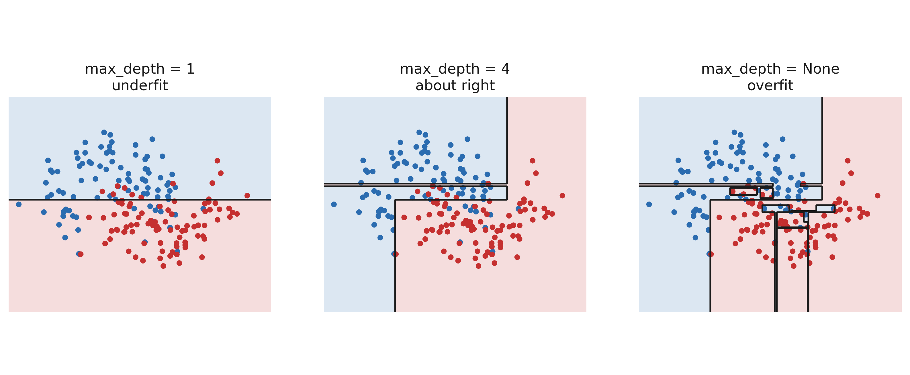

::: notes
Depth 1 is a single line. Depth 4 recovers the moons. Unbounded depth carves out
islands around individual noisy points — a lookup table, zero bias, maximal
variance. In practice min_samples_leaf is the more robust knob than max_depth.
:::

## Early stopping can also be used as regularization

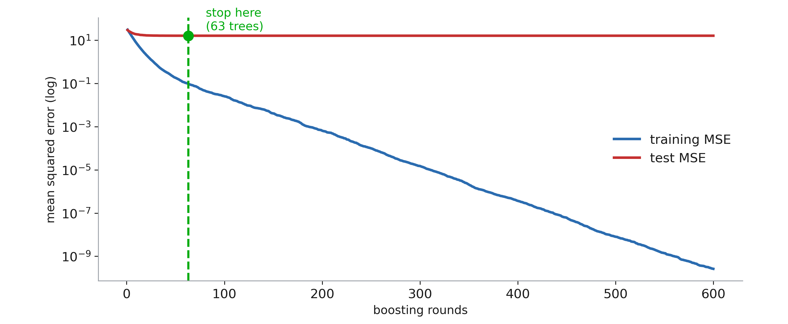

::: notes
Gradient boosting on Friedman-1. Training MSE keeps falling forever. Test MSE
bottoms out and climbs. Stopping at the green line IS regularization — nothing was
added to the objective. This is also exactly how you should choose the number of
trees in part VI, so flag it now.
:::

# The hyper-parameter landscape

## Parameters vs hyper-parameters
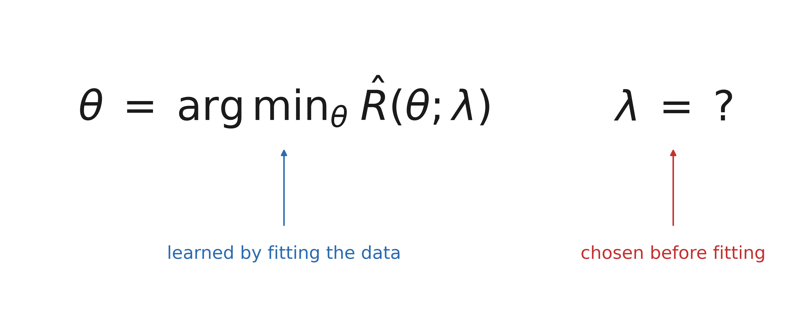

::: notes
θ is learned by fitting; λ is chosen before fitting. Why can't we learn λ the same
way? Because minimizing TRAINING loss over λ gives the degenerate answer every
time: λ = 0, max_depth = ∞, as many trees as you can afford. Those are exactly the
settings that let the model memorize. Hyperparameters must be scored on data the
fit has not seen. Preprocessing choices count too: scaler, encoder, imputer.
:::

## Hyperparameter search is hard
- Expensive evaluations
- Noisy
- Non-convex
- Mixed continuous / integer / categorical

::: notes
No gradient with respect to λ. Each evaluation is a full model fit or a full CV
loop. Conditional structure means the space is a TREE, not a box: gamma only
exists if the kernel is RBF. Grid search cannot express that; Optuna can.
:::

## Search on a linear / log scale

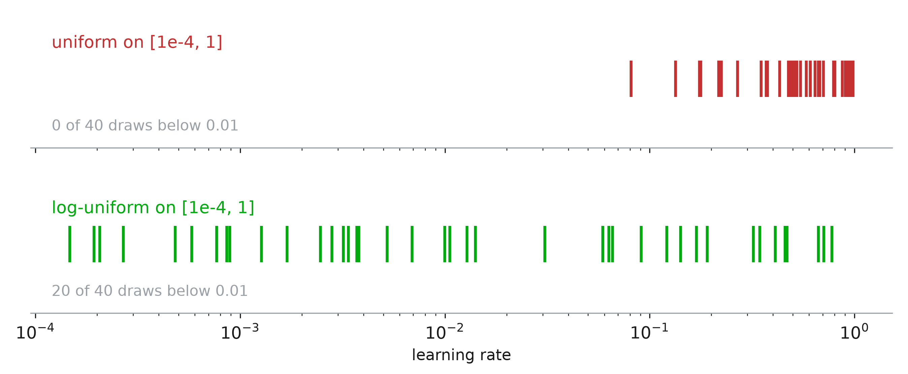

::: notes
Same range, same number of draws. Uniform sampling puts almost nothing below 0.01
— read the counts. Learning rates, regularization strengths, C, gamma: always log.
Depths, counts, folds: linear integers. This one line of code is the difference
between a search that works and one that mysteriously does not.
:::

## The 1D landscape

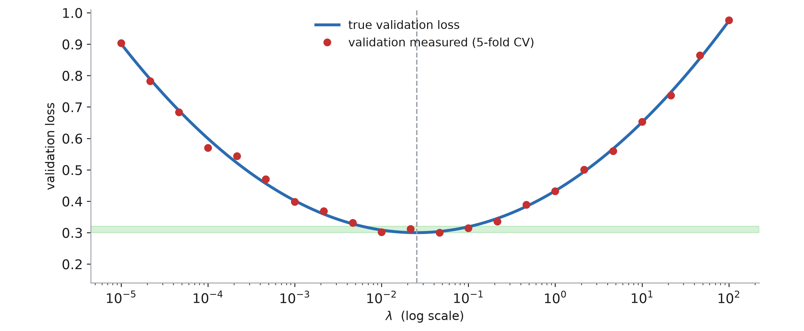

::: notes
Smooth and roughly convex on a LOG scale — which is why we search orders of
magnitude, not increments. Nearly flat near the optimum: everything in the green
band is statistically indistinguishable, so chasing the exact minimum is wasted
budget. And the red dots are what you actually measure: the objective is noisy.
:::

## The 2D landscape

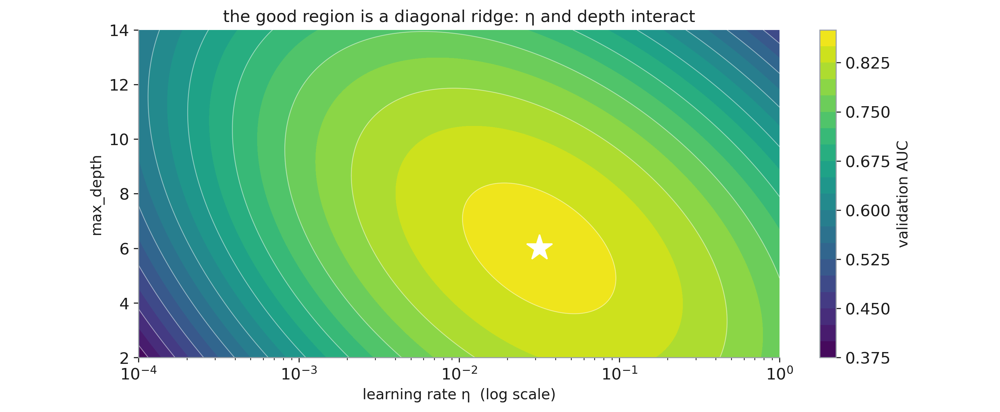

::: notes
The good region is a diagonal RIDGE, not a point: learning rate and depth trade
off against each other. Consequence — tuning one knob at a time is unreliable,
because the best depth depends on the learning rate you happened to fix.
:::

## Three hyper-parameters search strategies

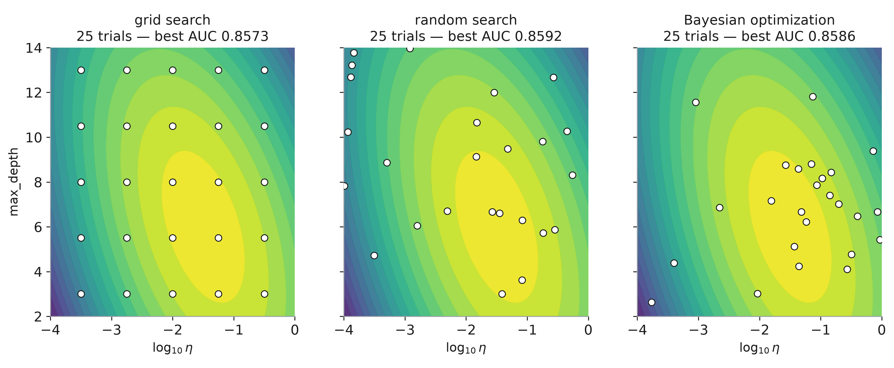

::: notes
Same surface, same 25-trial budget. Grid is regular and coarse. Random covers.
Bayesian starts random then concentrates on the ridge — look at the clustering.
Honesty slide: with 1000 cheap parallel fits, random search is hard to beat.
Bayesian optimization is inherently sequential, and that is its cost. Use it when
fits take minutes, the budget is 50–500 trials, and you have 3–20 knobs.
:::

# Bayesian optimization

## Replace the expensive loss function by a cheap surrogate

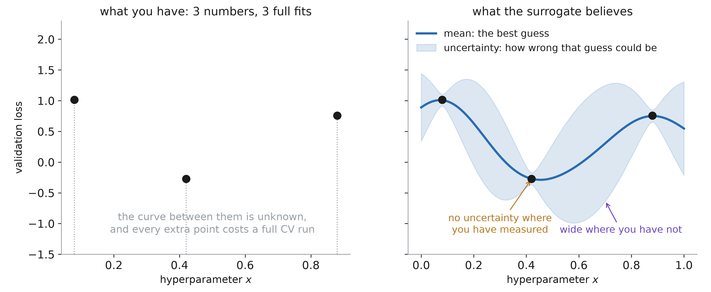

::: notes
Set the scene: the function we are minimizing is "hyperparameters in, validation
score out", and one evaluation is a full cross-validation — minutes. We can afford
a few dozen calls, no more, and we get no gradient.
Left: after three trials that is literally all we know — three isolated numbers.
Right: fit a cheap probabilistic model, the surrogate, to those three points. A
Gaussian process is the usual choice; think of it as smooth interpolation that
also reports how sure it is. It answers in milliseconds, so we can ask it about
thousands of candidate settings for free — that asymmetry is what the method
exploits. Two outputs at every x: a mean (best guess) and a band (how wrong the
guess could be). Note the band pinches to nothing at the three measured points.
:::

## The surrogate knows what it does not know

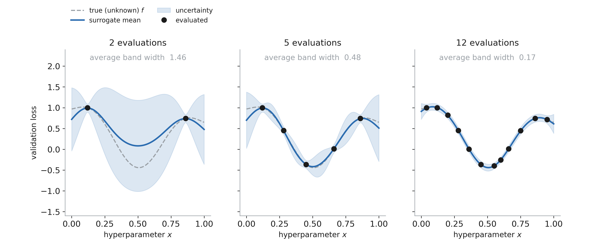

::: notes
Same true curve, more evaluations. The band is the honest part of the model: wide
where nothing has been measured, and shrinking everywhere a point is added — read
the printed average width, 1.46 down to 0.17. By twelve points the surrogate has
essentially recovered the curve.
Two remarks students always ask about. Far from any data the mean drifts back to
the prior (flat here) — with no evidence the model returns to its default belief.
And the band never closes completely, because evaluations are noisy: a different
CV split gives a slightly different score.
This is the ingredient random search does not have. Random search cannot say "I
have never looked between 0.5 and 0.9"; the surrogate can, and the next slide
turns that into a decision.
:::

## Building the surrogate: a distribution over curves

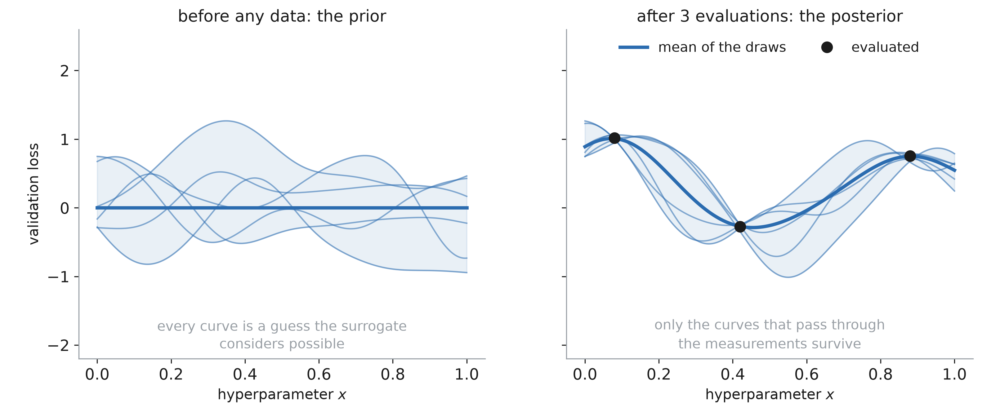

::: notes
This is the "how" behind the previous two slides. A Gaussian process is not one
curve, it is a probability distribution over curves, and both panels show six
draws from it.
Left, before any data: the prior. Every curve is smooth — that is the only thing
we have assumed — and they scatter around a flat mean. Say out loud that the flat
line is a default belief, not a prediction.
Right, after three evaluations: keep only the curves that agree with what we
measured. That is all conditioning is. The thick line is the average of the
survivors — that is the mean — and their spread is the band. Where the survivors
still disagree we are uncertain; at a measured point they all pass through it, so
the band pinches shut.
If someone asks why the curves do not pass EXACTLY through the dots: the model
allows for noise in the measurement, which is honest — a different CV split would
have given a slightly different score.
:::

## Kernels for modeling

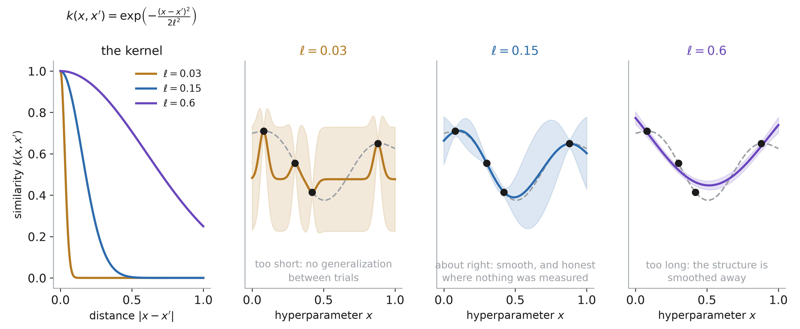

::: notes
The only thing you choose when you build the surrogate is the kernel: a function
saying how similar two hyperparameter settings are. Left panel, the standard
choice — squared exponential — similarity 1 at zero distance, decaying with a
length-scale ℓ.
Read ℓ as "how far a measurement's influence reaches". The three panels use the
same four points and differ only in ℓ.
ℓ too short: each point informs nothing but itself, the mean snaps straight back
to the prior between trials, the band is wide everywhere. The surrogate is a
lookup table and the search degenerates to random.
ℓ too long: everything is assumed similar to everything, the real structure is
smoothed into one broad bowl, and the band is falsely narrow — overconfident.
About right: smooth where we have evidence, uncertain where we do not.
Two practical consequences. One, this is why you search learning rates on a LOG
scale: "nearby" has to be measured in the units in which the loss actually
behaves. Two, ℓ is a hyperparameter of the hyperparameter search — libraries fit
it to the observed trials by maximizing the marginal likelihood, so you never set
it by hand. Note the honest recursion here and move on.
:::

## Sum of the bumps

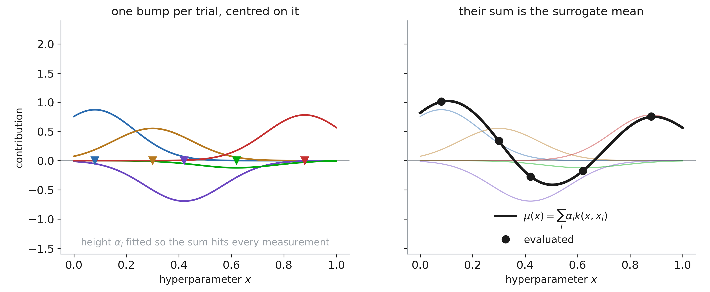

::: notes
The same arithmetic seen as a curve instead of a table.
Rearranged, μ(x) = Σ αᵢ k(x, xᵢ): one kernel bump per trial, centred on that
trial, and the only freedom is each bump's height αᵢ. Left panel: those five
bumps. Note two are negative — a trial can pull the curve down, which is how the
model represents "the neighbour already accounted for this".
Right: add them up and you get exactly the blue mean curve we have been staring
at since the start of the section, passing through all five measurements.
Two consequences worth stating. Far from every trial all the bumps have decayed
to zero, so the mean returns to the prior — that is the flat region students ask
about. And the width of a bump is the length-scale: it is literally how far one
measurement's influence reaches, which is the previous slide seen from the other
side.
:::

## Noises levels

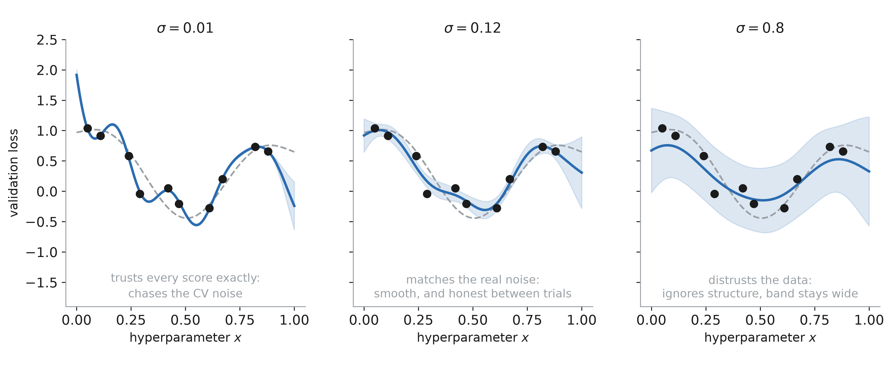

::: notes
Beside the length-scale there is σ, how much measurement noise the model assumes,
the σ²I added to the diagonal. Same nine trials, same kernel, three values.
σ ≈ 0: the curve is forced through every score exactly, so it invents oscillations
between nearby trials to reconcile scores that only differ by CV noise. It is
overfitting, in the same sense as the first section of today's lecture.
σ far too large: the model treats the scores as mostly noise, keeps a wide band
even where it has measured, and flattens toward the prior. It learns nothing.
Matched to the real noise: smooth through the trials, tight band at them, honest
between them.
This matters because our scores ARE noisy — resplit the CV and the number moves.
Ask the room what σ ≈ 0 does to the acquisition function: it drives uncertainty to
zero at every measured point and makes the search chase artefacts. Libraries fit σ
along with ℓ by maximizing the marginal likelihood; the reason to know it exists
is that it is the knob that decides whether the surrogate interpolates or smooths.
:::

## Decide where to spend the next fit on
- The **mean** says where the loss is *probably* low → **exploit**
- The **band** says where it *could* be low → **explore**
- Maximize the *acquisition*, not the model

::: notes
Deliberately a text slide: this is the conceptual jump of the whole section.
We never optimize the expensive function directly. We optimize a cheap surrogate
score over the whole space, spend one real evaluation at its argmax, then update.
Ask the room what happens if we only use the mean — someone will say "it gets
stuck where it already looked", which is exactly right and is the greedy failure
we come back to in two slides.
The acquisition also solves a practical problem: it turns a search over a space
we cannot differentiate into maximizing a closed-form function we can evaluate at
thousands of points for nothing.
:::

## Exploration vs exploitation

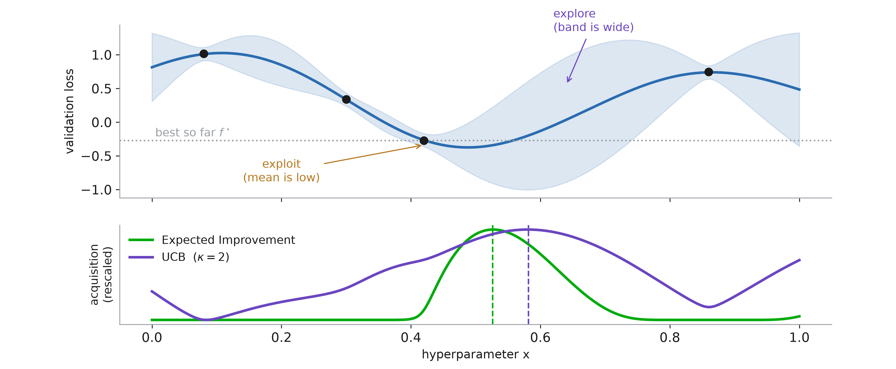

::: notes
Two ways to score a candidate. Expected Improvement is large where the mean is
good OR the uncertainty is big, and balances the two with no knob. UCB gives you
an explicit dial κ: zero is pure greed, large is near-random, and it is often
annealed down as budget is consumed. Too greedy misses the global optimum; too
exploratory never converges. That trade-off is all an acquisition function is.
:::

## Full algorithm

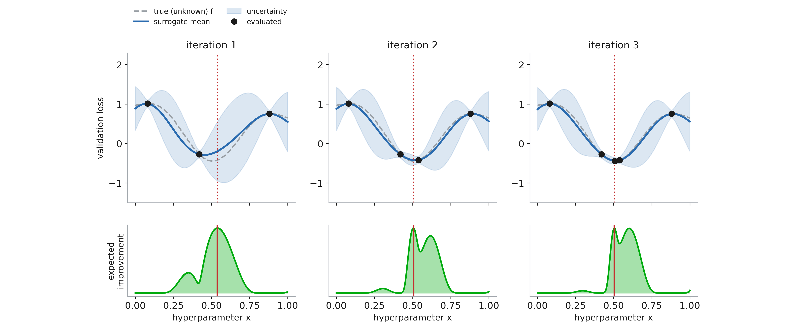

::: notes
Top: a Gaussian process gives a mean and an uncertainty band at every untried
point — uncertainty is zero at evaluated points and grows away from them. Bottom:
the acquisition function scores each candidate, and its maximum is the next point
to evaluate. That evaluation is expensive; the acquisition is cheap, so we can
optimize it densely. Follow one iteration across all three columns.
:::

## The loop (simplified)
```python
# 5-10 random trials to begin
D = [(x, evaluate(x)) for x in random_start]

for t in range(budget):
    # cheap: compute fit and expected improvement
    model  = fit_surrogate(D)
    score  = lambda x: expected_improvement(model, x, best(D))
    # cheap: find best candidate
    x_next = argmax(score, over=search_space)
    # expensive: one full CV run
    D.append((x_next, evaluate(x_next)))
```

::: notes
The whole method, and every library implements exactly this. Three things to say.
One: `evaluate` is the only expensive line — one full cross-validation per pass of
the loop, everything else is arithmetic on a few dozen points. Two: the random
start is not optional; with no data the surrogate has nothing to model, which is
why Optuna's TPE ignores its model for the first ten trials. Three: the loop is
sequential by construction — trial t+1 needs trial t's answer. That is the price
we pay for the sample efficiency, and it is why random search still wins when you
have a hundred machines and cheap fits.
:::

## Optuna
```python
def objective(trial):
    depth = trial.suggest_int("depth", 3, 12)
    lr    = trial.suggest_float("lr", 1e-4, 0.3, log=True)

    model = XGBClassifier(max_depth=depth, learning_rate=lr)
    return cross_val_score(model, X, y, cv=5,
                           scoring="roc_auc").mean()

study = optuna.create_study(direction="maximize")
study.optimize(objective, n_trials=100)
```

::: notes
Define-by-run: the search space IS Python code, evaluated while the trial runs.
Note log=True. Default sampler is TPE — instead of modelling p(y|x) it splits past
trials into good and bad, fits a density over x for each, and proposes values that
look like the good ones and unlike the bad ones. Cheaper than a GP and native with
categorical and conditional spaces.
:::

## Reading the optimization history

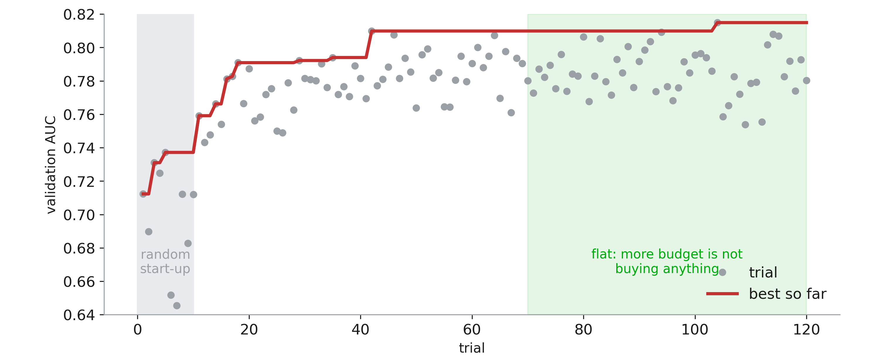

::: notes
Grey dots are trials, red is best-so-far. First ten are random start-up — TPE
needs data before it can model anything. The green region is the question this
plot exists to answer: the curve is flat, more budget is not buying anything, stop.
:::

## Pruning

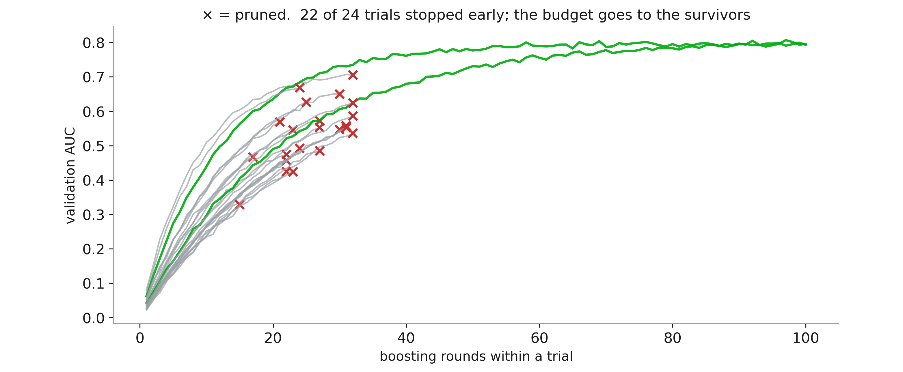

::: notes
Report an intermediate score each round; if it is below the median of past trials
at the same step, raise TrialPruned. Effectively multiplies the budget by 2–5×.
The danger: prune too early and you kill slow starters — a small learning rate
looks terrible at round 20 and wins at round 800.
:::

# Ensembles

## Averaging

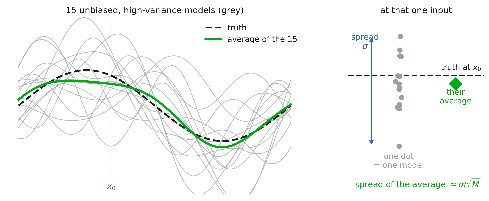

::: notes
Before the equation, the picture it summarises. Every grey curve is one model
fitted on a slightly different sample: each is unbiased — right on average — but
wildly wrong at any given point. That is exactly a deep tree. Green is their
average, and it tracks the truth far better than any grey curve does.
Right panel: freeze one input. Fifteen predictions, spread σ around the truth.
Some are too high, some too low, and the errors partly cancel when you add them
up — the average lands much closer, with spread σ/√M. Averaging M models is the
same arithmetic as averaging M noisy measurements of the same quantity.
Say the two conditions out loud now, because the next slide is about breaking
them: the models must be roughly unbiased, and their errors must be independent.
:::

## Only mistakes that *differ* cancel

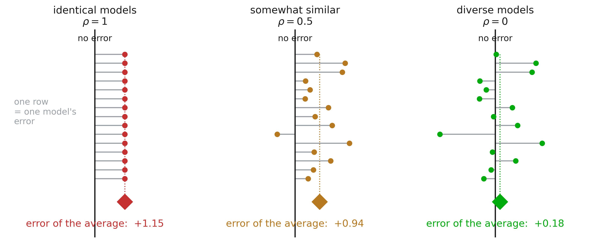

::: notes
Same fifteen models, same amount of error each, three levels of agreement.
Left: identical models. Every one is wrong by the same amount in the same
direction, so the average is wrong by exactly that amount. Fifteen models bought
nothing — and 500 would buy nothing either. This is the answer to "what if I bag
500 copies of the same linear regression".
Middle: the realistic case. Part of the error is shared — every tree splits first
on the same dominant feature — and only the private part cancels. Some benefit,
not the full benefit.
Right: diverse models. The errors point in different directions and mostly wipe
each other out.
So the quantity that matters is not how many models you have, it is how much of
their error is shared. That number has a name: ρ, the pairwise error correlation.
Keep ρ as vocabulary for the rest of the section: it is the reason more trees hit
a wall, and max_features in a random forest is the knob that lowers it.
:::

## Bagging vs boosting

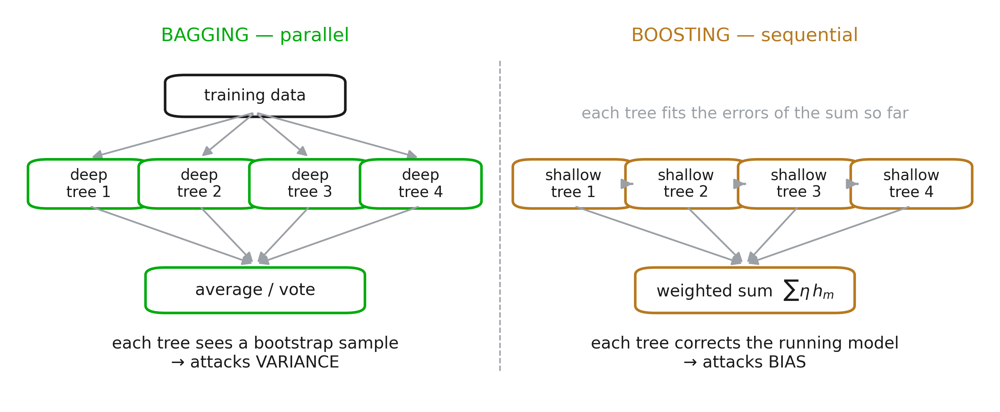

::: notes
Two ways to spend many trees, set side by side before we look at either closely.
Bagging: independent, parallel, deep trees, averaged — it is the picture from the
last two slides, and it attacks VARIANCE. Boosting: sequential, shallow trees,
each one fitting the errors of the sum so far — it attacks BIAS.
The consequence to flag now and cash in later: more trees cannot hurt a bagged
model, and more trees CAN overfit a boosted one, which is why early stopping came
up two sections ago. Next slide takes the left column, then we spend the rest of
the section on the right one.
:::

## Bagging

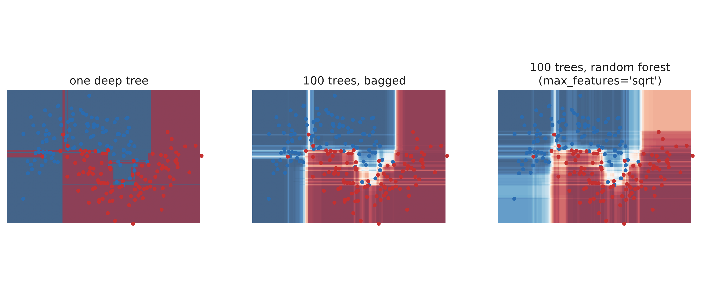

::: notes
One deep tree: jagged, high variance. Bagged: much smoother, same bias — averaging
is doing exactly what the dot strip promised. Random forest adds max_features, so
each split only considers a random subset — without it every tree splits first on
the same dominant feature and ρ stays high. max_features is literally the ρ knob
from the correlation slide: it does not make any single tree better, it makes the
trees disagree, which is the only thing that lowers the floor.
Bootstrap detail worth saying: each sample omits about 37% of rows, which gives
the out-of-bag error estimate for free. And n_estimators cannot overfit — more is
only slower. That stops being true for boosting, which is the rest of the section.
:::

## Boosting

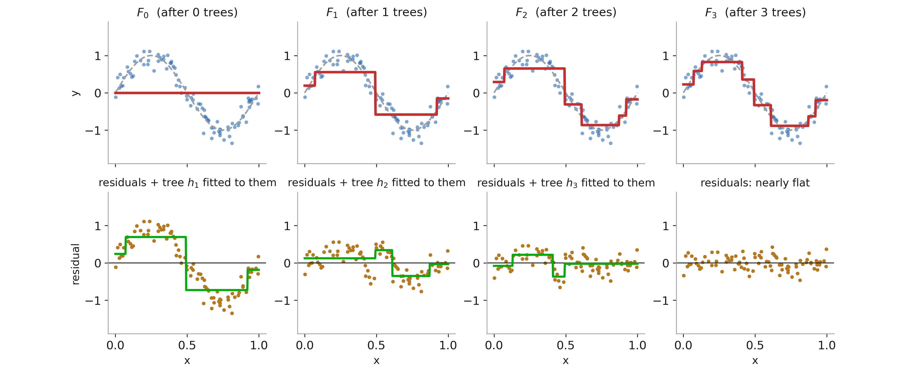

::: notes
Top row: the running model F_m. Bottom row: the residuals it has not explained
yet, and the depth-2 tree being fitted to them. Follow one column top to bottom,
then move right. By the fourth panel the residuals are nearly flat — done.
A depth-2 tree is barely better than guessing; the SUM of many is very flexible.
Bagging averages strong learners; boosting sums weak ones.
:::

## Boosting

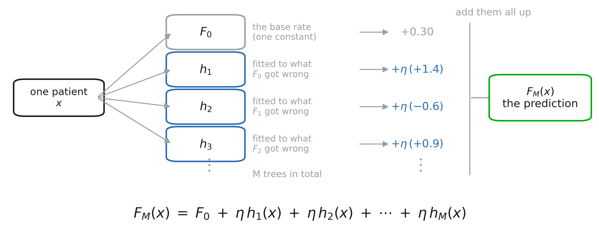

::: notes
F_m has been on the last two slides without a definition — fix that now, because
everything after this is written in terms of it. Say the title as "F sub m".
F_m is not "the model at step m" in some abstract sense: it is literally the sum
of the first m trees, plus a starting constant. F_0 is that constant — the base
rate, the one number you would predict for everybody. h_1 is a small tree fitted
to what F_0 got wrong, h_2 a tree fitted to what F_0 + eta*h_1 still gets wrong,
and so on.
So a fitted boosting model is a LIST of trees, and predicting means running the
patient down all M of them and adding the M numbers up. There is no single tree
to look at, which is why these models need SHAP or importance plots to be read.
Two properties worth saying out loud, both consequences of the plus sign.
One: nothing is ever revised. Tree 3 cannot correct tree 1 by editing it — it can
only add something on top. That is why the order matters and why the fit is
sequential.
Two: F_m for every m is available for free from the same fitted model, just stop
adding early. That is exactly what early stopping does, and what staged_predict
gives you in sklearn.
:::

## Shrinkage

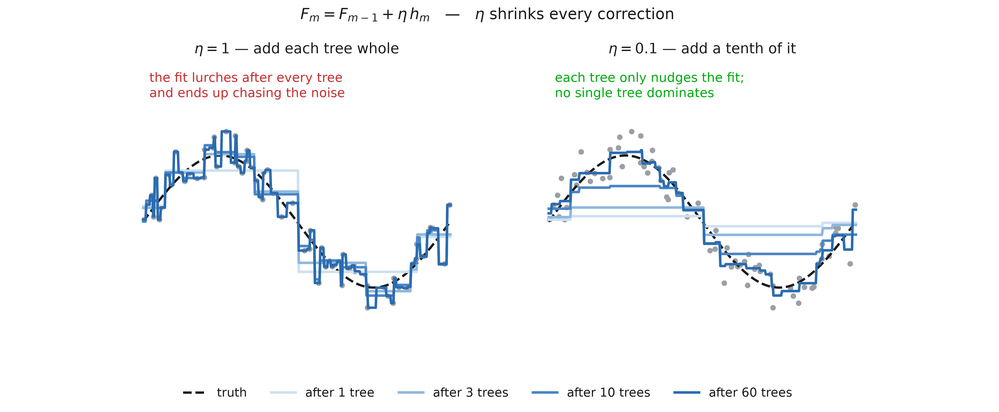

::: notes
Before the tuning curve, the mechanism. Boosting's update is one line: the new
model is the old one plus η times the tree just fitted. η is not a speed setting —
it decides how much of each tree's opinion actually makes it into the model.
Left, η = 1: each tree is added at full size. Three trees in, the fit already has
big steps in it; sixty trees in it is tracking individual points. Nothing later
can undo an early tree's overreach, because boosting only ever adds.
Right, η = 0.1, the same sixty trees: every tree moves the fit a little, so it
takes many of them to reach the same shape — and what it reaches is the smooth
signal rather than the noise.
That is why η is called shrinkage, and why it is a regularizer: it limits how much
any one tree can contribute, exactly as ridge limits how large any one coefficient
can be. The price is that you need more trees to get anywhere — which is the
trade-off the next slide measures.
Worth flagging: this figure holds the tree count fixed to compare shapes. In
practice you do not fix it — you let early stopping choose it, per η.
:::

## Boosting is gradient descent in function space
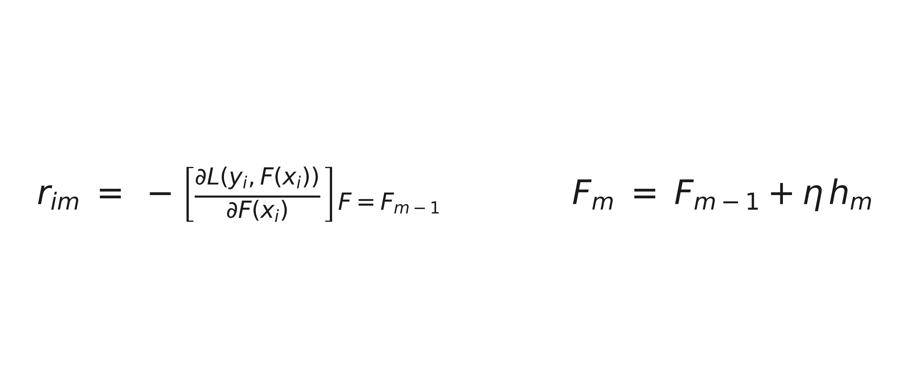

::: notes
The variable being optimized is the FUNCTION. The negative gradient is known only
at the training points; the tree h_m generalizes it everywhere, so the tree IS the
step direction and η is the step size. For squared loss the pseudo-residual is the
plain residual; for log loss it is y − p. Note the tree is always a REGRESSION
tree, whatever the task.
:::

## The learning rate is a regularizer

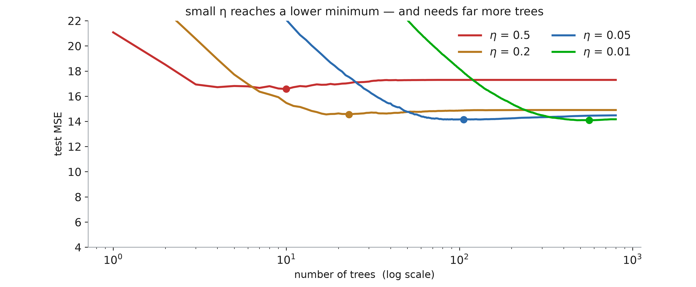

::: notes
η = 0.5 drops fast and then climbs — it overfits. η = 0.05 is slower and reaches a
LOWER minimum. Shrinkage keeps any single tree from dominating. η and M are one
knob in two halves: halve η, roughly double M. So do not tune both blindly — fix
η small and choose M by early stopping.
:::

# XGBoost, LightGBM, CatBoost

## XGBoost: regularization inside the tree objective
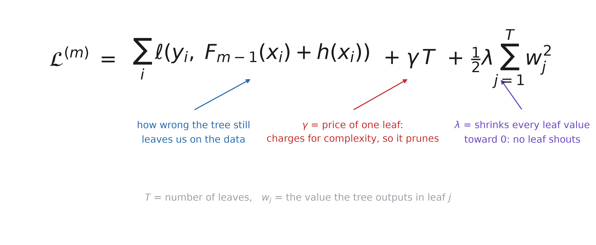

::: notes
Read it left to right. First term: the usual loss, but measured on the model we
already have plus the tree we are about to add — h is what we are solving for.
Second term: γ times T, the number of leaves — every leaf costs γ, so a leaf has to
earn its keep. Third term: λ times the sum of squared leaf values w_j — the same
ridge penalty as in section 2, applied to what each leaf outputs, so no single leaf
can shout.

The point to make here is structural: the complexity of the tree is written into
the thing being minimized. Other implementations grow a tree and then prune it;
here there is nothing to bolt on afterwards, because the price of a leaf is already
in the objective. Next slide: what falls out when you actually minimize it.
:::

## Splitting candidates
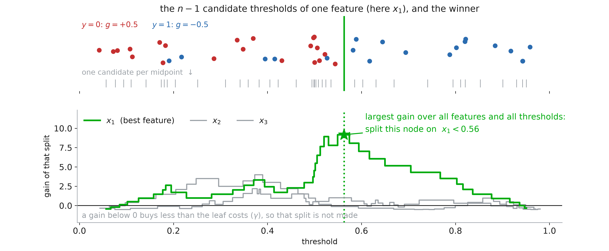

::: notes
Open the section with the thing a tree actually spends its time doing, then spend
the rest of the section explaining the y axis of the bottom panel. A candidate
split is a pair: one feature, one threshold. For a feature, sort the rows by its
value and take the midpoint between every pair of consecutive values — n rows give
n−1 candidates — and do that for every feature. There is nothing adaptive about the
list; it is enumeration.

Top panel: 40 rows on one feature, coloured by label, so at the first tree g is
+0.5 for one class and −0.5 for the other and h is 0.25 for everyone. The tick marks
are the candidates. Bottom panel: the gain of every one of them, for all three
features. Sweep the threshold left to right and G_L and H_L are just running sums,
which is why the whole scan costs one pass per feature after sorting, not one
refit per candidate.

The gain is the number we build up over the next four slides; for now say only
that it is "how much better off the node is after this split, net of what the extra
leaf costs". The winner is the argmax over the whole picture — over thresholds AND
over features. Here it lands at x₁ < 0.56, close to where the classes actually separate,
and the other two features never get near it. Note the ends of the curve: a
threshold that puts one or two rows on a side has almost no gain, because λ in the
denominator kills a leaf with no evidence behind it. And where the gain goes below
zero the split buys less than the γ it costs, so it is not made at all.

If asked about cost: exact scanning is O(n log n) per feature per node for the
sort. This is precisely the step LightGBM replaces by binning the feature into
~255 buckets, so the scan is over bins rather than over rows.
:::

## Loss simplification for one leaf
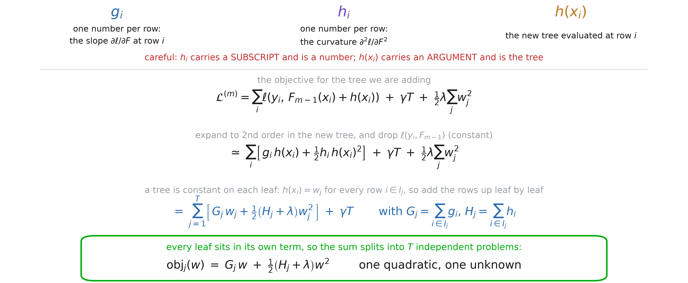

::: notes
Spend the first minute on the three symbols along the top, because two of them
share a letter and that trips everybody.

h(x_i), with an argument, is the NEW TREE — the thing we are solving for. It is a
function: give it a row, it returns a number. That is the same h_m as in the
boosting section, the tree being added to F_{m-1}.

g_i and h_i, with a subscript, are NUMBERS, one pair per row, and they are already
known before the tree exists: they are the first and second derivative of that
row's loss, evaluated at the prediction the current model already makes. Say the
concrete case out loud — for squared loss g_i is the residual and h_i is 1; for log
loss g_i = p_i − y_i and h_i = p_i(1 − p_i). Slide 64 is entirely about them.

So in the second line, g_i·h(x_i) is a known number times the unknown tree output,
and ½h_i·h(x_i)² is a known number times that output squared. The unknown appears
only as h(x_i) — everything else is data. That is why it turns into a quadratic.
If anyone reads ½h_i h(x_i)² as "the tree squared times the tree", stop and
separate the two h's again.

Now the moves. One: the loss term is awkward because the new tree sits inside ℓ.
Taylor-expand to second order around the model we already have — g_i and h_i are
exactly the coefficients that expansion produces. The leftover term ℓ(y_i, F_{m-1})
has no tree in it at all, so as far as choosing this tree is concerned it is a
constant and can be dropped.

Two: use what a tree actually is. A tree is a piecewise-constant function — every
row landing in leaf j gets the same output w_j. So instead of summing over rows,
sum over leaves and collect the rows inside each. All the row-level detail
collapses into two numbers per leaf: G_j, the sum of the g's in that leaf, and H_j,
the sum of the h's. Note where λ went: the ridge penalty on w_j merges into the
quadratic coefficient, which is why it will turn up as H_j + λ everywhere from here
on.

Three, the payoff: look at the sum and notice that w_j appears in exactly one of
its terms. Nothing couples the leaves — the choice of value in leaf 3 has no
bearing on leaf 5. So minimising the whole objective over the whole tree is not one
T-dimensional problem, it is T separate one-dimensional problems, one per leaf, and
each is a plain quadratic in a single unknown.

That is what makes everything after this slide possible. A quadratic in one
variable has a closed-form minimum, and its value at that minimum is a number you
can score a set of rows with — which is the next two slides.
:::

## Scores candidate splits
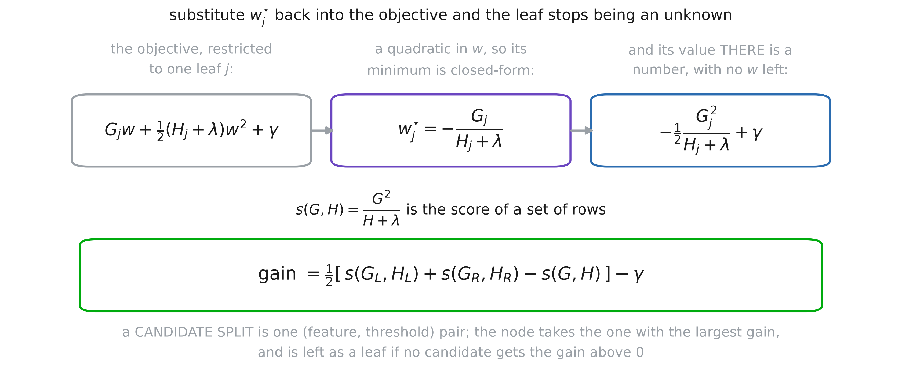

::: notes
This is the step most people never see, and it is short. Restrict the objective to
a single leaf: as a function of that leaf's value w it is G_j·w + ½(H_j+λ)w² + γ —
a plain one-dimensional quadratic. Minimise it and you get w*. But now substitute
w* back in: the w disappears and what is left is a pure number, −½·G²/(H+λ) + γ,
that depends only on which rows are in the leaf.

So define the score of a set of rows as G²/(H+λ). Splitting replaces one set of
rows by two, and the gain is the score after minus the score before, halved,
minus γ for the extra leaf. Every candidate split — every feature, every threshold
— is ranked by that one number, and the node is not split at all if no candidate
gets it above zero.

Be explicit about one thing, because it is the usual confusion: w* does not choose
the split. w* is what a leaf outputs. What chooses the split is the SCORE, which is
the value the objective reaches once the leaf is filled with w* — that is the only
role the substitution plays here. Thresholds are not solved for at all; they are
found by trying every candidate, which is the scan we opened the section with. Go
back to that slide here if the room wants to see the y axis land.

The punchline is worth saying out loud: the quantity the tree will later output is
the same quantity used to decide the tree's shape. That is what people mean when
they say XGBoost's pruning is "derived from the objective" — and it is why λ and γ
change not just the leaf values but which splits exist at all. Ask them what
happens to the gain as λ grows: every score shrinks, weakly-evidenced splits shrink
fastest, and the tree gets smaller on its own.
:::

## Gradient and Hessian
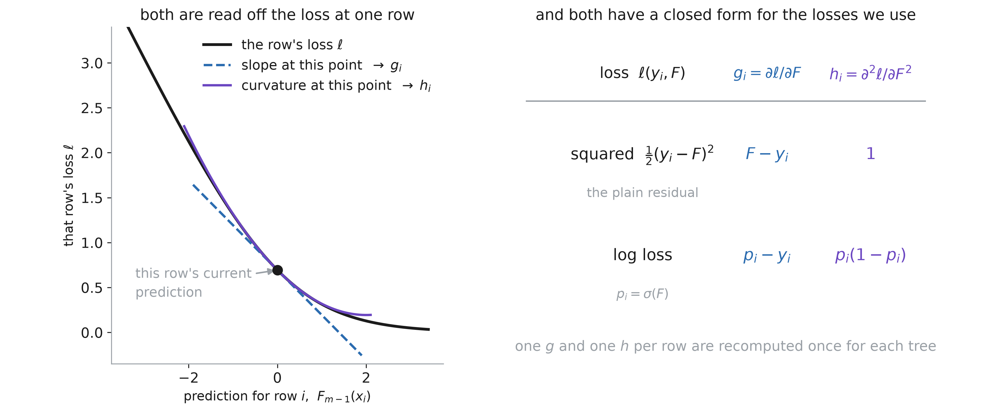

::: notes
Before the leaf-value formula, say what is in it. Take one row and freeze
everything else: the model has a current prediction for that row, and the loss has
a value, a slope and a curvature at that prediction. The slope is g_i — which way
the prediction should move and how badly. The curvature is h_i — how fast that
slope changes, so how far it is safe to move.

The table is the part to memorise. For squared loss g is just the residual and h is
1, which is why plain gradient boosting on squared loss looks like "fit the
residuals" — it is the same algorithm with h = 1 everywhere. For log loss g = p − y
and h = p(1−p), so a confident row has h ≈ 0 and hardly counts, while an uncertain
row near p = 0.5 counts fully.

Two things to stress. First, g and h are recomputed for every row before every
tree, from the current predictions. Second, once they are computed the tree never
looks at y again: the whole tree-building problem is expressed in g and h. That is
what makes swapping the loss cheap.
:::

## Summing trees to predicts the leaf value
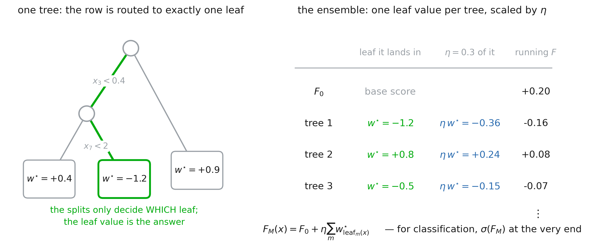

::: notes
Walk the row through, left to right. The splits do one job only: they decide which
leaf the row ends in. They carry no numbers of their own. Once the row is in a
leaf, that leaf's w* IS the tree's output for it — a regression tree, whatever the
task, and every row in that leaf gets the same value.

The right side is the arithmetic across trees. Start from F_0, the base score
(the mean for regression, the log-odds of the base rate for classification). Each
tree contributes exactly one leaf value, scaled by η, and the predictions
accumulate. Point out that with η = 0.3 a leaf that solved for −1.2 only moves the
row by −0.36 — the tree's own answer is deliberately not taken in full.

Two things they should be able to state after this slide. First, a boosted model's
prediction for a row is a base score plus one number per tree — that is why
inference is fast and why you can stop at any M. Second, this is all in score
space: for classification the sigmoid is applied once at the very end, never
between trees, which is exactly why the trees can stay regression trees.
:::

## LightGBM: bin each feature once
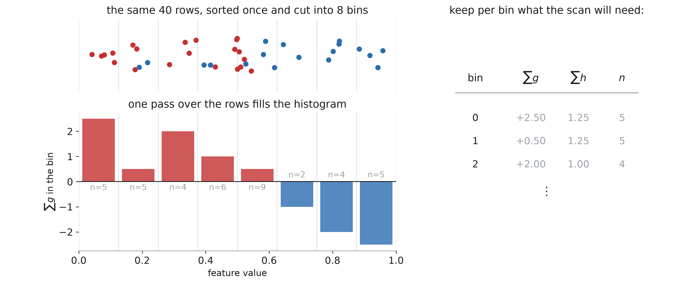

::: notes
Say first what LightGBM does NOT change: the objective, the gain, the closed-form
leaf value — every line of the XGBoost section still holds. What changes is the
cost of the scan we opened with, because that scan is where a GBDT spends its life:
features × candidates × nodes × trees.

The idea is to stop asking the exact question. Sort each feature once, up front,
and cut it into at most 255 bins. Then one pass over the rows fills a histogram:
per bin, Σg, Σh and a count — which, if you look back at the gain formula, is
exactly and only what a split needs. Nothing else about the rows is ever consulted
again.

Two side effects worth naming. Memory: a bin index is one byte where the raw value
was four or eight, so far more of the data stays in cache. And the binning is
itself mild regularization — a threshold can no longer be tuned between two
adjacent rows, which is the "regularization is broader than a penalty" idea again.
:::

## Finding optimal cut in one sweep
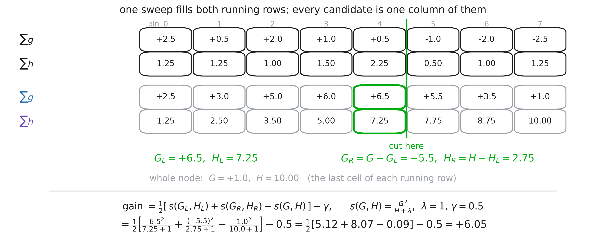

::: notes
This is what the histogram is FOR, in one picture. The gain formula never asks for
rows — it asks for four numbers: G_L, H_L, G_R, H_R. So the histogram stores two
things per bin, Σg and Σh, and everything else on this slide is addition.

Top two rows: the histogram itself, filled by one pass over the node's rows.
Bottom two rows: the running totals of each, left to right. Do the Σg one out loud
— 2.5, 3.0, 5.0, 6.0, 6.5 — and the Σh one alongside — 1.25, 2.50, 3.50, 5.00,
7.25. Each column of those two rows is a complete candidate split: the entry under
bin 4 says that cutting there puts G_L = +6.5 and H_L = 7.25 on the left. The right
side is free, because the last cell of each running row is the whole node: G = +1.0
and H = 10.00, so G_R = 1.0 − 6.5 = −5.5 and H_R = 10.00 − 7.25 = 2.75.

Now substitute, and show every step rather than quoting the answer. s(G,H) is
G²/(H+λ) with λ = 1, so the left child scores 6.5²/8.25 = 5.12, the right child
(−5.5)²/3.75 = 8.07, and the unsplit node 1.0²/11 = 0.09. Half of (5.12 + 8.07 −
0.09) is 6.55, minus γ = 0.5, giving a gain of +6.05 — which is exactly the peak
you will see on the next slide, because it is the same node and the same numbers.

Point out the sign trap while it is on screen: G_R is negative, and it is squared,
so a child pulling hard downward scores just as well as one pulling upward. The
gain rewards SEPARATION, not positivity.

Two things to draw out. Building the histogram costs one pass over the node's rows;
after that the scan costs one pass over 255 numbers no matter whether the node
holds a thousand rows or a million. And the histogram is a sufficient statistic
here: it is not an approximation of the rows, it is exactly and only what the gain
can consume, which is why nothing is lost by throwing the rows away.
:::

## Scan bin edges, not rows
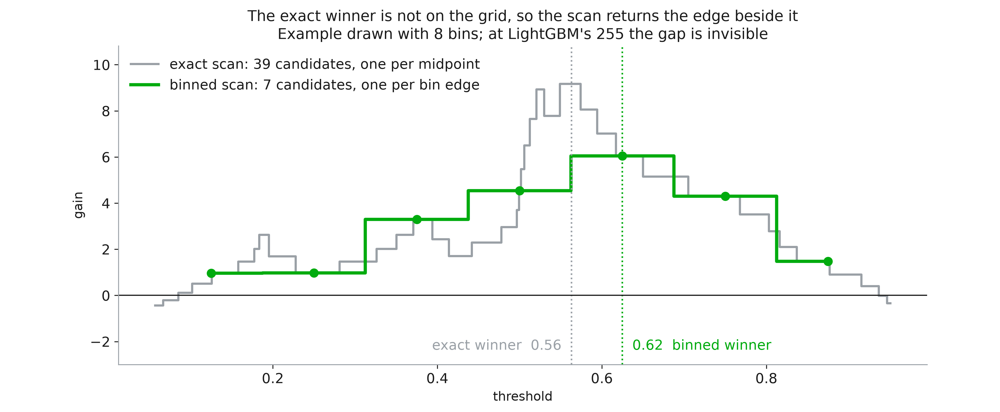

::: notes
Same node, same gain formula, two candidate lists. Grey is the exact scan from the
start of the section: 39 midpoints. Green is the binned scan: 7 bin edges, and each
of its points is computed from the histogram alone, in constant time per bin.

Be honest about what is lost. The exact optimum, 0.56, is not on the grid, so the
binned scan returns 0.62 — the edge beside it. I have drawn 8 bins so you can see
that; with LightGBM's default 255 the two winners are indistinguishable in
practice, and the empirical answer to "does it hurt accuracy" is no.

The scaling is the point: exact costs one sort per feature per node, binned costs
one pass to fill and then a walk over 255 numbers no matter how many rows there
are. On a million rows that is the difference between minutes and seconds.
:::

## A child's histogram is the parent minus its sibling
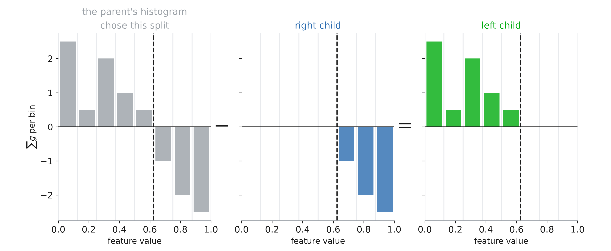

::: notes
First answer the question this slide begs: what is a child's histogram FOR? A
split does not finish the tree — each child is itself a node that must be split
next, and to choose ITS split you run the same scan again, which reads a histogram
built from only the rows that landed in that child. So a histogram is not built
once per feature; it is built once per node, per feature, all the way down. That
is the cost this slide is attacking.

Head off the question that always follows: does a child get fewer bins? No. The bin
edges are a property of the FEATURE, chosen once from its quantiles before any tree
exists, and frozen for the whole run. Every node uses the same 255 bins. What a
split divides is the rows — 256 rows might go 120 and 136 — while both children
still carry a 255-long array, just with smaller sums in it, and with the bins on
the far side of the threshold empty. That identical binning is exactly what makes
parent[b] = left[b] + right[b] true, and hence what makes the subtraction legal at
all.

Two consequences worth stating. The cost of a node is O(bins x features) no matter
how few rows it holds, so as the tree deepens the rows shrink but the histogram
work does not — which is why halving it matters. And a node holding nine rows still
pays for a 255-bin histogram, which is a second reason min_data_in_leaf exists.

Now the saving, and it is free. A split sends every row of the parent to exactly
one of the two children, so the two children's histograms add up to the parent's,
bin by bin. Build the smaller child by scanning its rows, and get the other by
subtracting it from the parent you already have — no rows touched.

Always scan the smaller side, so at worst you touch half the rows at each level,
and it compounds down the tree. It is also why the histogram stores sums rather
than something non-additive like a median: the whole trick rests on Σg over
disjoint sets adding up.
:::

## Leaf-wise growth: spend every split where it pays most
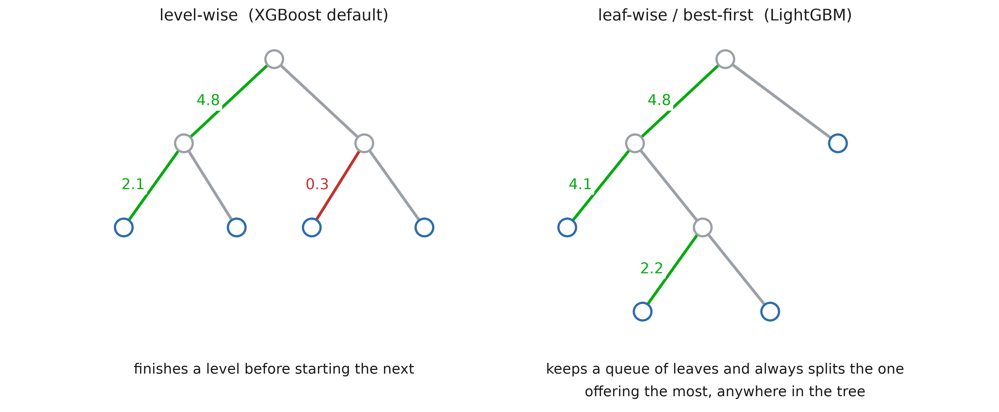

::: notes
Both strategies are handed the same candidate list and the same gain formula. They
differ only in which node they apply it to next.

Level-wise finishes a level before starting the next, so every node at that depth
gets split — including one whose best candidate is worth 0.3. The tree stays
balanced and depth is a meaningful control.

Leaf-wise keeps a queue of leaves and always splits whichever leaf offers the
largest gain anywhere in the tree. Same four leaves, but the two extra splits went
where the gain still was: 4.1 rather than 0.3. The tree comes out deep and
lopsided, so max_depth stops being the natural control — num_leaves is.

Ask before turning the page: if leaf-wise always takes the better split, why is it
not simply better?
:::

## GOSS: sample the rows that are already fitted
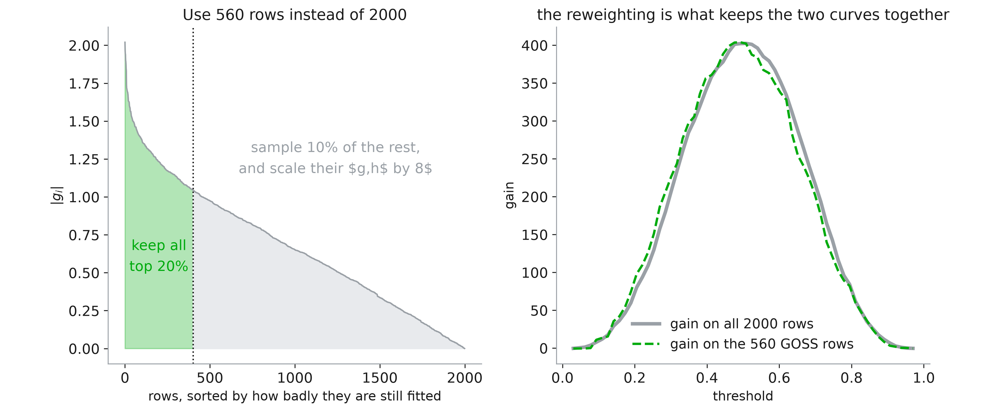

::: notes
The last cost to attack is the number of rows. Plain subsampling throws away rows
uniformly, which is wasteful in boosting: after a few trees most rows are nearly
fitted and carry a tiny |g|, and it is the badly-fitted rows that determine where
the next split should go.

GOSS keeps every row in the top a of |g| — a = 20% here — and takes a random b =
10% of the rest, so the scan runs on 28% of the rows. The trick is the last step:
the sampled rows have their g and h multiplied by (1−a)/b = 8, so they stand in for
the ones left behind. Without that factor the small-gradient region would be
under-represented and the gain would be biased toward splitting the hard rows apart.

The right panel shows the two gain curves, full data and GOSS, on the same node.
They sit on top of each other, including the location of the maximum — which is the
only part that actually matters, since the scan only uses the argmax. Note this is
sampling per iteration, not once: every tree gets a fresh draw, so a row that is
skipped now is available later, and its own gradient decides that.
:::

## Categories: the target statistic problem
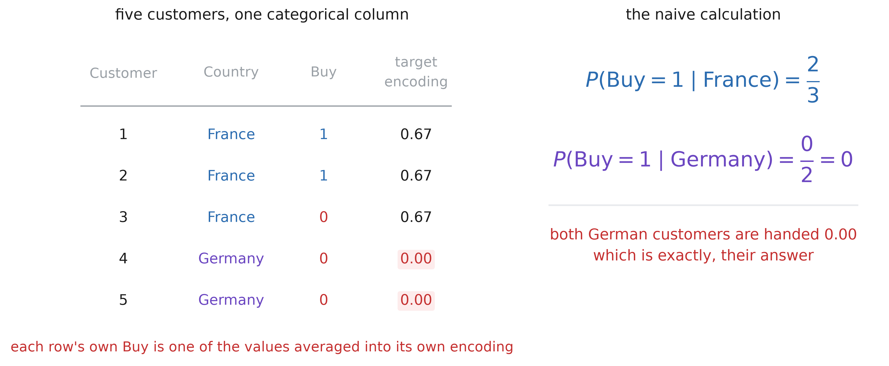

::: notes
Work this one on the board, it takes two minutes and the rest of the section
follows from it.

Five customers, one column: their country. A tree cannot split on a string, and
one-hot on a column with hundreds of countries or cities gives hundreds of nearly
empty columns. So the natural move is target encoding: replace each country by
P(Buy = 1 | country). France: two of the three French customers bought, so 2/3.
Germany: neither bought, so 0.

Now ask what customer 4 has been handed. Its feature is 0.00, and that 0.00 is the
average of two labels, one of which is customer 4's own Buy. The same for customer
5. For the French rows the effect is diluted but still there: each contributed a
third of its own encoding.

State the principle plainly: if you use the target y_i of an observation to encode
that same observation, you leak the target into the features. The column will look
excellent in cross-validation and know nothing in production, because the leak
lives inside the feature and travels with it across any split you make.
:::

## Leak extreme values
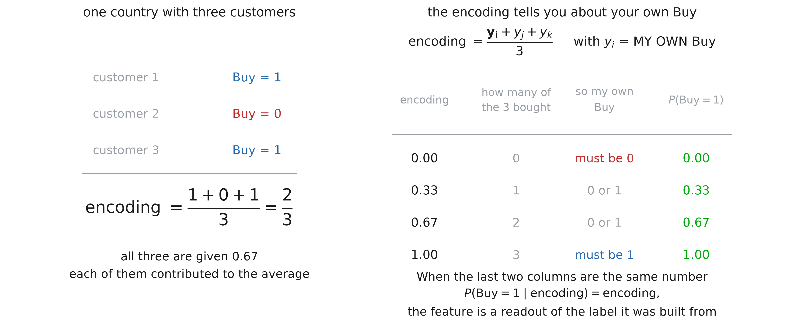

::: notes
This is the slide that makes the previous one inevitable rather than anecdotal.
Take any country with three customers. The encoding they all receive is the average
of three numbers — and for each of them, one of those three numbers is their OWN
Buy. Write it as (y_i + y_j + y_k)/3 and put y_i in bold: my own answer is a third
of my own feature.

Now enumerate, which takes ten seconds. The encoding can only be 0, 1/3, 2/3 or 1,
because it counts how many of the three bought. If it is 0.00, nobody bought, so I
did not buy — certainty, not a hint. If it is 1.00, everybody bought, so I did.
And in between: given the encoding is 1/3, I am one of three customers of whom
exactly one bought, so my chance of being that one is 1/3.

Read the last two columns together: P(Buy = 1 | encoding) = encoding, exactly.
The feature is not correlated with the label by accident — it is a direct readout
of it. Say the general version: with k rows per category, the encoding pins the
label down to within 1/k, and high-cardinality columns are exactly the ones where k
is small.
:::

## Ordered target statistics: use only what came before
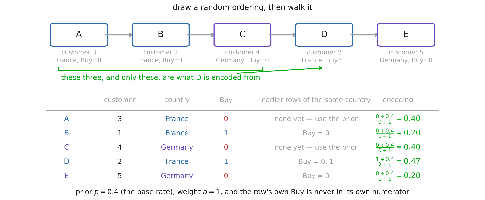

::: notes
CatBoost's answer is to impose an order. Shuffle the rows into a random
permutation — call them A, B, C, D, E — and pretend they arrive one at a time.
When you encode a row, you may look only at the rows that arrived before it:

  for B, use A;  for C, use A and B;  for D, use A, B and C;  and so on.

A row's own target is therefore never in its own encoding. That is the whole
innovation, and everything else is bookkeeping.

Walk the table with the same five customers, in the shuffled order. A is the first
French row, so there is no history at all: it gets the prior p, the base rate 0.4,
smoothed with weight a = 1. B is French and has seen one earlier French customer
who did not buy, so (0 + 0.4)/(1 + 1) = 0.20 — and note B itself bought, and that 1
appears nowhere. C is the first German row: prior again, 0.40, instead of the 0.00
the naive encoding gave. D has two earlier French rows, one of which bought:
(1 + 0.4)/(2 + 1) = 0.47.

Three things to point out. The encoding of a country now MOVES down the column as
evidence accumulates, instead of being one constant per country. Early rows are
noisy — they lean on the prior — which is the price, and it is why a is a smoothing
parameter worth tuning. And a fresh permutation is drawn for every tree, so no
single row is permanently unlucky in being early.
:::

## Ordered target statistics: removes the correlation
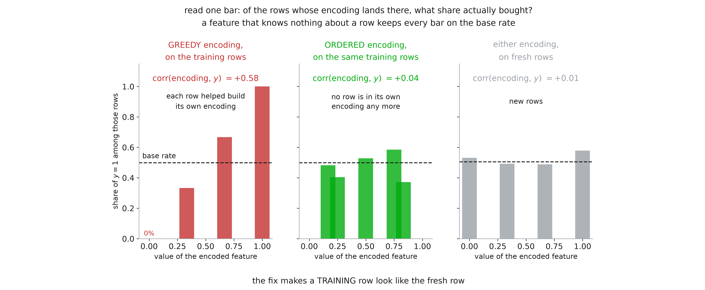

::: notes
Before reading the panels, agree on how to read ONE BAR, because the chart is a
conditional probability and that is not a shape people read fluently. Take all the
rows whose encoded value falls in a given slice of the x axis, and ask what
fraction of them actually bought. That is the bar's height. Now the key: if the
feature genuinely knows nothing about a row's own label, then slicing the rows by
it tells you nothing either, so every bar sits at the base rate, 0.5. A feature
that leaks makes the bars climb.

All three panels show that same statistic on the same 200-country dataset where
Buy was a coin flip. Only the encoding changes.

Left: the greedy encoding on the rows it was built from. The bars climb 0, 1/3,
2/3, 1 — the ramp from two slides ago — and the correlation with y is +0.58 on a
feature that is provably pure noise.

Middle: the ordered encoding, same rows, same labels. The bars are back on the base
rate and the correlation is +0.04. Nothing about the data changed; only the rule
for computing a row's encoding did.

Right, and this is the panel that makes the point: 600 customers the model has
never seen. Note the title — EITHER encoding. At prediction time both approaches do
the same thing, encoding a new row from the whole training table, so this panel was
never broken and is not what we fixed. It is the reference: this is what an honest
feature looks like.

So say the conclusion in those terms rather than as "the leak is gone": ordered
target statistics make a TRAINING row behave like a row the model has never seen.
That is the property the model needs, because during fitting every row is a
training row, and if training rows flatter the feature the model will trust it and
then be wrong in production.
:::

## Oblivious trees: one split per level
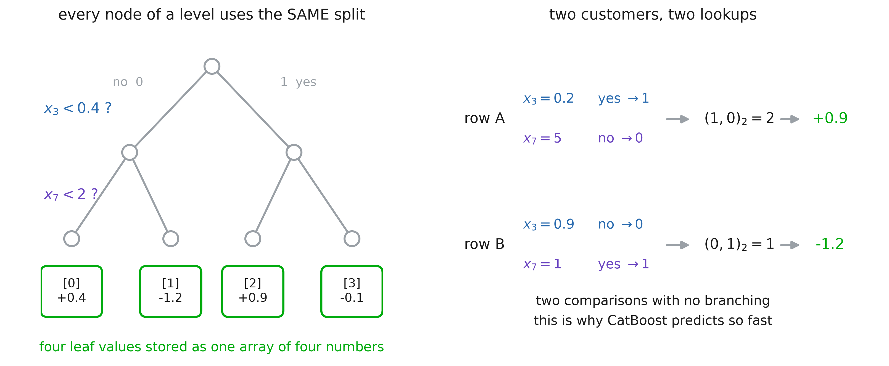

::: notes
The last difference is the tree shape, and it is the one people notice first
because it looks wrong. In a CatBoost tree, every node at a given depth tests the
SAME feature against the SAME threshold. A depth-6 tree therefore has 6 tests
total, not 63.

That makes prediction trivial: run the 6 comparisons, read the results as 6 bits,
and that binary number is an index into an array of 64 leaf values. No branching,
no pointer chasing, identical work for every row — which vectorises, and is why
CatBoost's inference is unusually fast. If a deployment constraint is latency, this
is the reason to look at it.

And it is a strong constraint, so it regularizes: far fewer trees fit this shape,
which is a bias-variance trade paid on purpose. Compare with the previous section
— LightGBM's leaf-wise growth is the opposite bet, maximum flexibility per leaf.
Same objective, opposite instincts about what to constrain.
:::

## XGBoost, LightGBM, CatBoost comparison
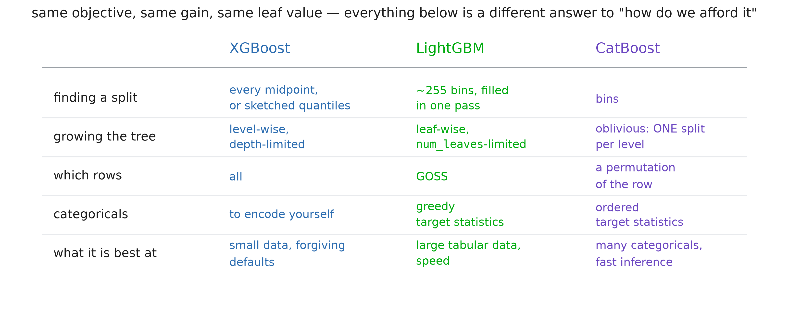

::: notes
The summary slide, and the one worth photographing. Read the header first: the
objective, the gain and the closed-form leaf value are identical in all three.
Everything in the table is an engineering answer to "how do we afford that", or a
different guess about what should be constrained.

One row I have not drawn: LightGBM's EFB, which packs features that are never
non-zero on the same row into one, cutting the effective feature count in a wide
sparse matrix. And CatBoost's learned feature combinations, which build new
categorical features by combining existing ones as the tree grows — the reason it
often needs no manual interaction engineering.

Practical advice to close the section on. Large tabular data and you care about
wall-clock: LightGBM, and set num_leaves and min_data_in_leaf. Many
high-cardinality categoricals, or a small dataset where prediction shift bites, or
strict inference latency: CatBoost, and let it handle the categorical columns.
Small data and you want the most forgiving defaults: XGBoost. All three take the
same hyperparameters conceptually, so the search from section 5–8 transfers
unchanged — which is the point of having done the maths once.
:::

# Stacking

## Learn the combination

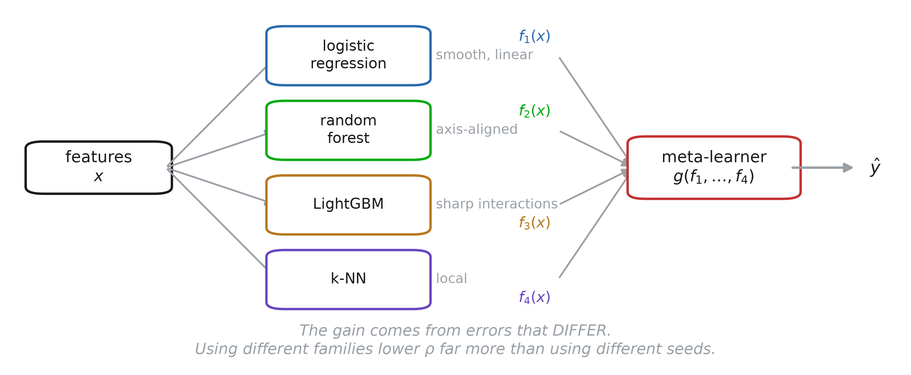

::: notes
Instead of fixed averaging weights, train a meta-model on the base models'
predictions. Averaging is the special case g = mean. Recall the variance formula:
different model FAMILIES lower ρ far more than different seeds of one model.
Keep the meta-learner simple — non-negative least squares or logistic regression —
because it trains on few, highly correlated columns and will overfit instantly
otherwise. Typical gain is small but real, and it costs k models to train, tune,
serve and monitor. Do not stack until you have one genuinely well-tuned model.
:::

## Meta learning needs unseen data

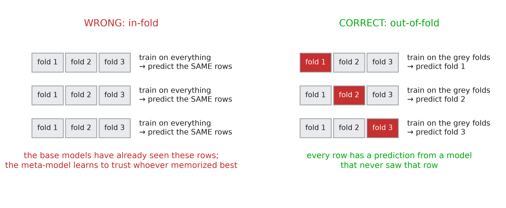

::: notes
Left: base models predict the rows they were trained on, so their predictions are
unrealistically good and the meta-model learns to trust whoever memorized best.
Nothing errors, nothing warns you. Right: out-of-fold — every row's prediction
comes from a model that never saw it. At test time, refit the base models on all
the training data. In sklearn this is the cv=5 argument to StackingClassifier, and
it is not a detail: it is the entire correctness argument.
:::

## Split correctly

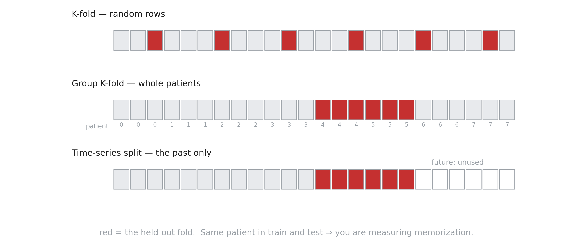

::: notes
Getting the grouping wrong is the most common leak in clinical data. Same patient
in train and test and you are measuring memorization. Stratify for imbalanced
classification, group by patient for repeated measures, and split by time whenever
there is a temporal order — random splits leak the future.
:::

## Nested cross-validation

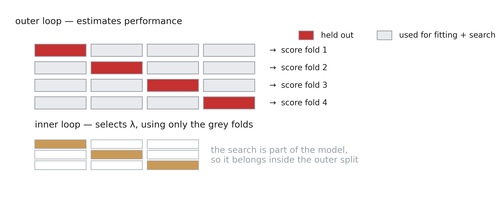

::: notes
Outer loop estimates performance, inner loop selects hyperparameters. The search is
part of the model, so it belongs inside the outer split. Cost is outer × inner ×
trials, so use it to REPORT performance and a single split to ITERATE quickly.
:::

# Conclusion

## Tools map

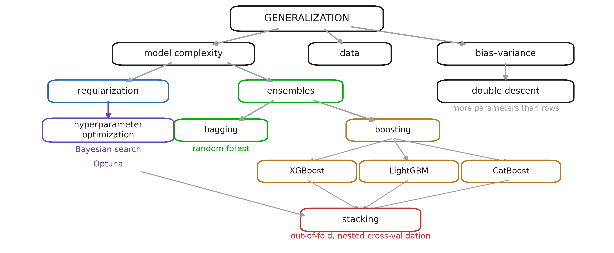

::: notes
Walk it top-down once, quickly. Generalization splits into complexity and data.
Complexity is controlled by regularization and by ensembles. Ensembles split into
bagging and boosting; boosting into the three libraries. Hyperparameter
optimization hangs off regularization because it is how you choose λ, and
everything feeds stacking at the bottom.
:::

