## Main question
> We have a trained model.
>
> How can we interpret the output as probabilities?

::: notes
Start from what they actually have: a fitted model with a `predict_proba` method
that returns numbers between 0 and 1. The question of the day is whether those
numbers mean anything, and the first half of the answer is uncomfortable — in
general they do not, and each model family is wrong in its own characteristic way.

Set the plan: four standard classifiers on one dataset, four different failures,
each with a mechanism you can name. Then, once we know why it happens, what to do
about it.
:::

# Why a model's output is not a probability

## Models tend to have bias

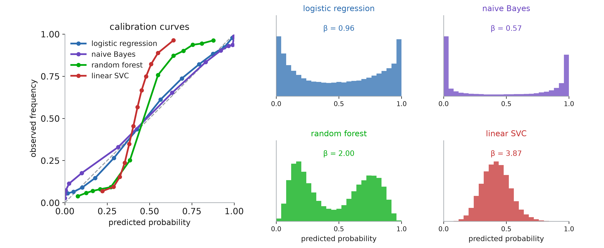

::: notes
One dataset — twenty features, two of them informative, two of them redundant
copies — and a deliberately small training set of 100 rows so the effects are
visible. Four classifiers you would all reach for. This is the scikit-learn
calibration comparison, and it is worth reproducing because the four failures are
so different from each other.

Read the histograms first, not the curves, because the histograms are the shape of
the problem.

Logistic regression: spread across the range, curve on the diagonal, β = 0.96.
Naive Bayes: 58% of all predictions are below 0.05 or above 0.95 — it is almost
always certain. Random forest: the exact opposite, 1% of predictions are that
confident, and the mass sits in two humps around 0.15 and 0.8. Linear SVC: nothing
below 0.2 or above 0.7 at all.

Now the curves. Logistic on the diagonal; naive Bayes flatter than the diagonal
(β = 0.57, too extreme); forest and SVC steeper (β = 2.00 and 3.87, too timid),
with the characteristic sigmoid shape.

One number to flag before they over-read the Brier column later: naive Bayes has a
BETTER Brier score than logistic regression here, 0.101 against 0.128, because it
discriminates better — AUC 0.929 against 0.896. Promise them the decomposition
that explains it; it opens the second half. Being badly calibrated and being
useless are different things, and a single scalar will not separate them.

The rest of the section takes the four in turn and names the mechanism.
:::

## A generalized linear model

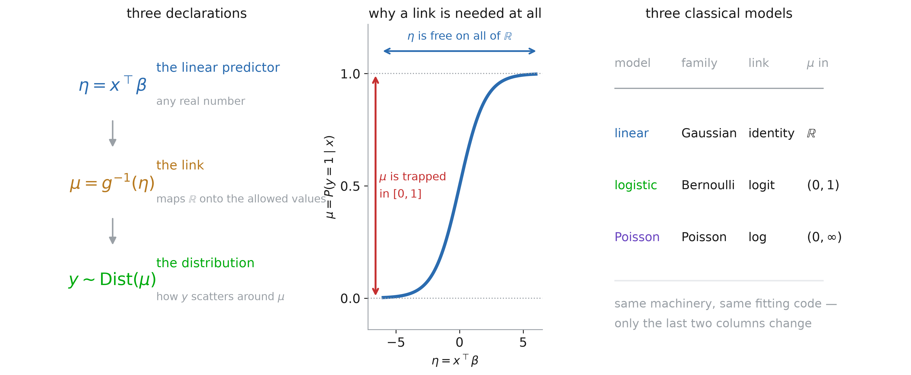

::: notes
Before the argument about logistic regression, the vocabulary it needs. Most of
them have fitted GLMs without being told the name.

A GLM is three declarations and nothing else.

One: the LINEAR PREDICTOR, η = xᵀβ. Say the letter — eta. This is the only place
the model is linear, and it is free: xᵀβ will happily come back −7.3 or +12.

Two: the LINK. The mean μ = E[y | x] is usually not free. A probability has to sit
in [0, 1]; a count rate has to be positive. So we do not model μ directly, we model
η and map it back: μ = g⁻¹(η). The middle panel is that mapping for logistic
regression — the whole real line squeezed into the unit interval by the sigmoid.
The link g is the trip in the other direction, from μ to η.

Three: the DISTRIBUTION of y around μ. Gaussian, Bernoulli, Poisson.

Right panel is the one that makes it land. Linear regression is a GLM: Gaussian
with the identity link, where μ really is free so the link does nothing. Logistic
regression is a GLM: Bernoulli with the logit. Poisson regression is a GLM. Same
machinery, same fitting code, and only the last two columns change.

One sentence to make η concrete, because it will recur all session: for logistic
regression η = logit(p), so η IS the log-odds. It is the same quantity as the
x-axis of the calibration-slope plot, and the same quantity Platt scaling takes as
its input. Three names, one object.
:::

## What the log loss is doing

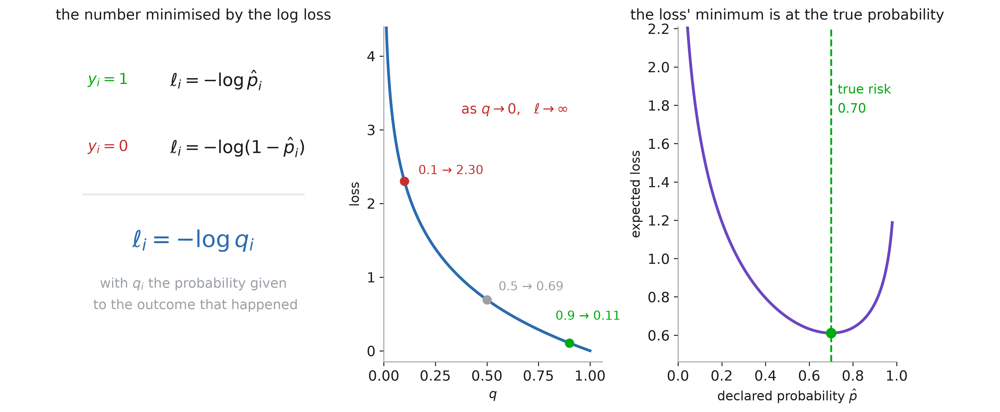

::: notes
The GLM slide said "Bernoulli" in declaration three and moved straight on. Take
that seriously for the next few slides and the rest of the session falls out
of it.

Start with a question to the room, and wait for the silence: who CHOSE log loss?
Everyone has typed `LogisticRegression()`; nobody chose anything. So what is that
loss doing, and why that one?

Left: the definition, and it is smaller than people remember. For a row with
y = 1 it is −log p̂; for y = 0 it is −log(1 − p̂). One line covers both: it is
−log q, where q is the probability you gave THE OUTCOME THAT HAPPENED. Say that
phrase twice. The loss never looks at the outcome that did not happen — there is
no credit for the 0.3 you had left over.

Middle: the shape. Give the right answer 0.9 and you pay 0.11. Say 0.5 and you
pay 0.69. Give 0.1 and you pay 2.30, and the curve has no ceiling — as q → 0 the
loss goes to infinity. Being confidently wrong is unboundedly expensive, and that
is deliberate. Contrast accuracy, which only asks which side of 0.5 you were on
and cannot tell 0.51 from 0.99. A loss that cannot tell those apart cannot
possibly train a model to produce meaningful probabilities.

Right is the slide, and it is the one to spend time on. Fix a patient whose TRUE
risk is 0.70 and ask what number you should declare. Plot the expected loss
against your declared p̂. The minimum sits at 0.70. Not near it — at it.

That is what the log loss is doing: it makes honesty optimal. You cannot do
better by shading your answer towards 0 or 1 to look decisive, and you cannot do
better by hedging towards 0.5 to look cautious. The technical name is a PROPER
scoring rule, and proper means exactly this: the expected loss is minimised by
reporting the true probability. It is the entire reason we can hope for calibrated
output at the end of training.

One detail that pays off later: the minimum value is 0.61, not zero. Even a
perfect forecaster pays something, because the outcome is genuinely random — that
floor is the entropy of the true risk. When we decompose the Brier score later, the
irreducible term is this same idea. A loss that does not reach zero is not a
failure; a model whose loss reaches zero on held-out data is a leak.
:::

## Log loss is a likelihood

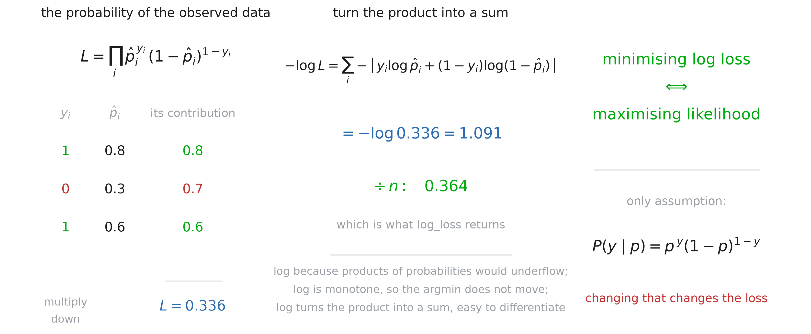

::: notes
Now where it comes from, because "someone designed a proper scoring rule" is still
a story about a clever choice, and the truth is better than that.

Left: three patients, outcomes 1, 0, 1, and a model saying 0.8, 0.3, 0.6. Ask the
room for the probability the model assigned to what actually happened — to that
exact dataset. Row one contributes 0.8. Row two contributes 0.7, the other side,
because the event did not happen. Row three contributes 0.6. Multiply: 0.336. That
is the LIKELIHOOD, and every student has met the word without meeting the object.

Middle: nobody wants a product of six thousand numbers below one — it underflows
to zero in float64 within a few hundred rows, and it does not differentiate
pleasantly. So take the log, which turns the product into a sum, and flip the
sign, so that big-is-bad like every other loss. −log 0.336 = 1.091; divide by n
and you get 0.364, which is the number `log_loss` hands back. Say the structural
point: log is monotone, so the sign-flipped log has its minimum exactly where the
likelihood has its maximum. Taking the log changes the number, never the argmin.

Right: so what was `LogisticRegression().fit()` doing all along? Maximum
likelihood. Not "penalising errors" — finding the β that makes the data you
actually observed as probable as it can be made.

And now point at the single input, because this is the hinge of the whole section.
The ONLY thing we assumed was one line: P(y | p) = p^y (1−p)^(1−y). The Bernoulli.
Everything else was bookkeeping — a product, a log, a sign. So if you change that
one line, you get a different loss, automatically, with no new ideas required.
Change it to a Gaussian and you should get squared error. That is a claim, and the
next few slides make good on it.
:::

## Now write it in exponential form

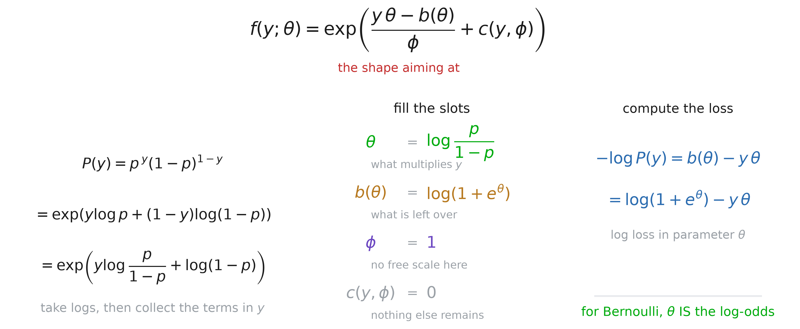

::: notes
Start at the top of the slide, not the left, because the whole slide is an
exercise in matching and you cannot match against nothing.

Put that shape up and be honest about it: I am handing you a form with four empty
slots — something multiplying y, something subtracted, something dividing, and a
leftover term. Where does it come from? Take it on trust for ninety seconds. The
only claim right now is that the Bernoulli fits into it, and the NEXT slide is
where we say why this shape and not another, and who else fits.

Then what we are doing is plain: rewrite the line we assumed two slides ago —
nothing new, the same Bernoulli — until it looks like the thing at the top. Do it
on the board; it is three lines.

Left. Start with P(y) = p^y (1−p)^(1−y). Take logs and exponentiate, which changes
nothing: exp(y log p + (1−y) log(1−p)). Now collect the terms in y: y log p −
y log(1−p) + log(1−p), so the coefficient of y is log(p/(1−p)).

Middle: now read the bottom line against the template, slot by slot. What
multiplies y? log(p/(1−p)). That goes in the θ slot. What is left over, not
multiplied by y? log(1−p), and the template wants it SUBTRACTED, so
b(θ) = −log(1−p), which rearranged in terms of θ is log(1+e^θ). What divides?
Nothing — so φ = 1. And what is left with neither a y nor a θ in it? Nothing at
all, so c(y, φ) = 0.

Make the φ point explicitly, because it is the clearest evidence that the template
is doing work. You cannot say "φ = 1" by staring at a Bernoulli. You can only say
it once something has told you there is a φ slot to fill. Same for c. The template
is not decoration; it is the question sheet.

Emphasise, because it is the sentence they should leave with: nobody CHOSE the
log-odds. We wrote down the Bernoulli, rearranged it, and the log-odds fell out as
the coefficient of y. That is the precise sense in which it is the distribution's
own natural coordinate — and it is the first hint that the logit is not a
convenience.

Right: and the loss comes along for free. The loss is −log of the density, and in
this form that is b(θ) − yθ, which is log(1+e^θ) − yθ. Check it against what they
already have: substitute θ = log(p/(1−p)) back in and you are staring at
−[y log p + (1−y) log(1−p)], the log loss we started from. Same function, new
coordinate.

Worth ten seconds: the middle form, log(1+e^θ) − yθ, is what a library actually
computes. That is `BCEWithLogitsLoss` in torch — it takes the linear predictor,
never forms the probability, and is numerically stable because of it. They have
all used it; now they know what the "WithLogits" is.

So the whole Bernoulli story is: yθ − b(θ). Two symbols. The obvious question is
whether that shape was a Bernoulli accident — and it is not, which is the next
slide.
:::

## The exponential family

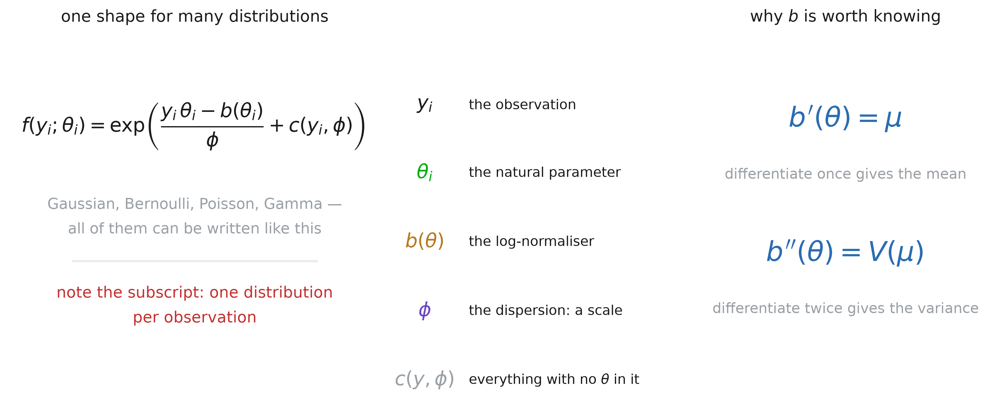

::: notes
Pay the debt from the previous slide. I put that shape up and asked them to take
it on trust; here is the justification, and it is simply that the Bernoulli was
not special.

Left: the same template, now with subscripts and a name. Do not let them read it
as a new distribution — it is a TEMPLATE, and the Bernoulli is the instance we
just built by hand. Gaussian, Poisson and Gamma go in too, each with its own θ and
its own b. Two contrasts with our case are worth naming: the φ that was stuck at 1
for us is a free scale for the Gaussian, where it is the variance; and the c that
was 0 for us is where the Gaussian parks its y²/2σ² and its log√(2πσ²).

If someone asks whether EVERY distribution fits: no. The uniform on [0, θ] does
not, because its support depends on the parameter, and mixtures generally do not
either. The family is large enough to cover what we model and small enough to have
theorems.

Point at the subscripts before anything else, because this is where the confusion
of the section lives. There is one distribution PER OBSERVATION. Patient i has
their own y_i and their own θ_i. The dispersion φ has no subscript: it is one
number for the whole dataset.

Middle: the glossary, and take all five — they have met four of them already,
which is the point. y_i is the observation. θ_i is the natural parameter, whatever
multiplies y_i; for us that was the log-odds. b(θ) is the log-normaliser, whatever
has to be subtracted to make the thing sum to one; for us that was log(1+e^θ). φ
is a dispersion, a scale factor, 1 for the Bernoulli and not for the Gaussian.
c(y, φ) is the leftovers — everything with no θ in it, which means it contributes
nothing to the fit and you can ignore it.

Right: the two facts that make the template worth having. Differentiate b once and
you get the mean. Differentiate it twice and you get the variance function. These
are not obvious, and they are the return on all this rewriting: one function, b,
and its first two derivatives hand you everything the model needs. We check them on
the Bernoulli on the next slide.

If someone asks the fair question — why bother, we already had the log loss — the
answer is two slides away. The template is what lets us derive the LINK and the
LOSS from the distribution alone, for any member, once. That is what "canonical"
is going to mean.
:::

## The two derivatives

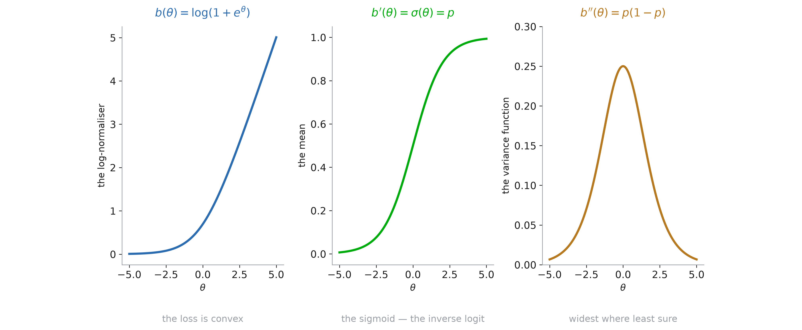

::: notes
Cash the promise on the case we built by hand. Bernoulli, so b(θ) = log(1+e^θ),
and the claim is that differentiating it once gives the mean and twice gives the
variance.

Left: b itself, the softplus. Flat on the left, linear on the right. It is convex,
and say why that matters now rather than later: the loss is b(θ) − yθ, so the loss
is a convex function plus a linear one, which is convex. Logistic regression has
one optimum and no local minima, and this is the reason. Nothing about the fit is
luck.

Middle: b′. Differentiate log(1+e^θ) and you get e^θ/(1+e^θ) — the sigmoid. Which
is p. Which is the mean of a Bernoulli. The claim b′ = μ is true here, and it is
not a coincidence of notation: the sigmoid the room has been drawing since session
two is the derivative of the Bernoulli's log-normaliser. Let that be slightly
surprising.

Right: b″ = p(1−p), the Bernoulli variance. Peaked at 0.25 where θ = 0, i.e. where
p = 0.5, and collapsing at both ends. Read it as a statement about the world: the
outcome is most variable where the model is least sure, and nearly deterministic
where it is confident.

Two things to put a pin in, both of which return before the section is out. The
curve on
the right is also the SLOPE of the curve in the middle — one function describes
both how fast the probability moves and how much the outcome scatters. And that
coincidence is what makes the gradient of logistic regression collapse to something
as simple as Xᵀ(y − p̂).
:::

## Loss is chosen for distribution

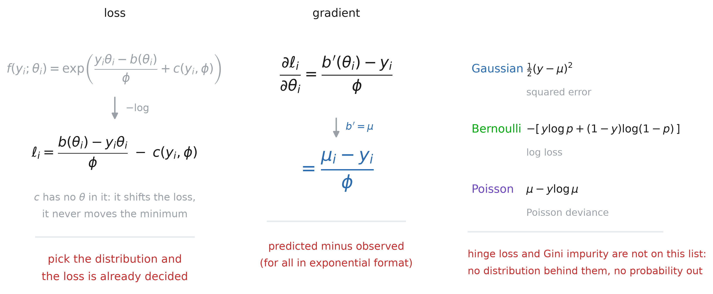

::: notes
Now make good on the claim from the likelihood slide: change the distribution and
the loss changes with it, automatically. We did the Bernoulli by hand three slides
ago; here is the same operation done once for the whole template.

Left: one operation, and it is the one they now recognise. The likelihood of row i
is the density; the loss is minus its log, summed over rows. Take minus the log of
the template and the exponential disappears:
ℓ_i = (b(θ_i) − y_i θ_i)/φ − c(y_i, φ). Put the Bernoulli's b and φ = 1 into that
and you are back at log(1+e^θ) − yθ, which is where we were three slides ago.

Point at c and then dismiss it. It contains no θ, so it is a constant as far as the
fit is concerned: it moves the value of the loss up or down and leaves the argmin
exactly where it was. That is why you never see it in a loss function in a library.

So the red line: you do not pick a distribution AND a loss. You pick a distribution
and the loss is already determined. The three declarations of a GLM were the whole
specification.

Middle: differentiate once with respect to θ. You get (b′(θ) − y)/φ, and we know
b′ = μ — we drew it on the previous slide — so it is (μ − y)/φ — predicted minus observed,
divided by a constant. Say the generality out loud: this is not a fact about
classification. EVERY member of the family has a loss whose derivative in the
natural parameter is the residual. Squared error having gradient (μ − y) is this
same statement, which is why that one feels obvious and this one should too.

Right: the three instances, so nobody thinks this is exotic. Gaussian gives squared
error — expand −log of a Gaussian density and everything that is not (y − μ)²/2 is
in c. Bernoulli gives log loss. Poisson gives μ − y log μ, which is what `sklearn`
calls the Poisson deviance and what you would use for counts of readmissions.
Three losses they already use, one derivation.

The red line at the bottom is the one to hold on to for the rest of the session.
Hinge loss is not minus the log of anything. Gini impurity is not minus the log of
anything. The SVC and the random forest are not fitting a distribution at all, so
there is nothing in their objective that makes the output a probability — and the
last three slides of this section are exactly that bill coming due.
:::

## Naive Bayes counts the same evidence twice

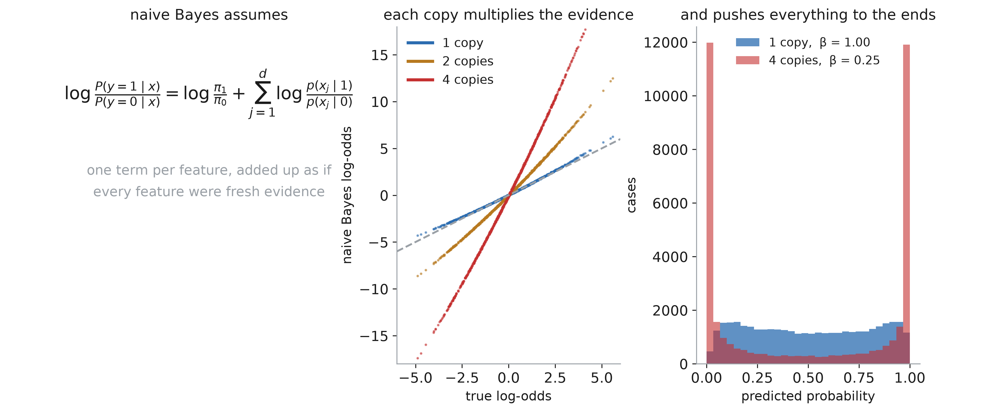

::: notes
Naive Bayes is the "too extreme" failure, and its mechanism is the cleanest of the
four because you can do it in your head.

Left: the model. The posterior log-odds are the prior log-odds plus one term per
feature — and that addition is only valid if the features are conditionally
independent given the class. Every feature is treated as fresh evidence.

Middle is the experiment, and it is almost too neat. Take ONE informative feature
and hand the model k near-identical copies of it. The fitted log-odds are k times
the truth: the measured slopes are 0.99, 1.99 and 3.97 for one, two and four
copies. The model is not learning anything new from the copies; it is counting the
same evidence again, and confidence compounds.

Right: what that does to the probabilities. With four copies, β collapses to 0.25
— exactly 1/k, as it must — and the predictions pile up against 0 and 1.

Now connect it back: the dataset in this section has `n_redundant=2`, two features
that are linear combinations of the informative ones. That is a mild version of
what I just did deliberately, and it is enough to produce the 58% figure from the
first slide.

The general lesson, which is bigger than naive Bayes: correlated features are the
norm in clinical data — repeated labs, a score and its components, height and
weight and BMI. Any model that assumes independence will be overconfident in
exactly this way.
:::

## Random forests cannot reach the ends

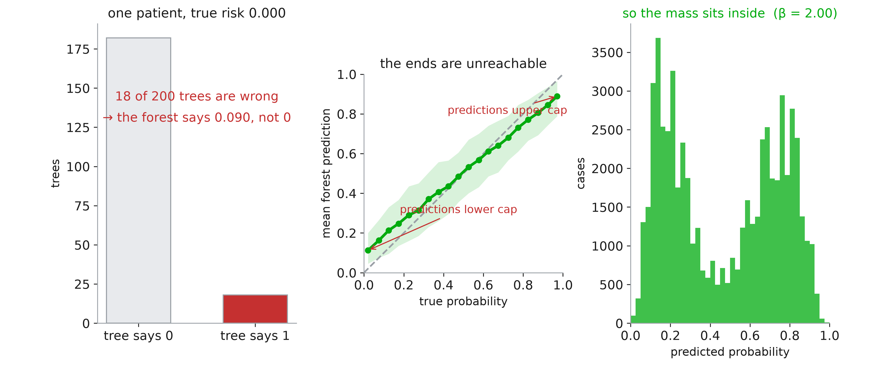

::: notes
The opposite failure, and the argument is Niculescu-Mizil and Caruana's.

Left: take the lowest-risk patient in the test set — true risk essentially zero.
For the forest to output 0, every single tree must output 0. But the trees are
high-variance, because each sees a bootstrap sample and a random subset of
features at each split. Here 18 of the 200 trees say 1, so the forest says 0.09.
Not because it is uncertain in any meaningful sense — because averaging cannot
cancel errors that all point the same way.

And they do all point the same way, which is the middle panel. Predictions live in
[0, 1]. Near zero, an erring tree can only err UPWARD; near one, only downward.
The error is one-sided at both ends, so the average is pulled inward at both ends,
and the mean prediction curve bends away from the diagonal in a sigmoid.

Right: the consequence on the shared example. Two humps, nothing at the ends,
β = 2.00.

Say the counter-intuitive part out loud, because it is the memorable bit: this
model should trust itself MORE. The repair stretches its predictions outward,
which is the opposite of what people expect a correction to do.

And note it is specific to averaging: a single tree has the reverse problem, it
outputs only 0 and 1. Bagging fixed the variance and bought a bias in the
probabilities.
:::

## Margins only look at the boundary

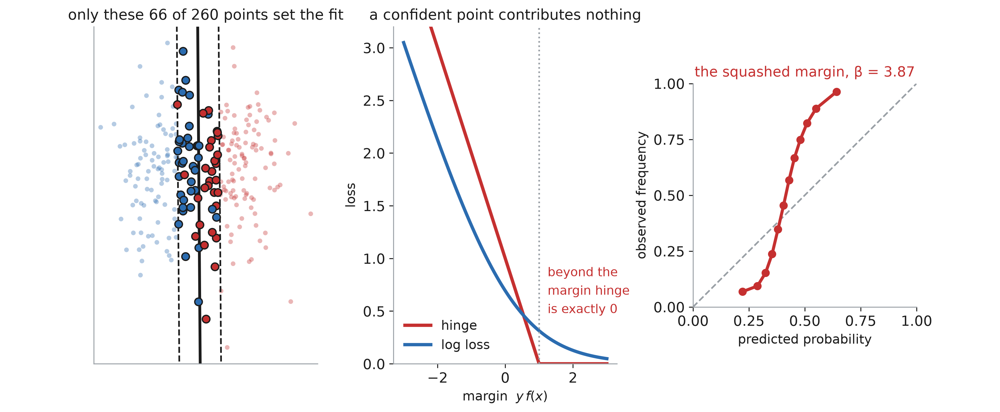

::: notes
The SVC is the worst of the four, and for a reason that is structural rather than
incidental.

Left: the fitted boundary and its margin. Of 260 points, 66 lie inside the margin
or on the wrong side. Those are the only points that matter — move any of the
other 194 and the solution does not change.

Middle: why. Hinge loss is exactly zero once y·f(x) exceeds 1. A point that is
comfortably, correctly classified contributes NOTHING to the objective. This is the
pin from the second slide of the section: log loss falling towards zero but never
reaching it, against hinge going flat at exactly zero past margin 1.

And the deeper version of the same point: hinge loss is not minus the log of any
density. There is no distribution here whose negative log-likelihood we are
minimising, so no b, no θ, no canonical pairing, and nothing that forces the
residuals to sum to anything. Logistic regression ends up with the balance
property because its loss came from a distribution; this one cannot, because its
loss did not.

So the fit is determined entirely by the hard cases near the boundary, and the
scale of f(x) is set by the margin, not by any probabilistic consideration. There
is no reason for f to be a log-odds, and it is not.

Right: what happens when you squash it anyway. Min-max the decision function into
[0, 1] — which is what a naive pipeline does — and you get the strongest sigmoid
of the four, β = 3.87, with no prediction below 0.2 or above 0.7.

Historical note worth ten seconds: this is exactly the problem Platt was solving in
1999. The method we will use to repair all four of these models was invented for
this one.
:::

# Until proven otherwise, models predict a score

::: notes
Pull the four together. Logistic regression was calibrated because the loss, the
link and the data-generating mechanism agreed — the first two by construction,
since both came out of the Bernoulli, and the third by luck of the simulation — and even then only in-sample, and
only at a sensible C. Every other model was biased, and each in a different
direction: naive Bayes too extreme, forest and SVC too timid.

So the working assumption should be reversed from the one students arrive with. A
model's output is a SCORE until you have looked at a reliability diagram. The
ranking may be excellent — the forest had the best AUC here — while the numbers
are unusable.

Transition to the fix: all four failures are monotone distortions of the truth.
That is a strong hint about the repair, and it is what the next section is about —
fit a function that maps the model's output to a probability, on data the model has
not seen.
:::

## What is AUC?

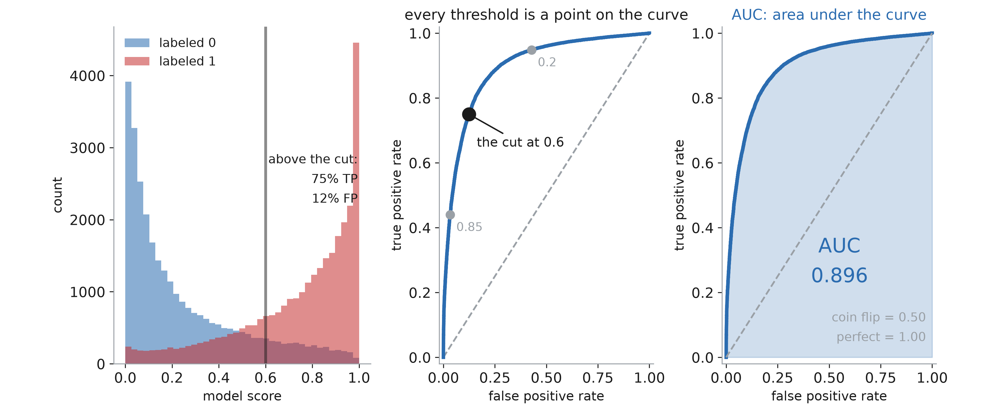

::: notes
I have been quoting AUCs all session — 0.896, 0.929, 0.934 — without defining the
thing. It is the other half of model evaluation, and the half that is blind to
everything we are about to repair, so it needs saying properly.

Panel 1. A classifier does not really give you a decision, it gives you a score,
and a decision only appears when you pick a threshold. Here are the logistic
regression's scores, drawn separately for the patients who had the complication
and those who did not. The two distributions OVERLAP — that is the entire problem
of classification in one picture. Put the cut at 0.6 and you catch 75% of the
complications while also flagging 12% of the people who were fine. Move the cut
left and you catch more of both; move it right and you catch fewer of both. There
is no setting that wins on both counts, and nothing in the data tells you where to
put it.

Panel 2. So stop picking one. Slide the threshold from 1 down to 0, and at every
position record the pair (false positive rate, true positive rate). Each threshold
is a point; the whole sweep is a curve. That is the ROC curve. The marked black
point is the cut from panel 1; the two grey points are the cuts at 0.85, which is
cautious, and 0.2, which is aggressive. The curve is the model's complete menu of
trade-offs, with the choice of threshold taken out.

Panel 3. Summarise the menu by the area underneath it. A model that ranks perfectly
hugs the top-left corner and scores 1.0; a model that ranks at random follows the
diagonal and scores 0.5. This one gets 0.896.

Two things to say explicitly, because both come back later. First, AUC is
threshold-free by construction — it is a summary over ALL thresholds — so it can
never tell you which threshold to use, and a model with a great AUC can still be
useless at the only cut-off your hospital would accept. Second, and this is the
one that matters for the rest of the session: notice that nowhere in that
construction did we compare a predicted probability with an observed rate. We only
ever asked which patient scored higher. Hold on to that.
:::

## Reliability diagrams

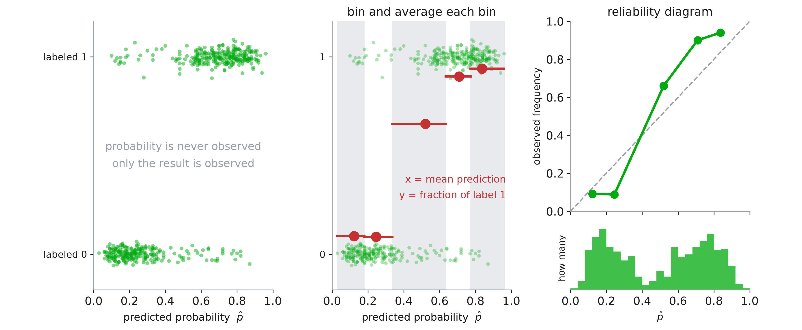

::: notes
We have been reading these since the first slide of the session without once
saying how they are made. Fix that now, because every metric that follows is a
summary of this picture, and the construction has choices in it.

Start with the problem, panel 1. Five hundred patients from the random forest.
Each one has a prediction between 0 and 1 — and an outcome that is 0 or 1. There
is no such thing as an observed probability for a single patient: the complication
either happened or it did not. So we cannot plot predicted against observed
directly. That is the whole difficulty, and it is worth letting them sit with the
cloud for a moment. You can see the model is doing something — the dots at the top
lean right, the dots at the bottom lean left — but you cannot see whether 0.7
MEANS 0.7.

Panel 2, the trick, and it is the only idea on the slide. You cannot get a
probability out of one patient, but you can get one out of a GROUP. Sort the
patients by prediction, cut them into bins — five here, shaded alternately — and
inside each bin ask two questions. What did the model say on average? That is the
x-coordinate. What fraction actually had the complication? That is the
y-coordinate. One red dot per bin. The red bar shows the bin's span; the dot sits
at the bin's mean prediction.

Panel 3, throw away the cloud and keep the dots. Add the 45-degree line, which is
where a truthful model lands: predicted 0.3, observed 0.3. Now the picture reads
in one glance — this forest sits ABOVE the diagonal in the middle and at the top,
so the true rates are higher than it claims, and we know from the α-β slide that
this is the β = 2.00 too-timid shape.

And the histogram underneath, which is not decoration. It says where the patients
actually are. Two humps, almost nothing between 0.4 and 0.5 — so the part of the
curve that crosses the diagonal is supported by very few patients, and you should
not read it hard. Any reliability diagram without this histogram is hiding
something: a point at 0.9 computed from eight patients looks exactly like a point
at 0.9 computed from eight hundred.

Terminology for the exam: this is a reliability diagram, a calibration curve or a
calibration plot — three names, one object. And note `sklearn` gives it to you as
`calibration_curve`, with `n_bins` and `strategy` arguments, which are precisely
the two choices the next slide is about.
:::

## Choices hidden in a calibration curve

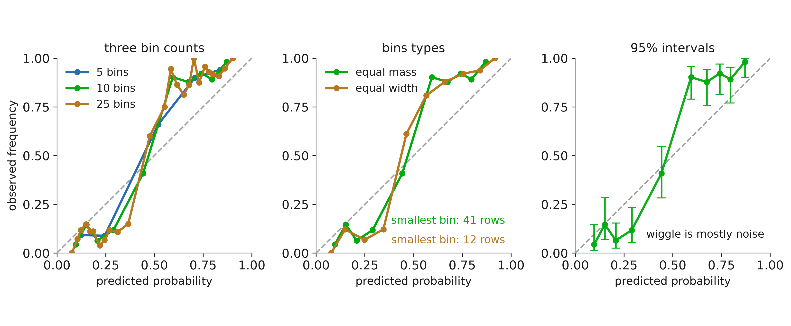

::: notes
Three decisions go into that picture, none of them printed on it. Someone hands
you a calibration curve; these are the questions to ask.

Panel 1: how many bins? The same 500 patients, three times. Five bins gives a
smooth, confident-looking curve. Twenty-five gives a jagged one that touches 1.00
and drops to 0.04. Both are the same model on the same data. Every wiggle you are
tempted to interpret — "it over-predicts in the 0.6 to 0.7 range" — may be nothing
but the bin count. Few bins hide real structure; many bins invent structure that
is not there. This is exactly the bias-variance trade-off from session 1, applied
to a plot.

Panel 2: how are the bins drawn? Equal WIDTH cuts the [0, 1] axis into ten equal
pieces; equal MASS puts the same number of patients in each. They are different
curves from the same data. The numbers in the corner are the point: with equal
mass the smallest bin still holds 41 patients, with equal width it holds 12. Those
sparse equal-width bins are where the wild swings at the ends come from. Equal
mass — `strategy="quantile"` — is the better default for exactly this reason, and
it is what the curves elsewhere in this deck use.

Panel 3: how sure are we of each point? Each dot is a proportion estimated from
about fifty patients, so it carries a binomial confidence interval — Wilson
intervals here, because the normal approximation misbehaves near 0 and 1. Look at
the widths. They span 0.2 or more. Now look back at panel 1 and ask how much of
that jaggedness survives once every point is allowed to move a fifth of the way up
or down. Almost none of it. The overall tilt is real; the wiggle is not.

The habit to build, and it is the point of the slide: a reliability diagram is a
plot with error bars that are usually not drawn. Before concluding that a model is
miscalibrated in some specific region, check n in that region. Before comparing
two curves, check that they were binned the same way. And prefer the summary
numbers — β, and the Brier score — when you need to actually decide something,
because they use every patient instead of throwing them into ten buckets.
:::

## Brier score

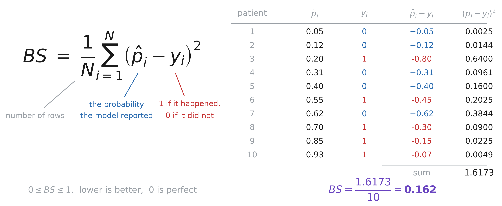

::: notes
Before we compare repairs we need something to compare them with, and every
scoreboard in the rest of the session leans on one number. It is the simplest
formula in the deck, so let us just compute it once, by hand, and never be vague
about it again.

Left, the definition. For each patient take the probability the model reported,
subtract the outcome — 1 if the complication happened, 0 if it did not — square
it, and average over the cohort. That is the entire Brier score. Say what is NOT
in that formula, because it is the reason it is trustworthy: no threshold, so you
are not committing to a decision rule; no binning, so there is no arbitrary choice
of how many bins as there is in a reliability diagram; and no fitted parameters,
so there is nothing to overfit. Every patient contributes exactly one term.

Right, the same ten patients worked through. Walk two rows out loud. Patient 1:
told 0.05, no complication, error +0.05, squared 0.0025 — essentially free.
Patient 3: told 0.20, and the complication happened, error −0.80, squared 0.6400.
That single patient contributes 40% of the total. Sum the column, 1.6173, divide
by ten, and the Brier score is 0.162.

Three reference points to anchor the scale, and it is worth putting them on the
board because a bare 0.162 means nothing on its own. Predict 0.5 for everybody and
you score 0.25. Predict the base rate ȳ for everybody — the no-model model — and
you score ȳ(1 − ȳ), which for a 30% complication rate is 0.21. A perfect oracle
scores 0. So the number only has meaning relative to the base rate of YOUR cohort:
on a rare outcome, a Brier score of 0.02 can be worthless.

Two footnotes. First, this is mean squared error with 0/1 targets; nothing more.
`sklearn.metrics.brier_score_loss`, and if you compute it with `mean_squared_error`
you get the same number. Second, and this catches people reading older papers:
Brier's 1950 original summed over BOTH classes, so it ranges to 2 and is exactly
twice this. Everyone now means the version on this slide.

The one property that makes it usable at all: it is a PROPER scoring rule. Your
expected penalty is smallest when you report your honest belief — hedging towards
0.5 to look safe, or exaggerating towards 0 and 1 to look decisive, both cost you.
That is what we are about to exploit: a repair that improves the Brier score is a
repair that made the probabilities more honest, not one that gamed the metric.
:::

## Brier score and calibration

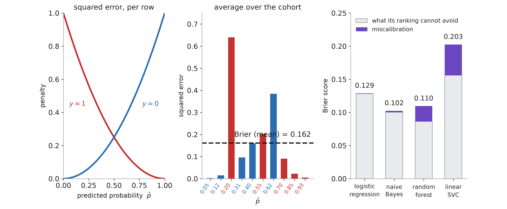

::: notes
Now that the arithmetic is settled, three things about the number that the
formula does not show.

Left: one patient. The model said p̂, the outcome was y, and the penalty is
(p̂ − y)². That is the whole definition. A patient who was told 0.7 and did have
the complication costs (0.7 − 1)² = 0.09. Two things to notice about the shape.
It is zero only when you were exactly right, and it is a PARABOLA, so being wrong
by 0.6 hurts nine times as much as being wrong by 0.2 — confident mistakes are
punished disproportionately. Compare with log loss from the first half: same
instinct, but log loss goes to infinity at a confident mistake, while Brier tops
out at 1. Brier is the gentler of the two, and it is bounded.

Middle: the cohort. Average the per-patient penalties. Ten patients here, and the
Brier score is 0.162 — that is all "Brier score" means, a mean squared error where
the target happens to be 0 or 1. Note which bars dominate: the patient given 0.20
who had the complication, and the one given 0.62 who did not. Two confident
mistakes, 63% of the total. The seven it got roughly right contribute almost
nothing. A Brier score is essentially a report on your worst calls.

Right: the catch, and this is the panel that matters. The four models from the
first slide, scored. Naive Bayes 0.102, better than logistic regression's 0.129 —
which is the number I flagged at the start of the session and promised to explain.
Here is the explanation. Murphy's decomposition splits the score in two:
BS = miscalibration + (irreducible − resolution). Grey is what the model's ranking
cannot avoid; purple is what recalibration could remove.

Read the four bars. Logistic regression: almost no purple, so it is honest — its
score is simply limited by how well it separates patients. Naive Bayes: a sliver
of purple and a much shorter grey bar, because it RANKS better; it wins on
discrimination while being badly calibrated. Random forest: a real purple band,
about a fifth of its score, sitting on the best grey bar of the four. Linear SVC:
worst on both counts.

So the lesson to write down: a Brier score is a good summary and a terrible
diagnosis. A bad one does not tell you whether the model ranks badly or lies about
its confidence, and only the second of those is fixable by what we are about to
do. Never report it without a reliability diagram beside it.
:::

## Intercept α and slope β

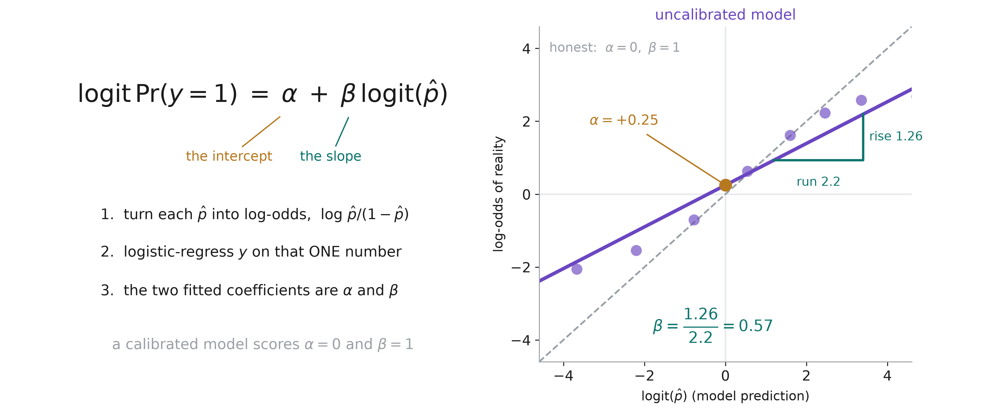

::: notes
The Brier score said HOW badly; these two numbers say in WHICH DIRECTION. They are
the pair I have been quoting since the first slide — β = 0.57 for naive Bayes,
β = 2.00 for the forest — so let us compute them properly.

Left, the recipe, and it is deliberately the same shape as Platt scaling two
slides from now: take the model's prediction, put it on the log-odds scale, and
logistic-regress the outcome on that one number. The fitted intercept is α, the
fitted slope is β. This is Cox's 1958 recalibration, and it is the standard way
clinical papers report calibration — if you read a TRIPOD-compliant paper, these
two numbers are in the results table.

Why the log-odds scale and not the probability scale? Because on the probability
scale a "straight line" is meaningless — the truth is squashed into [0, 1] and
every relationship curves. Taking logits unbends it, so the question "is the model
telling the truth" becomes "does this scatter lie on the 45-degree line", and a
straight line has exactly two parameters to check.

Right, the fit for naive Bayes, the second model from the opening slide. Each
purple dot is a bin of patients — x is what the model claimed in log-odds, y is
the log-odds of what actually happened, and the dot size is how many patients are
in the bin. The dashed 45-degree line is the honest model.

Read α off geometrically: it is the height of the fitted line where the model says
logit = 0, that is, where it predicts 50%. Here +0.25, so at the point where the
model says "coin flip" the truth is very slightly above a coin flip.

Read β as rise over run: go 2.2 to the right along the model's axis and the truth
only rises 1.26, so β = 0.57. That is the whole diagnosis of naive Bayes in one
number. The model moves its opinion nearly twice as far as reality moves. Point at
the dots at the ends — bottom-left the model says −3.7 and the truth is −2.0;
top-right it says +3.4 and the truth is +2.6. It is shouting where it should be
speaking.

One warning to leave them with: α and β are fitted numbers, so they have standard
errors, and on a few hundred patients those are wide. A β of 0.9 is not
distinguishable from 1. Do not over-read the second decimal.
:::

## Reading α and β

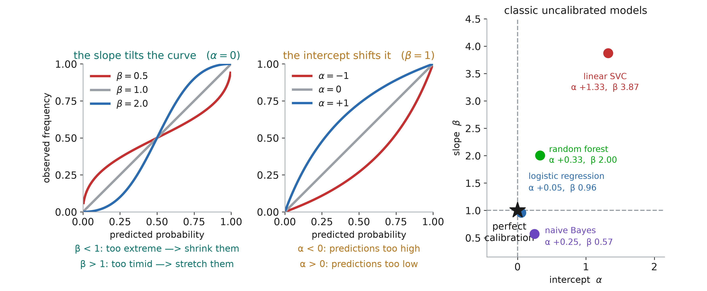

::: notes
Now the interpretation, and the two numbers do genuinely different jobs.

Left panel, the slope alone, with α held at 0. β = 1 is the diagonal. β = 0.5 in
red is FLATTER than the diagonal: the model's predictions are spread wider than
the truth, so a prediction of 0.9 corresponds to an observed 0.75. Too extreme,
and the repair shrinks the predictions towards the middle. β = 2 in blue is
STEEPER: the model's predictions are bunched in the middle while the truth spreads
out, so 0.6 corresponds to 0.69. Too timid, and the repair stretches them outward.

Make them say which is which, because the intuition is backwards for most people.
A curve that is FLAT means the model is OVERCONFIDENT. Flat looks cautious and
means the opposite.

Middle panel, the intercept alone, with β held at 1. Now the shape is preserved
and the whole curve lifts or drops. α = −1 in red means the truth is below what
was claimed everywhere — the model quotes risks that are systematically too high.
α = +1 is the reverse. This is the one that moves when you deploy a model in a
hospital with a different base rate, and it is the easy one to fix: a single
additive shift on the log-odds scale, no refitting.

The clinical framing worth saying out loud: α is a bias on the whole population —
everyone is quoted 20% when the truth is 12% — while β is a bias that depends on
the patient, hurting the high-risk and low-risk ends hardest and leaving the middle
roughly right. For a triage tool, β is the dangerous one, because the patients at
the ends are the ones the tool exists to find.

Right panel, the four models from the opening slide placed on the (α, β) plane.
The star is honesty. Logistic regression sits essentially on it, α +0.05, β 0.96.
Naive Bayes is BELOW the line, β 0.57 — the only one of the four that is
overconfident. The forest at β 2.00 and the SVC at β 3.87 are above it, both too
timid, the SVC absurdly so and with a large α on top.

And now the transition. Notice that everything on this slide is a monotone
distortion, and notice that the fix we just described — α + β·logit(p̂) — is
itself a two-parameter map from score to probability. That is not a coincidence:
measuring calibration this way and repairing it by Platt scaling are the same
regression, run for two different purposes. Which is the next slide.
:::

## Expected calibration error

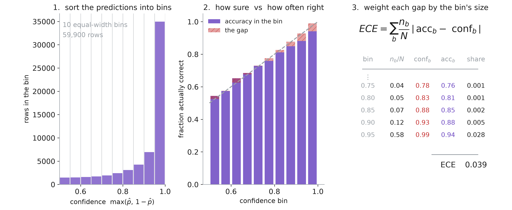

::: notes
The third metric, and the one they will meet in every deep-learning paper on
calibration. Brier gave one number for accuracy-and-honesty together; α and β gave
the direction of the bias; ECE tries to answer a narrower question — on average,
how far is the model's stated confidence from how often it is actually right?

First, a definition change to flag explicitly, because it trips people up.
Everything so far has used p̂, the probability of the complication. ECE comes from
the multiclass literature and uses CONFIDENCE — max(p̂, 1 − p̂), how sure the model
is whichever way it came down — paired with ACCURACY, the fraction it got right.
So a prediction of 0.02 and a prediction of 0.98 are both "98% confident". That is
a real loss of information, and it is the first thing to hold against the metric.

Panel 1: sort the predictions into M bins of confidence — ten equal-width bins
here, from 0.5 to 1.0. Look at the shape: naive Bayes puts 35 000 of its 60 000
patients in the top bin. It is almost always sure. This is the histogram from the
opening slide of the session, redrawn on the confidence axis.

Panel 2 is the heart of it, and this is the picture people mean when they say
"reliability diagram" in a deep-learning paper. For each bin, the purple bar is how
often the model was RIGHT, and the dashed diagonal is how sure it SAID it was. The
red hatched sliver on top of each bar is the gap between them. Every sliver points
the same way — accuracy below confidence — which is the signature of
overconfidence. If the bars reached the diagonal exactly, the model would be
perfectly calibrated in this sense.

Panel 3: turn the picture into a number. Take each bin's gap, weight it by the
share of patients in that bin, and add up. The weighting is what makes it an
EXPECTED error — the top bin holds 58% of the patients, so its gap of 0.05
contributes 0.028, which is most of the total on its own; the sparse low-confidence
bins barely matter however wrong they are. The answer is 0.039.

And say what that number means in words, because it is the one genuinely nice thing
about ECE: it is on the probability scale. 0.039 means that, averaged over patients,
this model is about 4 percentage points more sure of itself than it has any right
to be. Neither Brier nor β gives you a sentence that plain.

Next slide: why you should nevertheless not report it on its own.
:::

## ECE flaws

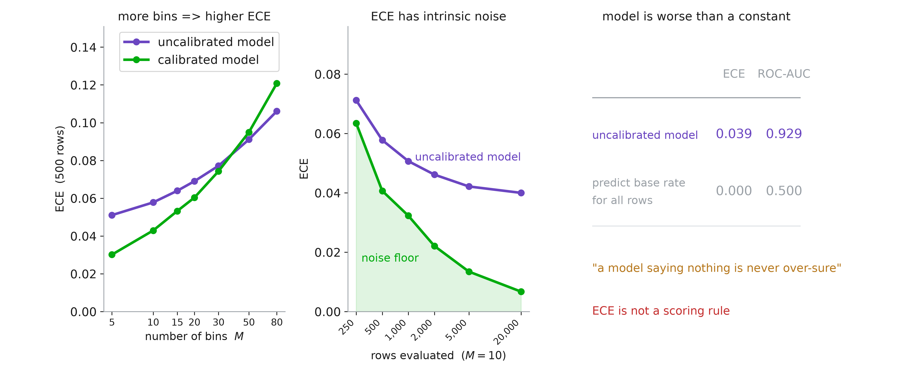

::: notes
Three problems, in increasing order of seriousness.

Panel 1. The number depends on M, and nothing in the definition tells you what M
should be. Ten is conventional, and that is the entire justification. Worse, the
dependence has a direction: more bins means fewer patients per bin, means the
observed accuracy in each bin is noisier, means |accuracy − confidence| is larger
on average even when the model is perfect. ECE is biased UPWARD, and the bias grows
with M.

The green line is the part to dwell on. That is a model whose predictions ARE the
true risks — perfectly calibrated by construction, nothing there to find. On 500
patients it scores 0.03 at M = 5 and 0.12 at M = 80. Pure measurement noise, read
as miscalibration. And follow the two lines to the right: past about 35 bins the
PERFECTLY calibrated model scores WORSE than naive Bayes. The bin count alone
reverses the ranking. If someone reports ECE without stating M, they have not
reported anything.

Panel 2. The same problem seen from the other side. The green band is the noise
floor — what a perfect model scores at M = 10 — as a function of how many patients
you evaluate on. At 20 000 patients the floor is 0.007 and naive Bayes sits at
0.040, so the gap is real and readable. At 250 patients the floor is 0.063 and
naive Bayes is 0.071. Indistinguishable. For a single-centre clinical study, which
is the setting this whole session is about, ECE at M = 10 is mostly measuring your
sample size. The honest fix if you must use it: compute the floor by simulation for
YOUR n and M, and report ECE against that floor rather than against zero.

Panel 3 is the deepest problem and the reason I would not let it stand alone.
Compare naive Bayes, ECE 0.039 and AUC 0.929, with a model that predicts the base
rate for every single patient. That constant model has ECE 0.000 — a perfect score
— and AUC 0.500. It is useless, and ECE calls it flawless.

The technical statement is that ECE is not a proper scoring rule: it is not
minimised in expectation by telling the truth, so you can improve it by saying less.
The Brier score cannot be gamed that way — that was the property we established two
slides ago — which is exactly why Brier is the one to report and ECE is the one to
add for interpretability.

So, the working rule for the three metrics together. Brier for the headline number,
because it is proper and cannot be gamed. α and β for the direction, because they
tell you what to fix. ECE only alongside the diagram that produced it, always with
M and n stated. And a reliability curve in all cases, because every one of these
scalars throws away the shape.
:::

# Calibration methods

## Platt scaling: fits a sigmoid

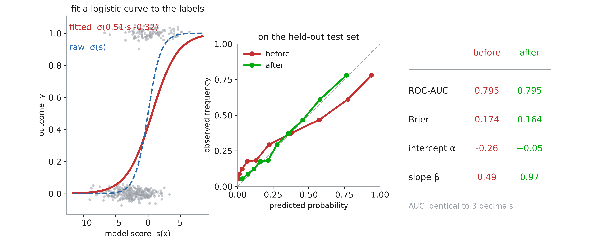

::: notes
The first and oldest of the three, and the one to teach properly because the other
two are variations on it.

Left panel is the whole method. Throw away every feature. Keep one number per
patient — the model's score s(x) — and the label y. That is a dataset with one
predictor and a binary outcome, so fit the thing we spent the first half of the
session on: a one-variable logistic regression, p̂ = σ(a·s + b). Two parameters.
The grey dots are the labels, jittered so you can see the density; the red curve
is the fit; the blue dashed curve is what the model was implicitly claiming by
squashing its own score. Here the fit is σ(0.51·s − 0.32) — the slope is a HALF,
which is the method saying, in one number, "this model is twice as confident as
it has earned".

Middle panel, on patients neither the model nor the calibrator has seen: the red
before-curve sags below the diagonal, the green after-curve sits on it.

Right panel is the scoreboard, and there are two lines worth pausing on. Brier
0.174 to 0.164, slope β from 0.49 to 0.97 — that is the repair. And ROC-AUC 0.795
to 0.795, identical to three decimals, because σ(a·s + b) with a > 0 is strictly
increasing and therefore cannot reorder two patients. Say it plainly: calibration
is free. You are not trading away discrimination, you are relabelling the axis.

Two properties follow from "only two parameters", and they are the reason Platt
survives in small clinical studies. It needs very little data — a few hundred rows
is genuinely enough to pin down two numbers. And it cannot overfit much, because
there is almost nothing there to overfit. The price is the assumption: it can only
produce sigmoid-shaped corrections. If the true distortion is not of that shape,
Platt will not find it, however much data you give it.

Historical footnote: Platt, 1999, and the model he was fixing was the SVM — the
worst-behaved of our four.
:::

## Isotonic regression: fits any monotone shape

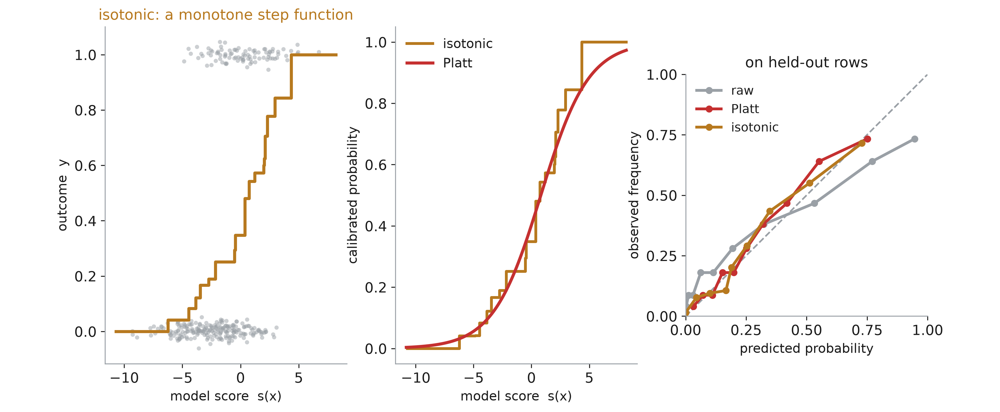

::: notes
The second technique drops Platt's assumption and keeps only the part we actually
believe.

What do we really know about the map from score to probability? Not that it is a
sigmoid. Only that it is INCREASING — a higher score should not mean a lower risk.
Isotonic regression fits the best non-decreasing function of the score, with no
other constraint. Left panel: the result is a staircase. The algorithm is
pool-adjacent-violators — sort by score, sweep left to right, and wherever the
running average goes DOWN, merge the two blocks into one and take their pooled
average. Repeat until the whole sequence is non-decreasing. Twenty steps here.
That is it; it is one pass, and it is exact, not iterative optimisation.

Middle panel puts the two maps side by side on the same axis. The staircase tracks
the sigmoid closely in this example, because I generated this example with a
sigmoid distortion — Platt's assumption happens to be true. Under those conditions
the extra flexibility buys nothing and costs something: on held-out patients Platt
gets Brier 0.160 and isotonic 0.164, and isotonic's slope is 0.77 against Platt's
1.03. Flexibility you do not need is variance you did not have to pay for.

Two failure modes to flag, both visible in the left panel. The steps at the ends
are wide and are estimated from few patients, so the extreme probabilities are the
least reliable ones — and note the top step is exactly 1.000, which is a
probability no honest model should ever issue. And the function is piecewise
constant, so patients whose scores differ get the identical probability; the map
is monotone but not strictly so, which means isotonic CAN destroy a little
discrimination where Platt cannot.

Where isotonic earns its keep is the case this figure does not show: a distortion
that is not sigmoid at all. Then Platt is structurally unable to fix it and
isotonic is. That trade is the next slide.
:::

## Flexibility against data

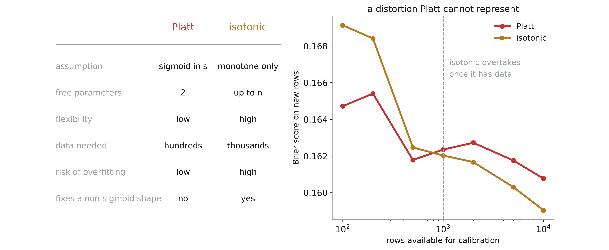

::: notes
Left, the comparison as a table; right, the same comparison run as an experiment.

Read the table down the middle column first. Platt assumes a sigmoid in s and has
two free parameters; isotonic assumes only monotonicity and has up to n — one per
distinct score, in the limit. Everything else in the table follows from that one
row. More parameters means more flexibility, means more data needed, means more
risk of overfitting, and means it can represent shapes Platt cannot.

Right panel is the experiment that makes it concrete, and the set-up matters:
here the true distortion is deliberately NOT sigmoid, so Platt is mis-specified —
this is isotonic's best case, not a neutral one. x-axis is the number of patients
available to fit the calibrator, log scale; y-axis is Brier on new patients.

Below about a thousand, Platt wins despite being wrong about the shape, because
isotonic's staircase is chasing noise. Above it they cross and isotonic keeps
improving while Platt flattens out — Platt has hit its own ceiling, the bias of an
assumption that does not hold, and no amount of extra data will move it.

So the rule of thumb, and it is only a rule of thumb: hundreds of rows, Platt.
Thousands, and a reliability curve that does not look sigmoid, isotonic. For a
typical single-centre clinical study — a few hundred events — the answer is
Platt, and this is why sklearn's default is `method="sigmoid"`.

Both of them, note, need patients the model has not seen. Which is the problem the
next slide is about.
:::

## Temperature scaling

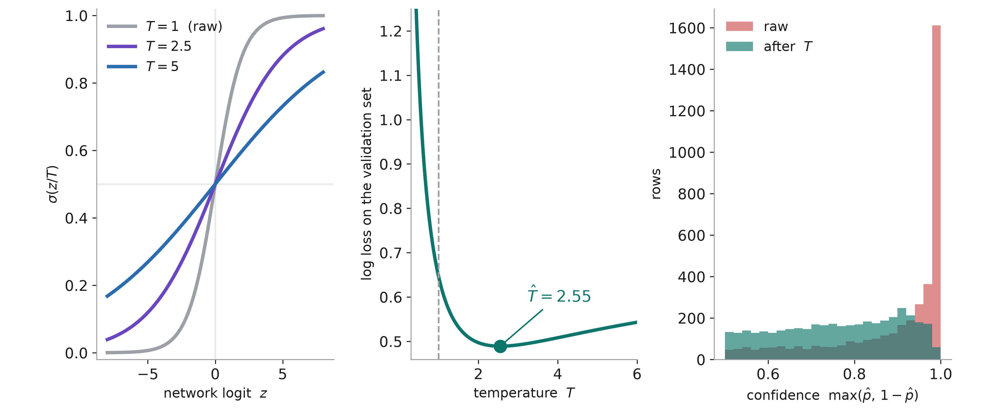

::: notes
The third method, and the one they will actually meet if they go anywhere near
deep learning. Guo et al., 2017, "On calibration of modern neural networks" —
the paper that made this a default step in the vision and NLP pipelines.

The setting first, because it explains the design. A network does not hand you a
probability, it hands you a LOGIT, and the probability comes from a sigmoid or a
softmax at the very end. Train that network to near-zero training loss and the
logits keep growing — the loss can always be reduced a little further by pushing
the correct logit higher — so the network ends up enormously overconfident. This
is the naive Bayes failure from the first half, but industrial-strength: a modern
image classifier routinely reports 99% on inputs it gets wrong a third of the time.

The fix is one number. Divide every logit by T before the sigmoid: p̂ = σ(z / T).

Left panel, what T does. T = 1 is the raw model. Larger T flattens the curve, so
the same logit produces a probability closer to a half. Two things to point at.
The curves all cross at z = 0 — the sign of the logit never changes, so nothing
that was classified one way is now classified the other. And the ordering along
the curve is preserved, so the ranking, and therefore the AUC, is untouched. T < 1
would sharpen instead; it is allowed, just rarely what you need.

Middle panel, how T is found. Fix the network, take the validation set, and plot
the log loss as a function of T. It is a one-dimensional, convex-looking curve
with a clear minimum — here T̂ = 2.55. You can literally find it by scanning a
grid, which is what makes this the cheapest calibration method in the deck: one
forward pass over the validation set, no refitting, no gradients through the
network. Note the asymmetry: being too sharp on the left is punished much harder
than being too soft on the right. Log loss hates a confident mistake.

Right panel, the effect on the predictions. Before, in red, a spike of 1600
patients pinned against confidence 1.0 — the model is certain about a fifth of the
cohort. After, in teal, that spike is gone and the confidence spreads out across
the range. The model has not learned anything new; it has stopped shouting.

Say the multiclass version out loud, since that is where they will use it:
softmax(z / T) instead of σ(z / T), same single T shared across all classes and all
inputs. Because it is shared, it cannot reorder the classes, so the argmax is
unchanged and the top-1 accuracy is EXACTLY the same after calibration as before.
That is the property that got it adopted — you can add it to a trained model and
nobody's benchmark number moves.
:::

## Temperature link with Platt

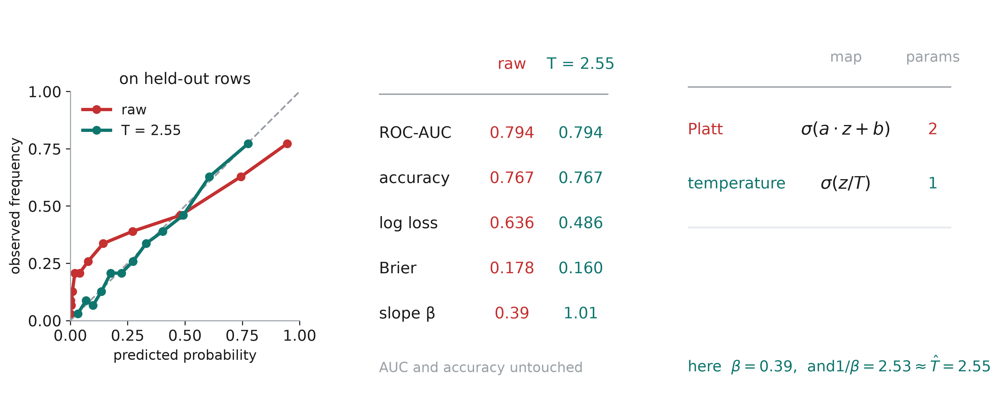

::: notes
What it buys, and what it cannot do.

Left, the reliability diagram on held-out patients. The raw curve is the flat,
overconfident shape we now recognise on sight — and read it the way we agreed two
slides ago: flat means overconfident. After temperature scaling it sits on the
diagonal.

Middle, the scoreboard, and the top two rows are the headline. ROC-AUC 0.794
before and after. Accuracy 0.767 before and after. Identical, not approximately
identical — dividing every logit by a positive constant cannot reorder anything
and cannot move anything across the 0.5 boundary. Meanwhile log loss falls from
0.636 to 0.486 and Brier from 0.178 to 0.160. You have bought honest probabilities
for free, in the strict sense that nothing else changed.

Bottom row ties it to the previous section: slope β goes from 0.39 to 1.01. And
now the connection worth spending thirty seconds on, right panel. Platt fits
σ(a·z + b), two parameters. Temperature fits σ(z / T), one — it is Platt with the
intercept forced to zero and a reparameterised as 1/T. So everything follows: it
can repair a slope but it CANNOT repair an intercept. If the model is
systematically too high or too low across the board, no temperature will fix it,
because every candidate map passes through 0.5 at z = 0.

And the numbers confirm the algebra. The raw model had β = 0.39; one over that is
2.53; the fitted temperature was 2.55. Temperature scaling is, quite literally,
estimating 1/β and dividing by it.

So the ladder, and this is the summary for the whole section: one parameter for a
network whose logits are merely too big, two for a general monotone-sigmoid
distortion, and up to n for isotonic when you have the data and the distortion is
not sigmoid at all. Pick the fewest parameters your problem needs — every one of
them has to be paid for with patients the model has never seen, which is the next
section.
:::

## Platt calibration does *not* change AUC

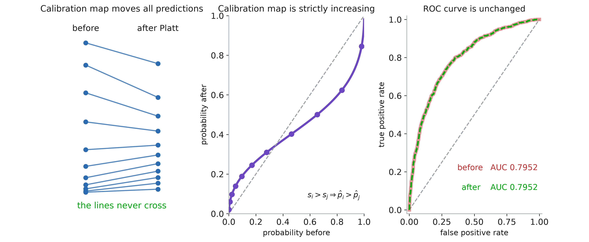

::: notes
Everything in the section we are about to start is a MONOTONE map applied to the
score. Platt, isotonic, temperature — all three take the model's output and push
it through an increasing function. This slide is the consequence, and it is the
reason recalibration is worth doing at all: it costs you nothing.

Panel 1. Eleven patients, spread across the range, red if they had the
complication. On the left their probability before Platt scaling, on the right
after. Every one of them moves — that is the whole point of calibrating — and some
move a long way; the top red patient falls from 0.88 to 0.62. But look at the
lines. They never cross. No patient overtakes another. The order going in is the
order coming out.

Panel 2. Why. Here is the map itself: probability after against probability
before. It is strictly increasing, which is exactly the statement that if patient
i scored above patient j before, they score above them after. Platt's map is
σ(a·s + b) with a > 0, and a sigmoid of an increasing linear function is
increasing — there is no arrangement of a and b that can make it fold back on
itself.

Panel 3. And therefore, since AUC depends on nothing but order, the ROC curve is
not merely similar, it is the SAME curve. I have drawn the before curve thick and
the after curve dashed on top of it so you can see there is only one line there.
AUC 0.7952 before, 0.7952 after. Every one of the millions of case–control pairs
kept the answer it had.

This is the free-lunch slide, so say it plainly. Recalibration improves the Brier
score, fixes β, cleans up the reliability diagram, and takes NOTHING from
discrimination. If a colleague worries that calibrating might hurt the model's
ability to find sick patients, this is the answer: it mathematically cannot.

And the reverse is worth stating too, because it is the trap: a great AUC is no
evidence of calibration, since you can destroy calibration completely — square all
the probabilities, say — without moving the AUC at all.
:::

## Isotonic calibration and AUC

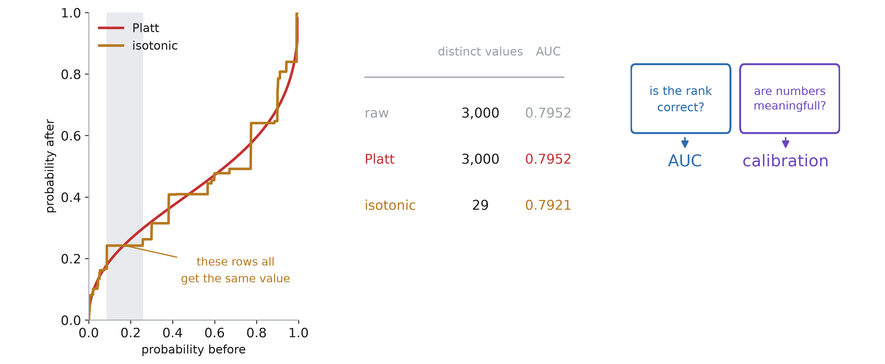

::: notes
Strictly increasing was the condition. Isotonic regression is increasing but not
STRICTLY, and that is the whole exception, so let us be precise about it.

Panel 1. The two maps on the same axes. Platt in red is a smooth curve — every
distinct input gives a distinct output. Isotonic in amber is a staircase, and a
staircase has flat treads. The shaded band is the widest of them: 592 patients
walked in with 592 different scores and walked out with the identical probability,
0.24.

Those patients used to be ordered. Now they are tied. And a tie, as we said two
slides ago, counts half a pair instead of a whole one — so every pair inside that
tread that the model used to get right is now scored 0.5 instead of 1.

Panel 2 puts a number on it. The raw model and the Platt-calibrated model have
3 000 distinct values and identical AUC to four decimals. Isotonic collapses them
to 29 and gives back 0.003 of AUC. So the exception is real, and it is also tiny —
0.003 on 0.795. Worth knowing, not worth worrying about; and it is one more small
entry on the isotonic side of the ledger we drew two slides ago, alongside needing
more data.

Panel 3 is the summary for the whole metrics half of the session. There are two
questions you can ask about a model, and they are independent. Does it put the
right patients first — that is discrimination, and AUC measures it. Are the numbers
it prints honest — that is calibration, and the reliability diagram, β and the
Brier score measure it. Recalibration moves the second and leaves the first
untouched. Nothing you have seen today moves the first at all; to improve AUC you
need a better model, not a better calibrator.

So report both, always. A paper that gives you only an AUC has told you the model
can rank patients and has said nothing whatever about whether its 30% means 30%.
:::

# Recalibration needs data of its own

## Main steps

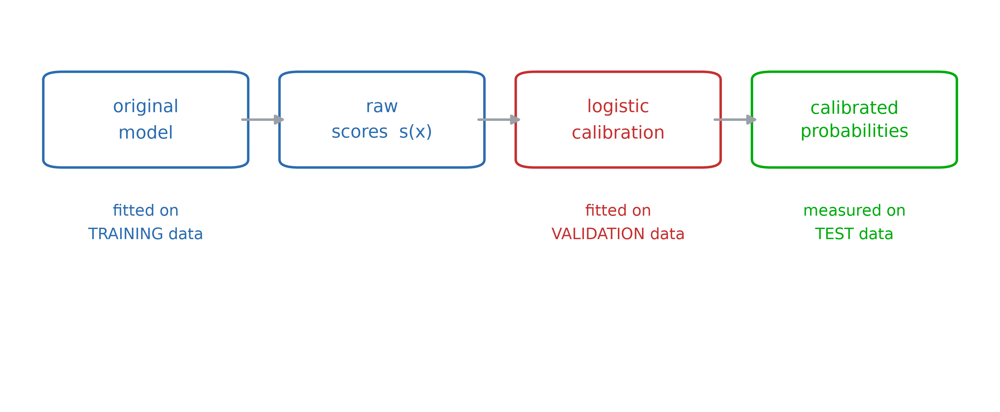

::: notes
The fix itself is almost insultingly small. Take the model's output, treat it as a
single feature, and fit a one-variable logistic regression of the outcome on it:
p̂ = σ(a·s + b) — Platt, from two sections ago. Two parameters, and it repairs
every monotone distortion we catalogued at the start — the naive Bayes stretch, the forest
squash, the SVC squash — because all of them are monotone, and a sigmoid of a
linear function of s is the most natural monotone family to reach for.

Say the free lunch out loud: the map is strictly increasing, so it never reorders
two patients. The AUC after recalibration is the AUC before it, to the last
decimal. You are not trading discrimination for calibration; you are only
relabelling the axis.

Now the part of the slide that actually matters, and the reason this section
exists: the three colours are three DIFFERENT sets of rows. The model is fitted on
training data. The calibrator is fitted on validation data. The result is measured
on test data. It is tempting to read that as ceremony — one more fold because
that is what one does. It is not. The next two slides show that folding the middle
box into the first one does not merely weaken the estimate, it produces a
calibrator that is confidently, systematically wrong, and wrong in a direction you
can predict in advance.
:::

## Calibration leak

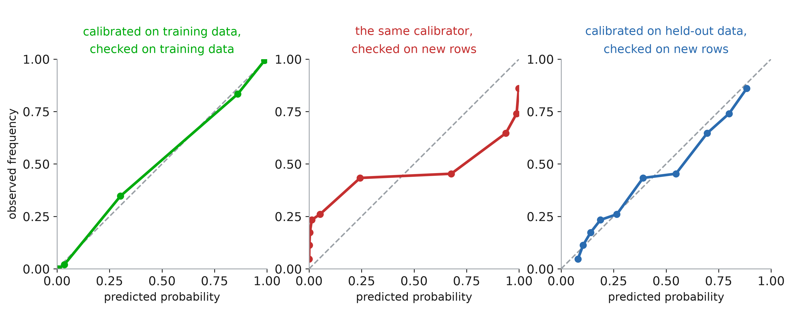

::: notes
Same experiment, now told the way it would actually reach you — as three
reliability diagrams, which is what someone hands you in a slide deck.

Left: calibrated on training data, and checked on training data. Perfect. Sits on
the diagonal from end to end. If this is the plot in the paper, the model is
declared calibrated and everyone moves on.

Middle: the same calibrator, the same fitted numbers, checked on patients it has
not seen. Look at the shape rather than the distance from the diagonal — the two
vertical walls at 0 and at 1. A whole column of patients was given a probability
below 0.01, and about a quarter of them had the complication. Another column was
told 0.99, and a quarter of them did not. Those are the 69% from the previous
slide, and this is what "closer to 0 and 1 than it should be" costs at the
bedside: the flat middle means the model has stopped distinguishing a 30% patient
from a 60% one.

Right: the honest version, held-out calibration set, checked on new patients. Not
as pretty as the left panel — and that is the lesson. The left panel is prettier
than the right one, and it is the useless one.

So a calibration curve computed in-sample is not weak evidence, it is no evidence
at all. When someone shows you a reliability diagram, the first question is not
"how close to the diagonal" — it is "which rows is this computed on".
:::

## Cross validation for calibration

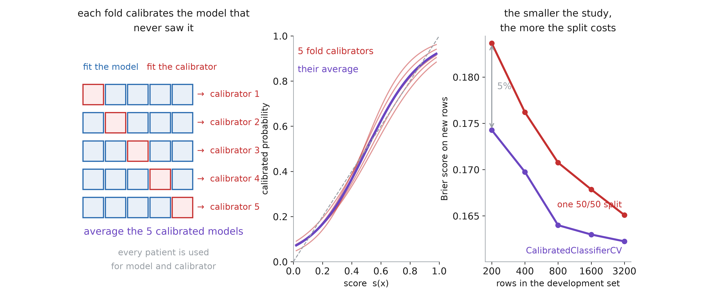

::: notes
Third technique, and it is not a third calibration curve — it is a way of paying
for one of the first two without sacrificing data. Platt and isotonic both need
rows the model was not fitted on, and in a 400-patient study handing half of them
to the calibrator is a real loss: the model is fitted on 200 rows instead of 400,
and you feel it.

Left panel, the trick. Split the development set into five folds. For fold 1, fit
the model on the other four and fit a calibrator on fold 1 — which that model has
never seen, so the mapping it learns is honest. Repeat five times. You now have
five (model, calibrator) pairs, and the final prediction is their average. Every
patient has been used to fit a model AND to fit a calibrator, and no patient has
ever calibrated a model that saw it. That is `CalibratedClassifierCV` with the
default `ensemble=True`: the split is conceptual, not physical.

Middle panel is the part people miss. Each fold's calibrator is fitted on only a
fifth of the data, so the five faint red curves disagree noticeably. They are
individually noisy. Their average, in purple, is much steadier — the same
variance-reduction argument as bagging, one level up: averaging five noisy
calibrators beats one calibrator fitted on a fifth of the rows, and it also beats
one fitted on half.

Right panel is what it is worth. Brier on new patients against the size of the
development set. At 200 patients, the single 50/50 split gives 0.184 and the
cross-validated version 0.174 — about five percent better. At 3200 the gap has
narrowed to 0.165 against 0.162. The smaller the study, the more the split costs
you, which is exactly backwards from what you can afford — and exactly why this
estimator exists.

The catch, since there is always one: you are now deploying an ensemble of five
models, not one, so prediction costs five times as much, and "the model" is
harder to write down in a paper. With `cv="prefit"` you get the single-split
version instead, for when you already have a fitted model you cannot refit.

And one thing it does NOT do: it does not give you a test set. The three-fold
rule — fit, calibrate, evaluate — still needs a third, untouched set of patients
to report on. Which brings us to why that rule exists at all.
:::
