## Main question
> Autograd gives us the gradient.
>
> How do we turn it into a network that trains well?

::: notes
Last session ended on `loss.backward()`: autograd fills `.grad` for every parameter.
Today is everything around that line — the optimizer that turns the gradient into a
step, the learning rate and how it should move during training, three tricks that
make training stable (clipping, batch norm, dropout), and the loss we put at the top.
:::

# Optimizers

## What an optimizer does

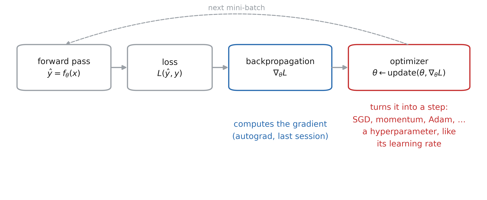

::: notes
Two reminders. Backpropagation is the algorithm that computes the gradient of the
loss with respect to every parameter of the network. A gradient descent optimization
algorithm takes that gradient and decides how to update each parameter to reduce the
loss.

Choosing the optimizer is among the most important design decisions in deep
learning. Treat it as a hyperparameter — and its own settings (learning rate,
momentum, ...) are hyperparameters too. The difficulty: the literature now lists
hundreds of optimization methods.
:::

## Benchmarking optimizers

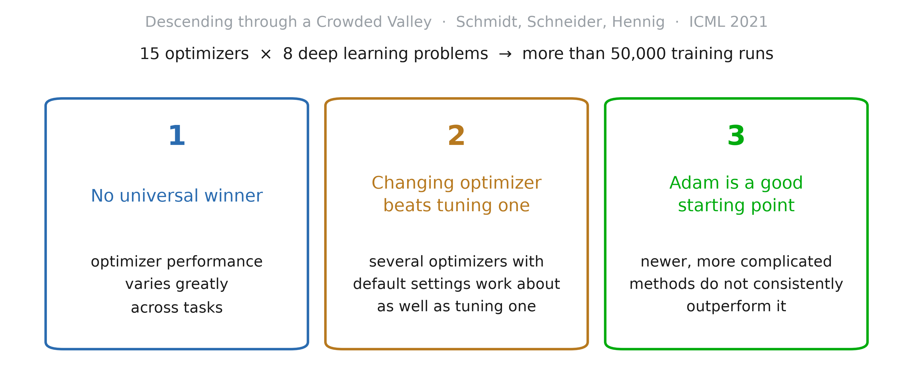

::: notes
Schmidt, Schneider, Hennig, "Descending through a Crowded Valley — Benchmarking
Deep Learning Optimizers" (ICML 2021, https://arxiv.org/abs/2007.01547). More than
50,000 individual runs. Three conclusions, quoting them:

(i) optimizer performance varies greatly across tasks; (ii) evaluating multiple
optimizers with default parameters works approximately as well as tuning the
hyperparameters of a single, fixed optimizer; (iii) no method clearly dominates, but
Adam remains a strong contender, with newer — more complicated, less documented —
methods failing to significantly and consistently outperform it.

Practical reading: start with Adam; if you have budget, try a few optimizers at
their defaults before spending it on tuning one.
:::

## SGD in PyTorch is gradient descent

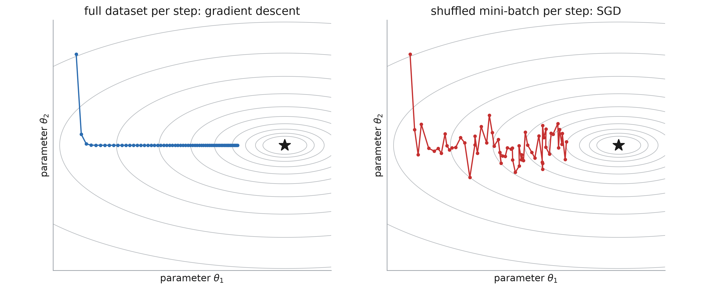

::: notes
The naming in PyTorch is a bit confusing. `torch.optim.SGD` implements plain gradient
descent: θ ← θ − lr · gradient. The stochasticity comes purely from the data loading:
each optimizer step uses a shuffled mini-batch. Feed it the whole dataset at every
step and you get gradient descent, not SGD.

Left: the full-data gradient, a smooth path. Right: the same update on mini-batch
gradients — noisy, but each step is much cheaper, and it still heads to the minimum.
:::

<!-- 
## Batch size 1

```python
train_loader = DataLoader(
    train_data, batch_size=1, shuffle=True)

for epoch in range(n_epochs):
    for inputs, targets in train_loader:
        optimizer.zero_grad()
        output = model(inputs)
        loss = loss_fn(output, targets)
        loss.backward()
        optimizer.step()
```
-->

## Batch size

```python
train_loader = DataLoader(
    train_data, batch_size=32, shuffle=True)

for epoch in range(n_epochs):
    for inputs, targets in train_loader:
        optimizer.zero_grad()
        output = model(inputs)
        loss = loss_fn(output, targets)
        loss.backward()
        optimizer.step()
```

::: notes
Only the first line changes. In practice a larger batch size usually allows a larger
learning rate — next slide for why.
:::

## Bigger batches implies less noise

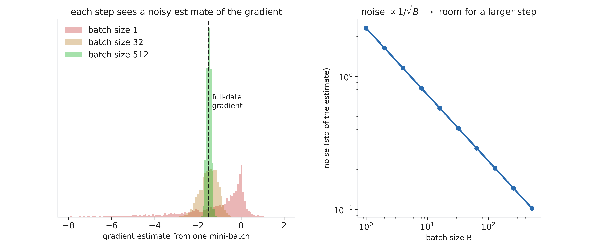

::: notes
IMPORTANT. A mini-batch gradient is an average of per-example gradients, so its
noise shrinks like 1/√B. Left: the estimates from batches of 1, 32 and 512 around
the full-data gradient. Larger batch → the gradient is more precise → less danger in
taking a larger step, i.e. a larger learning rate.
:::

## Momentum

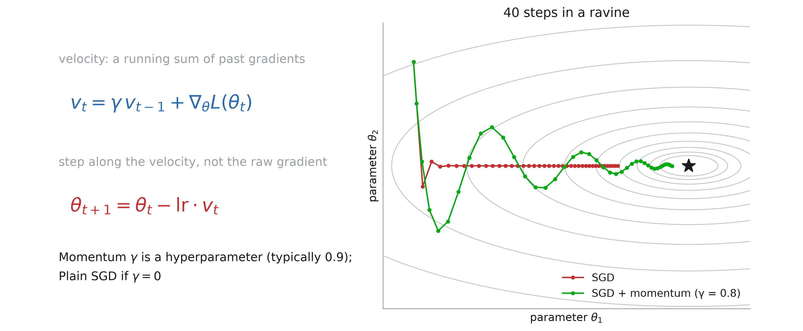

::: notes
Picture a ball rolling down a hill: high gradient = steep parts, low gradient = flat
parts. Often the minimum sits in a long, flat region; small gradients there mean
small steps, and learning is slow. We want the ball to keep the momentum it gained
on the steep slopes while it crosses the flat areas.

That is exactly what momentum does: the update uses a velocity v, the current
gradient plus the previous velocity times γ. Along a consistent direction the
velocity builds up; across a ravine the back-and-forth gradients cancel.

γ is a new hyperparameter (0.9 is the usual default). Further reading: Goh, "Why
Momentum Really Works", Distill 2017 — https://distill.pub/2017/momentum/
:::

# Learning rate

## The learning rate

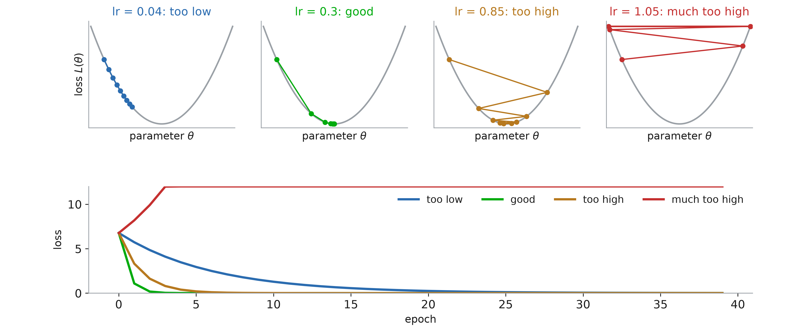

::: notes
Remind them what is on each axis: the parameter on x, the loss on y. Too low: it
converges, slowly. Good: a few steps. Too high: it bounces from wall to wall but
still gets there. Much too high: every step lands higher than the last — the loss
diverges. The bottom panel is what they will actually see: the loss against epochs.
:::

## Decay the learning rate

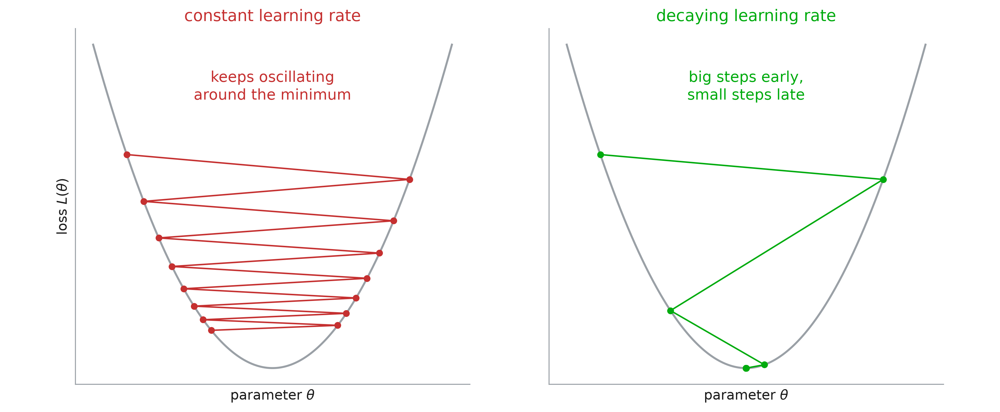

::: notes
Same axes. We want to get close to the minimum quickly, so a large learning rate at
the start; then we want to reduce it, otherwise we risk oscillating on either side of
the minimum forever. Hence learning rate schedules.
:::

## Learning rate schedulers

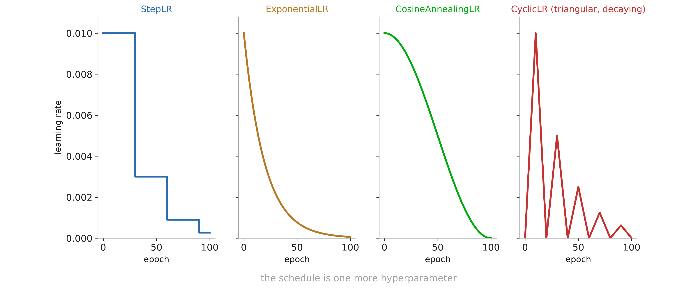

::: notes
All of these live in `torch.optim.lr_scheduler`, and there are many other —
sometimes rather exotic — ways to schedule the learning rate. Which schedule to use
is itself a hyperparameter. Call `scheduler.step()` once per epoch, after
`optimizer.step()`.
:::

## In the recitation
> Which optimizer, which schedule?
>
> We will try several of them in the notebook.

::: notes
We will also code the last figure — the cyclic schedule — in the notebook.
:::

# Training stability and regularization

## Gradient clipping

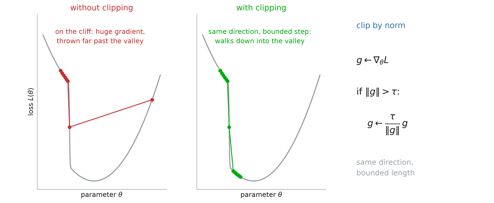

::: notes
Remind them of the axes again. Some loss surfaces have cliffs — common in recurrent
networks. On the plateau the gradient is small; on the cliff it is enormous, and a
single step throws the parameters far away, undoing the training so far.

Clipping by norm rescales the gradient when its norm exceeds a threshold τ: same
direction, bounded length. In PyTorch:
`torch.nn.utils.clip_grad_norm_(model.parameters(), max_norm)`, between
`loss.backward()` and `optimizer.step()`. The figure is the classic one from
Goodfellow, Bengio, Courville, Deep Learning, ch. 10.11 (after Pascanu et al. 2013).
:::

## Batch normalization

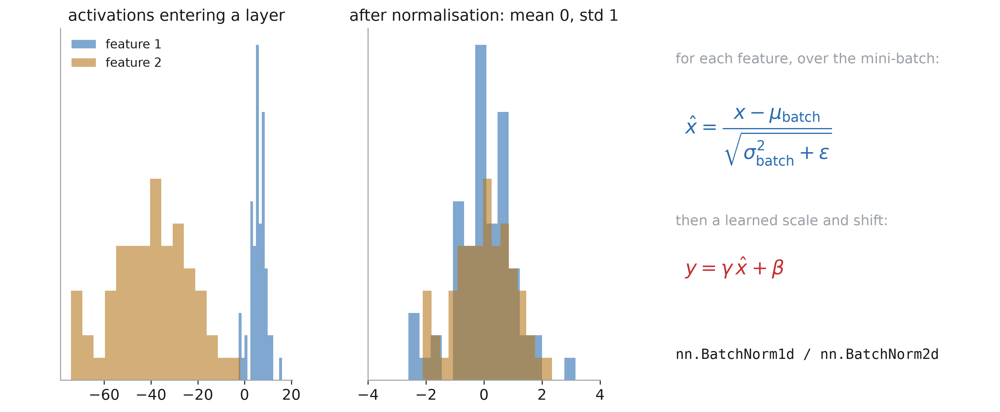

::: notes
We already standardize the input data so each feature has mean zero and standard
deviation one. Batch normalization does the same at the entrance of every layer,
which also makes learning easier. Then a learned scale γ and shift β let the layer
undo the normalization if that is what helps.

Proposed by Ioffe and Szegedy (2015), motivated by "internal covariate shift". Why
it works is still debated — Santurkar et al. (2018) argue it rather smooths the loss
surface. Deep learning is recent and not fully understood, and new tricks are often
oversold. The rule: try with and without, look at the validation loss, keep what is
better.
:::

## Why "batch" normalization

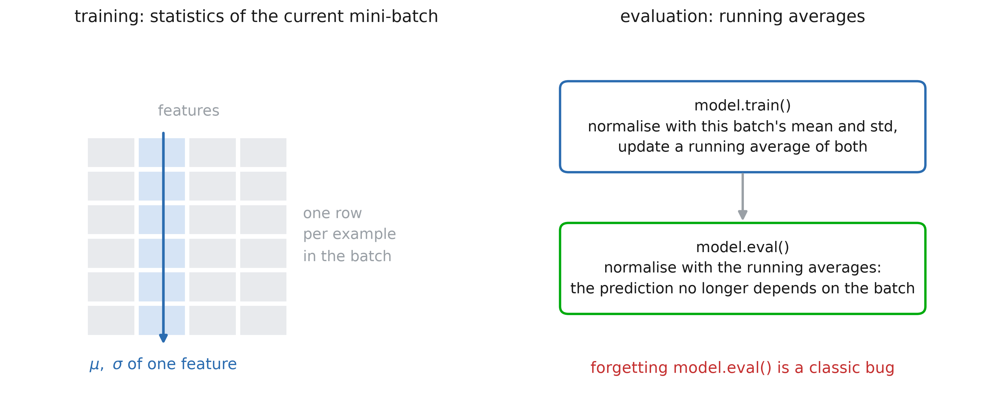

::: notes
The normalization is not computed on the whole dataset: the mean and standard
deviation come from the current mini-batch. Hence the name — and hence very small
batches make it noisy.

At evaluation time there may be one example, so the layer uses running averages
collected during training. That is one of the things `model.train()` and
`model.eval()` switch.
:::

## Dropout

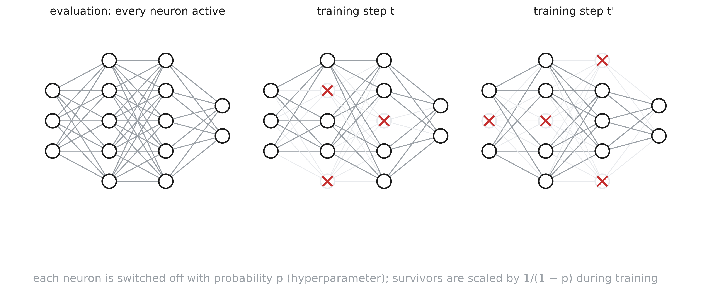

::: notes
Srivastava et al. (2014), "Dropout: A Simple Way to Prevent Neural Networks from
Overfitting". Which neurons are switched off is random: each one is dropped with
probability p — a new hyperparameter. With p = 0.1 each neuron has a 1 in 10 chance
of being off. This is redrawn at every forward pass, so the network trains a
slightly different thinned model at every step.

Caution: dropout is only active during training; at test time every neuron is on.

Caution 2: think of an output neuron. During training it receives inputs from only
about (1 − p) of the hidden neurons. Remove dropout and it suddenly receives more —
its activations become too large. To avoid this, PyTorch scales the surviving
activations by 1/(1 − p) during training, so nothing changes at test time.
:::

# Losses

## Regression losses

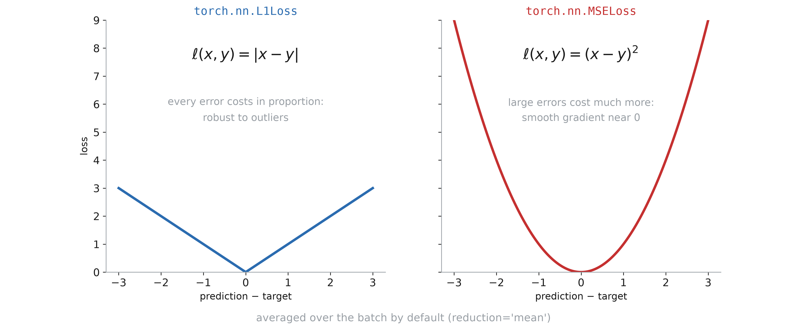

::: notes
The two regression losses they know. L1: every unit of error costs the same, so it
is robust to outliers. MSE: large errors dominate; the gradient vanishes smoothly
near zero.
:::

## Classification
> In the case of a categorical output,
>
> what should the loss be?

## Cross entropy

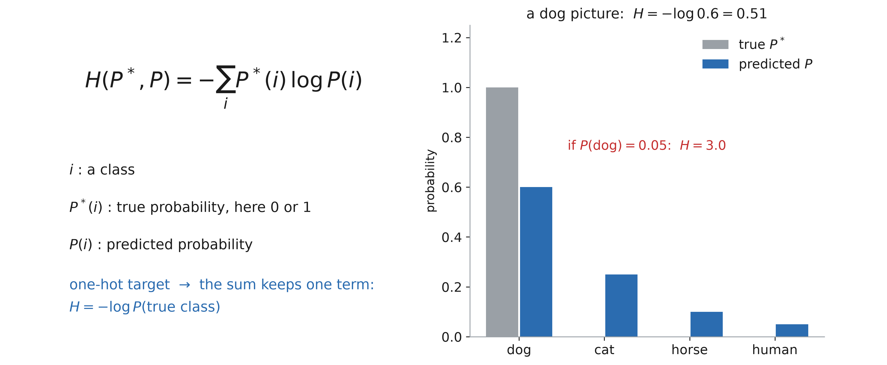

::: notes
Work the example on the board: classes dog, cat, horse, human. A dog picture, so
P* = (1, 0, 0, 0). Every term with P*(i) = 0 vanishes, and the loss is −log of the
probability given to the true class: 0.51 for P(dog) = 0.6, 3.0 for P(dog) = 0.05.
:::

## NLLLoss

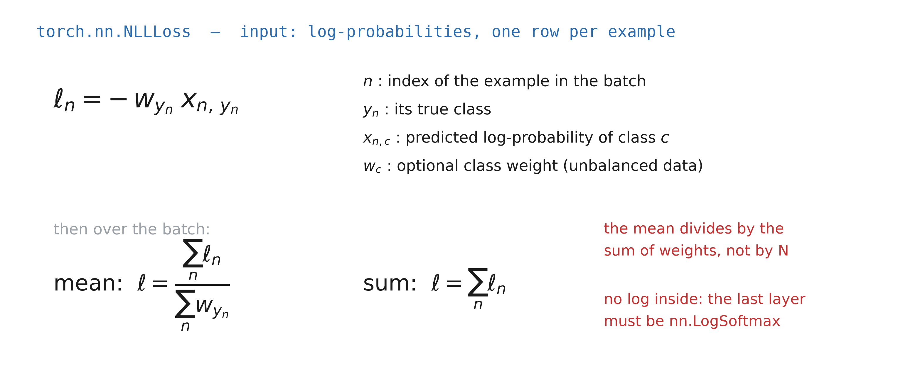

::: notes
Why only x_{n, y_n}? Because for all the other classes P*(i) = 0. Careful: with
reduction='mean' PyTorch divides by the sum of the weights, not by N. In practice
PyTorch handles it, but it is worth knowing how it works.

NLLLoss expects log-probabilities and takes no log itself: the last layer of the
network has to be `nn.LogSoftmax`.
:::

## Why softmax?

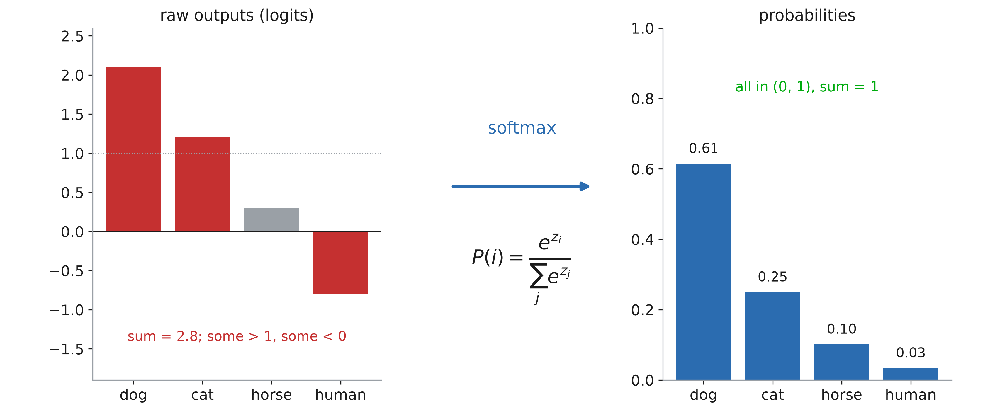

::: notes
We want probabilities. Raw network outputs can be above 1 or negative, and they do
not sum to 1 — and we cannot take the log of a negative number. Softmax exponentiates
(everything becomes positive) and normalizes (everything sums to 1).

Idea of the figure after Adian Liusie, "Intuitively Understanding the Cross Entropy
Loss" (2021) — https://www.youtube.com/watch?v=Pwgpl9mKars
:::

## CrossEntropyLoss

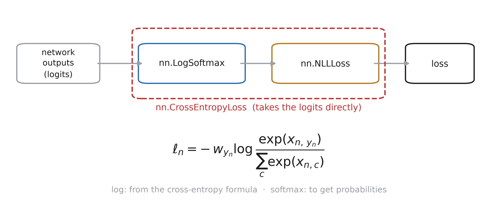

::: notes
`nn.CrossEntropyLoss` is `nn.LogSoftmax` followed by `nn.NLLLoss`, in one numerically
stable call. Why the log: the cross-entropy formula. Why the softmax: we want values
between 0 and 1. So the network ends on a plain linear layer, and you never put a
softmax before `CrossEntropyLoss` — that is a classic bug.
:::
